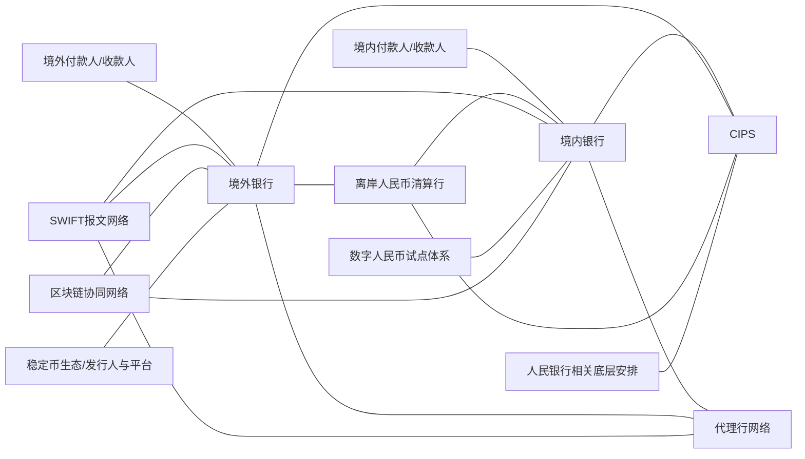
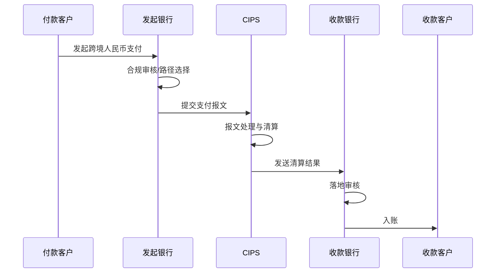
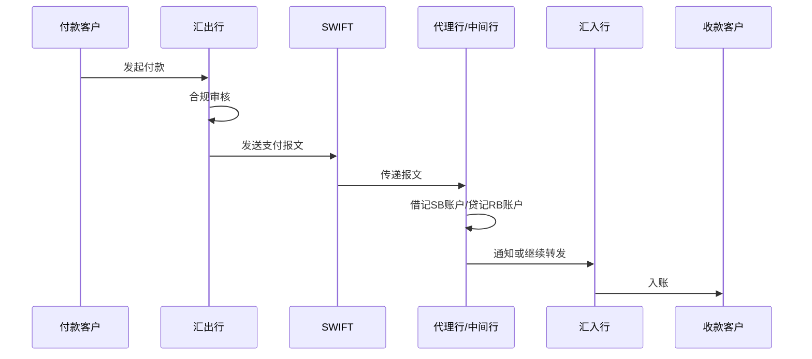
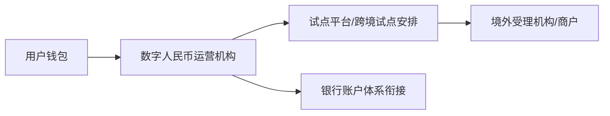
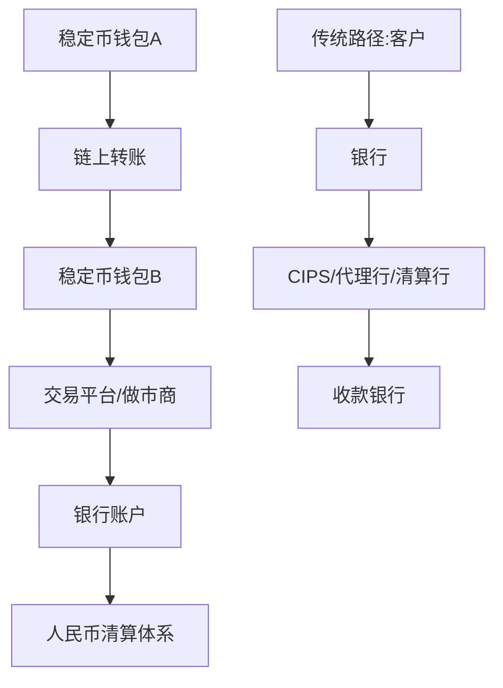
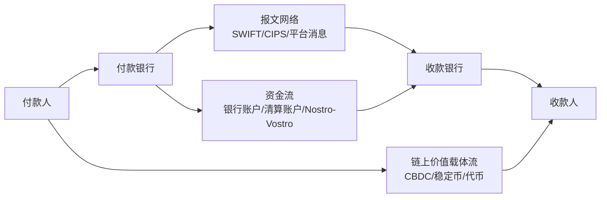
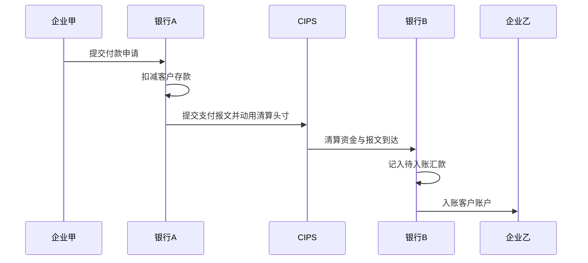
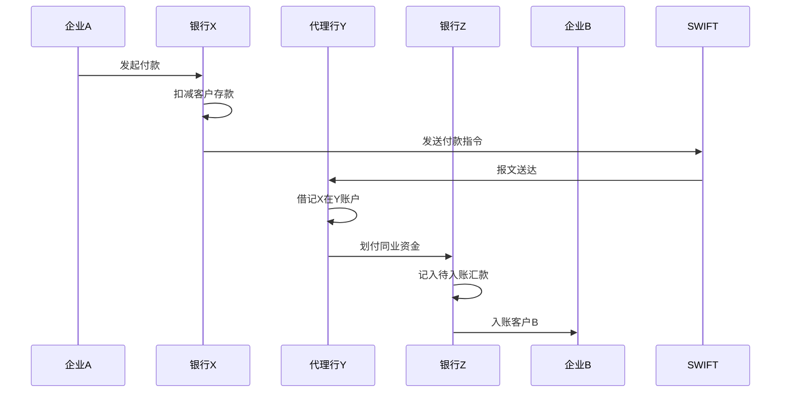
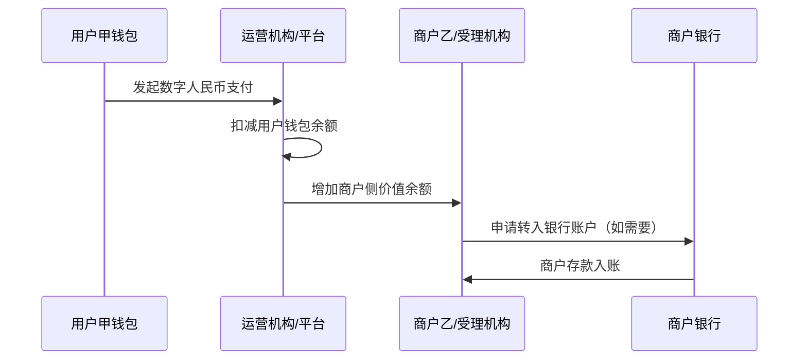

# 中国跨境人民币转账支付清算渠道与方式梳理（含 CBDC、区块链、稳定币等新兴技术）

## 1. 概述

### 1.1 什么是跨境人民币支付清算

**跨境人民币支付清算**，是指境内与境外之间、或境外不同机构之间，以**人民币**作为支付和结算货币所进行的：

- 支付指令发起
- 报文传递
- 资金清算
- 最终结算
- 账务更新
- 合规审核

它既包括企业、个人、机构看到的“汇款/收款”，也包括背后的银行账户关系、清算网络、报文网络和监管安排。

---

### 1.2 为什么需要区分传统模式与新兴技术路径

因为在中国实际中，**当前主流正式渠道**与**前沿技术探索**不是一回事。

#### 当前主流正式渠道
主要仍是：

- 银行账户体系
- CIPS
- 代理行模式
- 离岸人民币清算行模式
- 银行集团内部网络

这些是今天大规模、合规、可商用运行的主体。

#### 新兴技术路径
主要包括：

- 数字人民币跨境探索
- CBDC 多边桥，如 mBridge 类项目
- 区块链/DLT 协同网络
- 存款代币（Tokenized Deposit）
- 稳定币路径

这些更多属于：

- 试点
- 局部应用
- 技术探索
- 境外生态主导的支付路径
- 或监管敏感、尚未成为中国跨境人民币主渠道的安排

**核心结论：**
> 当前中国跨境人民币支付清算的主流正式路径，仍以现有银行账户体系和清算基础设施为主；区块链、稳定币、CBDC 不应被泛化为当前主流官方清算路径。

---

### 1.3 与境内人民币支付清算的主要差异

| 维度 | 境内人民币支付 | 跨境人民币支付 |
|---|---|---|
| 法域 | 单一法域 | 多法域 |
| 监管 | 境内统一规则为主 | 需同时满足境内外监管要求 |
| 参与方 | 境内银行、支付机构、清算机构 | 境内外银行、CIPS、代理行、清算行、SWIFT 等 |
| 账户关系 | 相对简单 | Nostro/Vostro、清算账户、参与者账户并存 |
| 合规要求 | KYC/AML 为主 | 叠加贸易真实性、制裁筛查、跨境政策管理等 |
| 时效 | 通常较统一 | 受时区、营业时间、路径选择影响较大 |
| 基础设施 | 境内系统为主 | 银行账户体系 + 跨境报文网络 + 清算安排组合 |

---

## 2. 整体体系版图

### 2.1 传统主流体系

中国跨境人民币主流体系，可先理解为三层：

#### 第一层：业务需求层
- 企业跨境汇款
- 跨境贸易结算
- 跨境电商收付款
- 境外机构人民币收付
- 银行间头寸调拨
- 个人跨境人民币汇款（合规允许场景）

#### 第二层：银行与账户关系层
- 境内银行
- 境外银行
- 代理行关系
- 离岸人民币清算行关系
- CIPS 直参/间参关系
- 银行集团内部账户网络

#### 第三层：基础设施层
- **CIPS**：跨境人民币支付系统
- **SWIFT**：跨境金融报文网络
- **离岸人民币清算安排**
- **人民银行相关底层支持安排**
- **银行内部全球清算网络**

---

### 2.2 新兴技术体系

中国跨境人民币相关的新兴技术路线，主要包括：

- **数字人民币跨境探索**
- **多边 CBDC 桥，如 mBridge 类模式**
- **区块链/DLT 协同网络**
- **存款代币 / Tokenized Deposit**
- **稳定币支付网络**

但它们与传统主流体系的关系不是简单替代，而是：

- 有些是**技术增强层**
- 有些是**试点中的新型清算/结算路径**
- 有些是**境外生态主导的价值转移路径**
- 有些在中国监管语境下**并非正式主流渠道**

---

### 2.3 二者关系总览

| 类别 | 当前定位 | 与主流体系关系 |
|---|---|---|
| CIPS / 银行账户体系 | 主流正式渠道 | 主干网络 |
| 代理行 / 离岸清算行 | 主流正式渠道 | 与 CIPS 并存互补 |
| 数字人民币跨境 | 试点/探索 | 补充，不是当前主渠道 |
| mBridge 类项目 | 多边试验/探索 | 未来可能协同或局部重构 |
| 区块链协同网络 | 局部应用 | 多用于信息协同、对账、贸易背景验证 |
| 稳定币 | 境外生态为主、监管敏感 | 不属于当前中国跨境人民币官方主流清算渠道 |
| 存款代币 | 概念到试点阶段 | 可能成为银行体系数字化延伸 |

---

## 3. 主要参与方与基础设施

### 3.1 主要参与方

| 参与方 | 角色 |
|---|---|
| 境内付款人/收款人 | 企业、个人、机构 |
| 境外付款人/收款人 | 企业、银行、投资者、平台等 |
| 境内银行 | 汇出行、汇入行、直参行、代理行 |
| 境外银行 | 汇出行、汇入行、间参行、代理行 |
| CIPS | 跨境人民币支付处理与清算基础设施 |
| SWIFT | 报文传输网络 |
| 离岸人民币清算行 | 离岸市场人民币清算枢纽 |
| 代理行 | 通过往来账户为其他银行清算 |
| 人民银行相关基础设施 | 提供人民币最终结算支撑与制度安排 |
| 数字人民币相关设施 | e-CNY 钱包、运营机构、试点安排 |
| 区块链网络参与方 | 银行、平台、企业、验证节点等 |
| 稳定币发行人/托管人/交易平台 | 境外稳定币生态中的核心角色 |

---

### 3.2 CIPS、SWIFT、代理行、离岸人民币清算行的真实角色

| 设施/机构 | 主要作用 | 是否负责资金清算 |
|---|---|---|
| CIPS | 跨境人民币支付处理、报文处理、清算安排 | 是 |
| SWIFT | 金融报文传输 | 否 |
| 代理行 | 通过 Nostro/Vostro 账户完成清算 | 是，通过账户记账实现 |
| 离岸人民币清算行 | 离岸市场人民币集中清算与流动性支持 | 是 |
| 人民银行相关安排 | 人民币最终结算支撑 | 是，底层支撑 |

**特别强调：**
> 报文传输网络和资金清算安排，不一定是同一个东西。  
> SWIFT 主要传“信息”，CIPS/代理行/清算行主要负责“钱怎么真正结清”。

---

## 4. 传统主流渠道与方式

---

## 4.1 CIPS 直参模式

### 定义
银行或其他合格机构直接接入 CIPS，作为**直接参与者**开展跨境人民币支付。

### 当前成熟度
**主流商用**

### 参与方
- 付款人/收款人
- 付款银行（CIPS 直参）
- 收款银行（可为直参或通过其他直参接入）
- CIPS
- 监管及底层结算支持机构

### 账户或价值载体安排
- 直参与 CIPS 的参与者账户/清算安排
- 客户账户仍在商业银行账上
- 配套头寸安排和流动性管理

### 信息流怎么走
- 客户向银行发起指令
- 银行通过 CIPS 标准报文提交支付信息
- CIPS 做报文校验、转发、状态反馈

### 资金流怎么走
- 客户账户扣款
- 银行使用其在 CIPS 下的清算安排和头寸
- CIPS 按规则完成跨境人民币清算
- 收款银行获得资金后入账

### 是否涉及最终央行货币结算
**涉及与央行相关安排衔接的最终结算支持**，但对新人来说，不宜简单理解为“所有客户资金都直接在央行账户上移动”。

### 典型适用场景
- 大额企业跨境人民币汇款
- 银行间跨境人民币清算
- 境内外大型银行标准化人民币支付

### 优点
- 链路较短
- 标准化高
- 透明度较好
- 适合人民币专门清算

### 局限
- 直参门槛较高
- 仍受营业时间、头寸、合规约束
- 覆盖虽广但不等于全球所有机构都直连

### 在中国实际中的常见程度
**非常核心**

### 监管与合规边界
- 客户身份识别
- 交易背景审核
- AML/CFT
- 制裁筛查
- 跨境人民币政策适用

---

## 4.2 CIPS 间参模式

### 定义
银行不是 CIPS 直接参与者，而是通过某家 **CIPS 直参行**接入 CIPS。

### 当前成熟度
**主流商用**

### 参与方
- 客户
- 间参银行
- CIPS 直参行
- CIPS
- 收款行

### 账户或价值载体安排
- 间参银行通常在直参行开立人民币账户或建立清算安排
- 间参银行客户资金仍在其本行账上

### 信息流怎么走
- 客户 → 间参银行
- 间参银行 → 直参行
- 直参行 → CIPS
- CIPS → 对手方银行

### 资金流怎么走
- 客户在间参银行扣款
- 间参银行使用其在直参行的人民币余额/额度
- 直参行通过 CIPS 完成清算
- 收款银行入账

### 是否涉及最终央行货币结算
通过 CIPS 与底层人民币结算安排衔接。

### 典型适用场景
- 中小银行开展跨境人民币业务
- 境外银行希望使用 CIPS 但不直接接入
- 银行业务量不足以支持直参接入

### 优点
- 成本较低
- 接入门槛低于直参
- 可借助直参行能力

### 局限
- 依赖直参行
- 时效与透明度略逊于直参
- 费用和服务能力受合作行影响

### 在中国实际中的常见程度
**非常常见**

### 监管与合规边界
- 间参银行自身合规
- 直参行再进行接入层审核和风险控制

---

## 4.3 代理行模式

### 定义
通过银行间开立 **Nostro/Vostro 往来账户**，由一家银行作为另一家银行的代理行，完成跨境人民币清算。

### 当前成熟度
**主流商用**

### 参与方
- 客户
- 汇出行
- 汇入行
- 一家或多家代理行/中间行
- SWIFT（常用报文网络）

### 账户或价值载体安排
- Nostro/Vostro 往来账户
- 账户预留人民币头寸

### 信息流怎么走
通常通过：
- SWIFT
- 银行专线
- 双边报文系统

### 资金流怎么走
- 汇出行指示代理行付款
- 代理行借记汇出行在其处账户
- 贷记收款银行在其处账户，或继续中转
- 收款行给客户入账

### 是否涉及最终央行货币结算
**不一定直接体现在客户视角中**；实务中更多表现为代理账户上的资金记账变动和结清安排。

### 典型适用场景
- 覆盖全球网络的人民币支付
- 未接入 CIPS 或对方银行不在 CIPS 主链路上
- 多市场、多层级中转支付

### 优点
- 覆盖广
- 灵活
- 适合跨币种、跨地区传统银行网络

### 局限
- 链路可能长
- 成本可能较高
- 透明度较低
- 预置头寸占用大

### 在中国实际中的常见程度
**仍然非常重要**

### 监管与合规边界
- 各环节银行均要做 AML/KYC/制裁筛查
- 中间行越多，合规与运营风险越复杂

---

## 4.4 离岸人民币清算行模式

### 定义
在香港等离岸人民币中心，由**人民币清算行**为当地参加行提供人民币清算、账户和流动性支持。

### 当前成熟度
**主流商用（在重点离岸市场）**

### 参与方
- 当地离岸银行
- 离岸人民币清算行
- 境内合作银行/系统
- 客户

### 账户或价值载体安排
- 参加行在离岸人民币清算行开立人民币清算账户
- 清算行连接境内人民币体系

### 信息流怎么走
- 本地系统
- 清算行内部系统
- SWIFT
- 与境内系统衔接通道

### 资金流怎么走
- 参加行在清算行账户间划转
- 必要时与境内人民币体系联动
- 收款银行入账

### 是否涉及最终央行货币结算
通过离岸清算行与境内安排衔接实现最终结清支持。

### 典型适用场景
- 香港等离岸市场本地人民币支付
- 离岸市场与境内的贸易、投融资人民币结算
- 离岸市场人民币流动性集中管理

### 优点
- 在特定离岸中心效率高
- 有利于流动性集中管理
- 当地接入较便利

### 局限
- 主要适用于特定离岸市场
- 不等于全球统一网络
- 仍需与其他体系配合

### 在中国实际中的常见程度
**在香港等市场很典型**

### 监管与合规边界
- 当地监管
- 中国跨境人民币相关政策
- 清算行内部规则

---

## 4.5 银行内部全球网络模式（如适用）

### 定义
大型银行集团通过其全球分支机构、内部账户和账簿网络，完成集团内部的跨境人民币资金调拨或客户支付中间环节处理。

### 当前成熟度
**局部商用**

### 参与方
- 银行集团内不同分行/子行
- 客户
- 外部清算基础设施（作为外围支持）

### 账户或价值载体安排
- 集团内部账户
- 镜像账簿
- 内部资金池

### 信息流怎么走
- 集团内部系统
- 外围仍可通过 SWIFT/CIPS

### 资金流怎么走
- 内部账簿先调拨
- 对外最终支付仍常需通过 CIPS/代理行/清算行

### 是否涉及最终央行货币结算
最终外部支付通常仍需接入正式清算基础设施。

### 典型适用场景
- 大型国际银行集团跨分支机构支付
- 内部头寸调拨
- 降低中间行成本

### 优点
- 内部效率高
- 成本较低
- 可缩短外部中间链路

### 局限
- 只适用于集团覆盖范围内
- 不能替代外部清算基础设施

### 在中国实际中的常见程度
**有限但重要**

### 监管与合规边界
- 集团内部规则
- 各法域监管要求
- 对外支付仍需满足跨境监管

---

## 5. 新兴技术路径

---

## 5.1 数字人民币跨境 / CBDC

### 定义
以**中央银行数字货币（CBDC）**为基础，在跨境场景中实现人民币支付、转移或结算的探索。中国对应的零售型 CBDC 是**数字人民币（e-CNY）**。

### 当前成熟度
**试点 / 探索中，不是当前跨境人民币主渠道**

### 参与方
- 人民银行
- 数字人民币运营机构
- 试点银行/机构
- 境内外用户或商户
- 特定试点地区合作机构

### 账户或价值载体安排
- e-CNY 钱包
- 指定运营机构体系
- 特定跨境试点安排

### 信息流怎么走
- 钱包系统
- 试点平台
- 运营机构处理网络

### 资金流或价值转移怎么走
- 数字人民币钱包间价值转移
- 或依赖运营机构与银行体系对接

### 是否涉及最终央行货币结算
理论上 CBDC 具备更接近央行货币的属性；但具体跨境试点中，实际清结算安排仍取决于试点设计。

### 典型适用场景
- 特定地区零售跨境消费
- 试点型小额支付
- 旅游、民生或示范场景

### 优点
- 可编程性更强
- 状态可视性更高
- 可减少部分中间环节
- 有潜力优化跨境零售支付

### 局限
- 仍处试点
- 跨法域监管协调复杂
- 钱包体系、准入、法偿接受度有限
- 不等于现有大规模企业跨境清算网络

### 在中国实际中的常见程度
**非主流，大规模商用尚未形成**

### 监管与合规边界
- 必须符合跨境使用范围和试点边界
- 涉及实名、AML、跨境监管协调

---

## 5.2 mBridge 等多边央行数字货币桥

### 定义
多边 CBDC 平台，尝试让多家央行数字货币在统一或互联的平台上实现跨境支付、兑换和结算。

### 当前成熟度
**试点 / 探索中**

### 参与方
- 多国央行/货币当局
- 商业银行
- 平台运营方
- 技术参与方

### 账户或价值载体安排
- 平台内持有或映射的批发型 CBDC
- 多边账本
- 平台规则控制的价值单元

### 信息流怎么走
- 平台内消息
- 分布式账本记录
- 规则引擎处理

### 资金流或价值转移怎么走
- 在平台上进行 CBDC 转移
- 理论上可实现更同步的跨境结算与外汇转换

### 是否涉及最终央行货币结算
**可能更接近央行货币层面的结算创新**，但具体法律和技术安排以项目设计为准。

### 典型适用场景
- 银行间跨境支付
- 跨境批发支付
- 跨币种同步结算探索

### 优点
- 可减少中间层级
- 透明度高
- 可能支持近实时结算
- 可增强 PvP 等机制

### 局限
- 法律和监管协调难
- 商业落地仍有限
- 参与范围受限
- 不属于当前中国跨境人民币日常主流通道

### 在中国实际中的常见程度
**前沿探索，不是日常大规模商用主链路**

### 监管与合规边界
- 高度依赖多边监管协调
- 涉及数据、货币主权、法律适用等复杂问题

---

## 5.3 区块链跨境支付协同网络

### 定义
使用区块链/DLT 作为**信息协同、单证共享、状态同步、对账或支付编排**平台，辅助跨境支付处理。

### 当前成熟度
**局部应用 / 试点 / 场景化商用**

### 参与方
- 银行
- 企业
- 平台
- 验证节点
- 贸易相关机构

### 账户或价值载体安排
可能有两类：
1. **只记录信息，不承载货币**
2. **记录代币化价值载体**

在中国实际中，前者更常见、更稳妥。

### 信息流怎么走
- 链上共享交易状态
- 共享单证、贸易背景、付款条件
- 多方同步对账

### 资金流或价值转移怎么走
多数情况下：
- 最终资金仍走银行账户体系
- 可能通过 CIPS、代理行、清算行完成

### 是否涉及最终央行货币结算
通常**不直接等于央行货币最终结算**。

### 典型适用场景
- 贸易金融协同
- 供应链融资
- 跨境电商资金对账
- 多方状态同步

### 优点
- 提高透明度
- 减少重复审单
- 改善对账和协同
- 可嵌入业务规则

### 局限
- 常常只优化信息层，不替代资金清算层
- 跨机构标准统一难
- 数据治理复杂

### 在中国实际中的常见程度
**作为协同层有应用，但不是主流最终清算层**

### 监管与合规边界
- 数据合规
- 隐私与跨境数据流动
- 平台接入规范
- 不能将“链上记账”等同于合规跨境清算

---

## 5.4 稳定币路径

### 定义
以某种资产或货币储备支持的数字代币，在链上实现价值转移，常见如锚定美元的稳定币。若讨论人民币相关稳定币，则需区分**离岸生态、私人发行、受监管稳定币**等不同形态。

### 当前成熟度
**境外生态有较多应用；在中国跨境人民币正式清算语境下不属于主流正式渠道**

### 参与方
- 稳定币发行人
- 托管人/储备管理方
- 钱包服务商
- 交易平台
- 商户/用户
- 做市商/兑换商
- 银行（出入金接口）

### 账户或价值载体安排
- 链上稳定币 token
- 发行人储备资产账户
- 用户钱包地址
- 出入金银行账户

### 信息流怎么走
- 链上转账消息
- 交易平台/钱包系统内部消息

### 资金流或价值转移怎么走
- 链上 token 所有权转移
- 法币出入金仍需依赖银行账户体系

### 是否涉及最终央行货币结算
**通常不等于央行货币最终结算**。  
链上稳定币转移只是某种数字代币的转移，不天然等于人民币央行货币结清。

### 典型适用场景
- 境外加密资产生态支付
- 境外商户结算
- 部分跨境资金快速转移需求

### 优点
- 全天候
- 转移速度快
- 全球可达性强
- 可编程性高

### 局限
- 法偿性不足
- 发行人风险
- 储备资产透明度风险
- 合规与制裁风险
- 价格脱锚风险
- 链上匿名/伪匿名带来的 AML 风险
- 进入银行体系时面临强监管

### 在中国实际中的常见程度
**不属于中国跨境人民币官方主流清算渠道**

### 监管与合规边界
- 在中国语境下高度敏感
- 不能将稳定币路径表述为中国正式跨境人民币清算主渠道
- 涉及金融监管、反洗钱、跨境资金管理、虚拟资产监管边界

---

## 5.5 存款代币 / Tokenized Deposit（如适用）

### 定义
由持牌银行基于其存款负债发行的数字化代币化存款，本质上仍是**银行存款货币的数字形态**，不是央行货币，也不同于私人稳定币。

### 当前成熟度
**概念研究到局部试点之间**

### 参与方
- 商业银行
- 企业/机构客户
- 平台运营方
- 可能的 DLT 网络参与方

### 账户或价值载体安排
- 银行负债对应的代币化表示
- 客户钱包/账户
- 银行总账与链上映射机制

### 信息流怎么走
- 链上消息 + 银行核心系统同步

### 资金流或价值转移怎么走
- 链上转移代币化存款
- 最终仍需银行账簿承认和兑付

### 是否涉及最终央行货币结算
通常**不直接等于央行货币**；其安全性和最终性取决于银行负债及清算安排。

### 典型适用场景
- 银行间或企业间数字化结算试点
- 可编程支付
- 链上资产交收协同

### 优点
- 与银行体系更兼容
- 可编程
- 比私人稳定币更容易纳入监管框架

### 局限
- 跨行、跨境互认仍难
- 法律与会计处理未完全成熟
- 平台互操作性不足

### 在中国实际中的常见程度
**尚不典型**

### 监管与合规边界
- 需由持牌银行主导
- 必须纳入银行监管与支付清算监管体系

---

## 6. 各模式对比总表

| 模式 | 成熟度 | 合规地位 | 信息流方式 | 资金/价值转移方式 | 是否中国当前主流正式渠道 | 典型场景 | 主要优点 | 主要局限 |
|---|---|---|---|---|---|---|---|---|
| CIPS 直参 | 主流商用 | 高 | CIPS | CIPS 清算安排 | 是 | 银行间、企业大额支付 | 标准化、透明度较高 | 接入门槛较高 |
| CIPS 间参 | 主流商用 | 高 | 间参行→直参行→CIPS | 通过直参行清算 | 是 | 中小银行、境外银行人民币支付 | 接入成本低 | 依赖直参行 |
| 代理行模式 | 主流商用 | 高 | SWIFT/双边报文 | Nostro/Vostro 划转 | 是 | 全球覆盖型支付 | 覆盖广、灵活 | 链路长、透明度较低 |
| 离岸清算行 | 主流商用（重点市场） | 高 | 本地系统/SWIFT/专线 | 清算行账户体系 | 是 | 香港等离岸中心 | 离岸效率高 | 区域性较强 |
| 银行内部网络 | 局部商用 | 高 | 内部系统 | 内部账簿/资金池 | 补充渠道 | 集团内部支付 | 效率高 | 覆盖有限 |
| 数字人民币跨境 | 试点 | 有边界 | 钱包/试点平台 | e-CNY 价值转移 | 否 | 零售试点、小额场景 | 可编程、便捷 | 未大规模商用 |
| mBridge 类 | 试点/探索 | 多边试验性质 | 平台消息 | 平台内 CBDC 转移 | 否 | 批发跨境结算探索 | 中间层级少 | 监管协调复杂 |
| 区块链协同网络 | 局部应用 | 视场景而定 | 链上共享信息 | 多数仍依赖传统清算 | 否（作为清算主渠道） | 贸易金融、对账协同 | 透明、协同强 | 多优化信息层 |
| 稳定币 | 境外生态有应用 | 在中国语境下敏感 | 链上消息 | 稳定币 token 转移 | 否 | 境外数字资产生态 | 7x24、速度快 | 法偿性、合规、脱锚等风险 |
| 存款代币 | 概念/试点 | 潜在可纳管 | 链上+银行系统 | 代币化存款转移 | 否 | 银行数字化结算探索 | 更接近银行体系 | 标准尚不成熟 |

---

## 7. 典型案例拆解

---

## 7.1 中国企业通过 CIPS 向香港供应商付款

### 场景
- 付款人：深圳企业
- 付款行：境内银行 A（CIPS 直参）
- 收款人：香港供应商
- 收款行：香港银行 B（可直接或间接接入 CIPS）

### 1. 支付发起
企业向银行 A 提交跨境人民币汇款申请，并提供合同、发票、用途说明等。

### 2. 报文传递
银行 A 通过 CIPS 发送标准支付报文。

### 3. 合规与校验
银行 A 审核：
- 客户身份
- 贸易真实性
- AML/CFT
- 制裁筛查
- 收款行可达性

### 4. 清算路径选择
银行 A 判断银行 B 是否可通过 CIPS 直接到达；若可，则优先走 CIPS。

### 5. 资金/价值转移路径
- 企业账户在银行 A 扣款
- 银行 A 使用其 CIPS 头寸
- CIPS 完成跨境人民币清算
- 收款行获得资金

### 6. 最终到账
香港银行 B 入账至香港供应商人民币账户。

### 7. 各参与方账务变化
- 企业账户减少
- 银行 A 客户负债减少、清算头寸减少
- 银行 B 清算资金增加
- 供应商账户增加

### 8. 风险点与边界
- 资料不全可能退回
- 营业时间影响到账
- 对手行落地审核可能延迟

---

## 7.2 境外银行通过 CIPS 间参向境内企业付款

### 场景
- 付款人：新加坡企业
- 付款行：新加坡银行 C（CIPS 间参）
- 直参行：银行 D
- 收款行：中国银行 E
- 收款人：中国企业

### 1. 支付发起
新加坡企业向银行 C 发起人民币汇款。

### 2. 报文或消息传递
银行 C 将支付信息发给其合作直参行 D，由 D 通过 CIPS 发出。

### 3. 合规与校验
- 银行 C 做客户和交易审核
- 银行 D 做格式、名单、接入审核
- 银行 E 做入账前落地审核

### 4. 清算路径选择
因银行 C 非直参，必须经 D 进入 CIPS。

### 5. 资金/价值转移路径
- 客户在 C 行扣款
- C 行动用其在 D 行的人民币余额/额度
- D 行通过 CIPS 向 E 行清算

### 6. 最终到账
E 行给中国企业入账。

### 7. 各参与方账务变化
- 新加坡企业账户减少
- C 行在 D 行的人民币余额减少
- D 行清算头寸变动
- E 行清算资金增加
- 中国企业账户增加

### 8. 风险点与边界
- 依赖直参行服务能力
- 中间层合规和格式问题可能导致延误
- 头寸不足会影响付款

---

## 7.3 数字人民币跨境试点案例

> **说明：以下为试点/探索型案例，不代表当前全国普遍商用现实。**

### 场景
- 境内游客在试点地区使用数字人民币
- 境外商户或合作受理机构参与特定跨境试点安排

### 1. 支付发起
用户通过数字人民币钱包发起支付。

### 2. 报文或链上消息传递
支付请求在 e-CNY 运营体系和试点平台中传递。

### 3. 合规与校验
- 钱包实名与风控
- 交易限额
- 场景准入
- 跨境试点规则检查

### 4. 清算路径选择
若属于试点闭环，可通过数字人民币试点安排直接处理；必要时再与银行账户体系衔接。

### 5. 资金/价值转移路径
- 用户钱包余额减少
- 商户/受理机构对应钱包或结算安排增加

### 6. 最终到账
商户收到数字人民币或其对应结算结果。

### 7. 各参与方账务变化
- 用户钱包减少
- 运营机构系统更新
- 商户钱包/结算账户增加

### 8. 风险点与边界
- 场景范围有限
- 不是普遍跨境企业结算主模式
- 仍受试点地区、机构、规则限制

---

## 7.4 稳定币跨境支付案例及其边界分析

> **说明：此案例用于分析可行性与边界，不应理解为中国跨境人民币正式主流清算方式。**

### 场景
- 境外买方向境外卖方或中间商使用某美元稳定币付款
- 后续再尝试转换并向中国境内企业支付人民币

### 1. 支付发起
付款方在钱包中向收款方转移稳定币。

### 2. 报文或链上消息传递
链上广播转账交易，节点确认。

### 3. 合规与校验
链上本身可能只做技术确认；真正合规常发生在：
- 交易平台入金/出金
- 托管机构
- 兑换商
- 银行出入金环节

### 4. 清算路径选择
链上转移仅完成稳定币 token 变更；若要进入中国境内人民币体系，必须经过合规银行渠道和法币兑换/结算安排。

### 5. 资金/价值转移路径
- 链上：稳定币从 A 钱包到 B 钱包
- 链下：若要入人民币账户，需卖出稳定币、取得法币，再通过银行体系完成人民币付款

### 6. 最终到账
只有在通过合规银行和人民币清算体系后，境内企业才可能收到人民币。

### 7. 各参与方账务变化
- 链上钱包余额变化
- 交易平台/发行人储备关系变化
- 银行账户在出入金时变化

### 8. 风险点与边界
- 稳定币转账 ≠ 合规跨境人民币清算
- 发行人和储备资产风险
- 合规和监管高敏感
- 可能涉及虚拟资产监管、反洗钱、资本流动管理问题

---

## 8. Mermaid 图示

### 8.1 中国跨境人民币清算整体参与方关系图



---

### 8.2 CIPS 模式流程图



---

### 8.3 代理行模式流程图



---

### 8.4 数字人民币 / CBDC 探索路径图



---

### 8.5 稳定币路径与传统清算路径对比图



---

### 8.6 信息流、资金流、价值载体流对照图



---

## 9. 容易混淆的概念辨析

### 9.1 CIPS vs SWIFT

| 项目 | CIPS | SWIFT |
|---|---|---|
| 定位 | 跨境人民币支付系统 | 全球金融报文网络 |
| 主要功能 | 报文处理 + 清算安排 | 报文传输 |
| 是否负责资金清算 | 是 | 否 |
| 币种 | 人民币为核心 | 多币种 |
| 中国跨境人民币地位 | 主流基础设施之一 | 重要信息传输网络 |

**一句话：**
- SWIFT 主要负责“传话”
- CIPS 负责“人民币支付处理与清算”

---

### 9.2 清算 vs 结算

- **清算**：计算各方应收应付、安排资金划转过程
- **结算**：最终完成不可撤销的资金交收

在很多业务讨论中两者常被混用，但严格上并不完全相同。

---

### 9.3 银行账户货币 vs CBDC vs 稳定币

| 类型 | 本质 | 发行人 | 信用基础 |
|---|---|---|---|
| 银行账户货币 | 商业银行存款 | 商业银行 | 银行信用 |
| CBDC | 中央银行数字货币 | 中央银行 | 国家信用/央行信用 |
| 稳定币 | 私人或机构发行的代币 | 私人机构 | 储备资产与发行人信用 |

---

### 9.4 区块链转账 vs 合规跨境清算

链上“转账成功”通常只说明：
- 某个链上地址的代币转给了另一个地址

但现实中的**合规跨境人民币清算**还必须满足：
- 付款人与收款人身份明确
- 交易背景合规
- 资金来源合法
- 反洗钱和制裁筛查
- 能进入正式人民币账户体系
- 符合跨境资金管理要求

所以：

> 区块链上的“转账”，不等于现实中的“合规跨境人民币清算”。

---

### 9.5 主流正式渠道 vs 探索性技术路径

| 类别 | 当前中国实际定位 |
|---|---|
| CIPS / 代理行 / 离岸清算行 | 主流正式渠道 |
| 数字人民币跨境 | 试点探索 |
| mBridge 类项目 | 多边试验 |
| 区块链协同网络 | 补充型协同层 |
| 稳定币 | 境外生态为主，监管敏感，不是主流正式渠道 |

---

### 9.6 为什么很多新兴技术优化流程，但不一定替代最终清算基础设施

因为跨境支付有两层：

#### 信息传递层创新
解决：
- 报文标准化
- 状态同步
- 单证共享
- 路由优化
- 对账协同

#### 最终结算层创新
解决：
- 钱到底在哪里真正结清
- 谁承担最终支付责任
- 是否具备央行货币最终性
- 法律上是否不可撤销

很多区块链平台主要优化的是**信息层**，而不是彻底替代**最终结算层**。

---

## 10. 风险、监管与现实约束

### 10.1 反洗钱 / KYC / 制裁筛查
跨境人民币支付必须考虑：
- 客户身份识别
- 受益所有人识别
- 交易监测
- 名单筛查
- 可疑交易报告

---

### 10.2 资本项目与账户管理
中国跨境人民币支付涉及：
- 经常项目与资本项目区分
- 贸易背景真实性
- 投融资合规性
- 账户开立和使用规则

---

### 10.3 流动性管理
不同模式下都要考虑：
- 代理账户预存资金
- CIPS 清算头寸
- 离岸市场人民币流动性
- 试点型数字货币额度和限额

---

### 10.4 营业时间与时区
- 境内系统营业时间
- 境外市场营业窗口
- 周末节假日差异
- 截止时间影响到账时点

---

### 10.5 法偿性
- 银行存款：商业银行负债
- CBDC：更接近法定货币形态
- 稳定币：一般不具备法偿地位

---

### 10.6 技术与运营风险
- 报文格式错漏
- 对账失败
- 系统中断
- 链上智能合约漏洞
- 钱包密钥丢失
- 节点治理问题

---

### 10.7 稳定币特别风险
- 脱锚
- 储备资产不透明
- 发行人信用风险
- 流动性挤兑
- 合规封堵风险
- 被用于规避监管的高敏感性

---

### 10.8 新兴技术落地的监管障碍
- 跨法域法律不统一
- 数据跨境流动要求
- 监管可视性不足
- 账户体系与链上体系衔接难
- 会计、审计、税务规则未完全成熟

---

## 11. 新人学习建议

### 11.1 应先掌握哪些概念

建议先掌握这 12 个概念：

1. 跨境人民币支付 vs 境内支付
2. 信息流 vs 资金流
3. 账务变化 vs 最终结算
4. CIPS
5. SWIFT
6. 代理行
7. 离岸人民币清算行
8. Nostro / Vostro
9. CIPS 直参 vs 间参
10. CBDC
11. 稳定币
12. 区块链协同层 vs 最终结算层

---

### 11.2 推荐阅读顺序

#### 第一阶段：先看传统主干
- CIPS
- 代理行
- 离岸清算行
- 银行账户关系

#### 第二阶段：再看流程拆解
- 信息流
- 资金流
- 账务更新
- 头寸安排

#### 第三阶段：再看新兴技术
- 数字人民币跨境试点
- mBridge 类项目
- 区块链协同网络
- 存款代币
- 稳定币边界

#### 第四阶段：最后看监管
- AML/KYC
- 跨境政策
- 资本项目
- 营业时间
- 技术和运营风险

---

### 11.3 如何建立完整认知框架

推荐用“五问法”：

1. **谁在向谁付款？**
2. **支付信息通过什么网络传？**
3. **钱或价值载体通过什么机制转移？**
4. **最终在哪里结清？**
5. **是否是中国当前正式、主流、合规渠道？**

如果这五问都能答出来，你就真正看懂了一条跨境人民币路径。

---

## 12. 总结

1. **当前中国跨境人民币支付清算的主流正式渠道，仍然是银行账户体系 + CIPS + 代理行 + 离岸人民币清算行等基础设施组合。**
2. **CIPS 是中国跨境人民币的核心基础设施之一，但不是唯一渠道。**
3. **SWIFT 在跨境人民币中主要承担报文传输功能，一般不承担资金最终清算。**
4. **代理行模式仍然重要，本质是通过 Nostro/Vostro 账户完成跨境资金划转。**
5. **离岸人民币清算行模式在香港等离岸中心具有关键作用。**
6. **CIPS 直参和间参的核心区别在于接入层级、账户安排和对直参行的依赖程度。**
7. **必须明确区分信息流、资金流、链上价值转移、账务记录变化和最终结算。**
8. **数字人民币跨境和 mBridge 属于前沿探索或试点，不是当前中国跨境人民币的大规模主渠道。**
9. **区块链在中国跨境支付中更多是协同层、信息层、对账层和贸易背景验证层的增强，不一定替代最终清算层。**
10. **稳定币在境外生态中有应用，但在中国跨境人民币支付语境下不属于官方主流正式清算渠道，且监管敏感度高。**
11. **存款代币比私人稳定币更接近银行体系，但目前仍处于概念到试点阶段。**
12. **未来更可能出现的是“传统主干网络 + 新兴技术局部增强/协同”的格局，而不是短期内被某一种技术完全替代。**

---

如果你愿意，我下一步可以继续为你补两份更深入的材料之一：

1. **“跨境人民币清算体系一张图（浓缩版）”**
2. **“逐笔账务分录视角：CIPS、代理行、CBDC、稳定币四种路径的账务与资金流详解”**

# 逐笔账务分录视角：CIPS、代理行、CBDC、稳定币四种路径的账务与资金流详解

> **定位说明**  
> 本文从“**逐笔账务分录 + 信息流 + 资金流/价值流**”的角度，帮助你看懂四类路径：
>
> 1. **CIPS 路径**
> 2. **代理行路径**
> 3. **CBDC / 数字人民币路径**
> 4. **稳定币路径**
>
> 重点不是讲抽象概念，而是回答：
>
> - 一笔钱到底从哪里扣、到哪里加？
> - 银行账上发生了什么变化？
> - 客户账、同业账、清算账分别怎么变？
> - 哪一步只是“发消息”，哪一步才是真正“结清”？
>
> 同时特别强调：
>
> - **CIPS、代理行**：属于当前中国跨境人民币支付清算的**现实主流路径**
> - **CBDC**：目前更多是**试点/探索路径**
> - **稳定币**：不属于中国跨境人民币官方主流清算渠道，以下仅作**机制分析与边界辨析**

---

# 1. 先建立一个统一观察框架

看任何一笔跨境支付，都建议你同时看 5 层：

| 层次 | 你要看什么 | 常见问题 |
|---|---|---|
| 业务层 | 谁向谁付款、什么用途 | 是货款、服务费、个人汇款还是同业划拨？ |
| 信息流 | 支付指令通过什么传 | 走 CIPS 报文？SWIFT？链上消息？ |
| 资金流/价值流 | 钱或价值载体怎么转 | 银行存款划转？清算账户变动？链上 token 转移？ |
| 账务层 | 各参与方账上怎么记 | 客户账、同业往来账、清算账、钱包负债怎么变？ |
| 最终结算层 | 最终在哪完成“不可撤销结清” | CIPS/清算账户？代理账户？平台内记账？链上确认？ |

---

# 2. 先统一几个账务术语

---

## 2.1 客户账、同业账、清算账

### 客户账
银行对客户的负债。

例如：
- 企业在银行有 100 万人民币存款
- 对企业来说，这是资产
- 对银行来说，这是**“吸收存款—客户存款”负债**

### 同业账
银行与银行之间的往来账户。

例如：
- 银行 A 在银行 B 开了人民币账户
- 对 A 来说是 **Nostro（我行存放同业款项）**
- 对 B 来说是 **Vostro（同业存放我行款项）**

### 清算账
用于清算系统、清算行或特定清算安排中的头寸记录。

比如：
- CIPS 相关清算头寸
- 离岸人民币清算账户
- 清算行参加行账户

---

## 2.2 一个账户，两种视角：Nostro / Vostro

假设：

- 境外银行 X 在境内银行 Y 开立人民币账户，余额 1,000 万

则：

- 对 **X** 来说：这是“我行存放 Y 行款项” → **Nostro 资产**
- 对 **Y** 来说：这是“X 行存放我行款项” → **Vostro 负债**

**同一账户，双方记账方向不同。**

---

## 2.3 本文中的分录写法说明

为了便于新人理解，以下分录采用**简化写法**，重点表达逻辑，不完全等同于某家银行真实总账科目名称。

常见写法：

- **借：客户存款**
- **贷：同业往来账户**
- **借：清算资金**
- **贷：客户存款**

你可以把它理解为“余额减少/增加”的一种简化表示。

---

# 3. 四类路径先看总览

| 路径 | 现实地位 | 钱的本质 | 主要账务变化发生在哪里 | 最终结清怎么看 |
|---|---|---|---|---|
| CIPS | 主流正式渠道 | 银行存款货币 + 清算系统安排 | 客户账 + CIPS相关清算账 | 在正式人民币清算安排下完成 |
| 代理行 | 主流正式渠道 | 银行存款货币 | 客户账 + Nostro/Vostro | 在代理账户链条上结清 |
| CBDC | 试点/探索 | 央行数字货币 | 钱包/运营机构/平台账 | 取决于试点设计，可能更接近央行货币 |
| 稳定币 | 境外生态路径 | 私人发行 token | 链上地址 + 出入金账户 | 链上确认不等于人民币正式最终结算 |

---

# 4. 路径一：CIPS 模式的逐笔账务与资金流

> 先看最典型场景：  
> **中国进口商通过境内银行 A 向香港供应商支付人民币货款 100 万元**  
> 假设：
>
> - 付款人：深圳企业甲
> - 付款行：境内银行 A（CIPS 直参）
> - 收款行：香港银行 B（可通过 CIPS 接收）
> - 收款人：香港企业乙
> - 金额：人民币 100 万

---

## 4.1 业务前提

企业甲在银行 A 有存款 150 万元，现要支付 100 万元货款给香港企业乙。

---

## 4.2 信息流

1. 企业甲向银行 A 提交付款申请
2. 银行 A 完成：
    - KYC/授权校验
    - 贸易真实性审核
    - AML/制裁筛查
3. 银行 A 通过 CIPS 提交支付报文
4. CIPS 将报文处理并转发给收款银行 B
5. 银行 B 落地审核后入账给企业乙

---

## 4.3 资金流

资金不是“报文跑过去了就算付了”，而是：

1. 银行 A 扣减企业甲存款
2. 银行 A 使用其 CIPS 相关清算头寸
3. 通过 CIPS 清算安排，将 100 万人民币清算给银行 B
4. 银行 B 获得清算资金后，再贷记企业乙账户

---

## 4.4 逐笔账务分录示意

---

### 第一步：付款行 A 扣客户款

**银行 A 账务：**

```text
借：客户存款—企业甲        1,000,000
贷：待清算/汇出汇款         1,000,000
```

含义：
- 企业甲在银行 A 的存款负债减少
- 银行 A 先形成一笔“待向外清算支付”的内部过渡负债/待处理款项

有些银行也可能直接记到“清算资金”或“同业清算应付”，这是实现差异。

---

### 第二步：银行 A 通过 CIPS 发起清算

当 CIPS 清算生效后，银行 A 的清算头寸被扣减：

```text
借：待清算/汇出汇款         1,000,000
贷：CIPS清算资金/清算账户    1,000,000
```

含义：
- 银行 A 不再只是“准备付款”
- 而是正式动用了其 CIPS 清算资金

如果从“余额减少”的理解看，就是：
- 银行 A 在 CIPS 相关清算安排中的可用资金减少 100 万

---

### 第三步：收款行 B 收到清算资金

**银行 B 账务：**

```text
借：CIPS清算资金/清算账户    1,000,000
贷：待入客户账/汇入汇款      1,000,000
```

含义：
- 银行 B 先收到来自 CIPS 的清算资金
- 尚未立即入客户账前，先挂一笔“待入账汇款”

---

### 第四步：银行 B 入账给香港企业乙

```text
借：待入客户账/汇入汇款      1,000,000
贷：客户存款—企业乙          1,000,000
```

含义：
- 银行 B 的过渡项冲销
- 企业乙账户入账 100 万人民币

---

## 4.5 用一张表看懂 CIPS 路径账务变化

| 参与方 | 变化前 | 变化后 | 本质 |
|---|---|---|---|
| 企业甲 | 在 A 行有 150 万 | 减至 50 万 | 客户存款减少 |
| 银行 A | 对甲负债减少；CIPS头寸减少 | 已完成对外清算 | 用清算头寸支付 |
| 银行 B | CIPS清算资金增加后转客户账 | 对乙负债增加 | 收到资金并入账 |
| 企业乙 | 原余额不变 | 增加 100 万 | 收款到账 |

---

## 4.6 CIPS 模式最关键的账务理解

### 核心点 1：客户账和清算账不是一回事
- 客户看到的是“账户扣了/到了”
- 银行内部要再通过 CIPS 完成同业间清算

### 核心点 2：CIPS 不只是传消息
因为在 CIPS 路径中，真正发生了**清算头寸变化**

### 核心点 3：最终到账依赖两段动作
1. 银行间清算成功
2. 收款银行客户入账

---

## 4.7 Mermaid：CIPS 账务流图



---

# 5. 路径二：代理行模式的逐笔账务与资金流

> 典型场景：  
> **境外银行 X 通过其境内代理行 Y，向中国境内银行 Z 的客户付款 100 万人民币**

假设：

- 付款人：境外企业 A
- 付款行：境外银行 X
- 代理行：境内银行 Y
- 收款行：中国银行 Z
- 收款人：中国企业 B
- 金额：100 万人民币

并假设：

- 银行 X 在银行 Y 开有人民币账户（X 的 Nostro / Y 的 Vostro）

---

## 5.1 信息流

1. 企业 A 向银行 X 发起汇款
2. 银行 X 通过 SWIFT 向银行 Y 发送付款指令
3. 银行 Y 根据指令，借记 X 在 Y 处人民币账户
4. 银行 Y 再向银行 Z 划款/发送通知
5. 银行 Z 入账给企业 B

---

## 5.2 资金流

资金流核心不是 SWIFT，而是：

- **X 在 Y 的人民币账户余额减少**
- **Y 对 Z 清算或记账**
- **Z 再入账给客户 B**

---

## 5.3 逐笔账务分录示意

---

### 第一步：银行 X 扣付款人企业 A 的款

**银行 X 账务：**

```text
借：客户存款—企业A          1,000,000
贷：存放同业款项—银行Y       1,000,000
```

含义：
- 企业 A 存款减少
- 银行 X 将资金支付责任转移到其在代理行 Y 的人民币 Nostro 账户

这里可以理解为：
- X 准备用自己存在 Y 的人民币来付款

---

### 第二步：银行 Y 收到 SWIFT 指令并借记 X 的账户

**银行 Y 账务：**

```text
借：同业存放款项—银行X       1,000,000
贷：待汇出至银行Z/同业应付    1,000,000
```

含义：
- 对 Y 来说，X 存在 Y 的钱是 Y 的负债（Vostro）
- 借记该负债，表示 Y 不再欠 X 这 100 万
- 同时形成一笔要支付给 Z 的款项

---

### 第三步：银行 Y 向银行 Z 划款

如果 Y 与 Z 有直接清算关系，Y 进一步记账：

```text
借：待汇出至银行Z/同业应付    1,000,000
贷：同业往来/清算资金—银行Z   1,000,000
```

含义：
- Y 完成对 Z 的支付安排
- 资金从“应付待处理”转为实际对 Z 的清算支付

---

### 第四步：银行 Z 收到资金

**银行 Z 账务：**

```text
借：同业往来/清算资金         1,000,000
贷：待入客户账/汇入汇款       1,000,000
```

---

### 第五步：银行 Z 给企业 B 入账

```text
借：待入客户账/汇入汇款       1,000,000
贷：客户存款—企业B           1,000,000
```

---

## 5.4 从三家银行视角看同一笔钱

| 银行 | 看到账务本质 |
|---|---|
| 银行 X | 用自己在 Y 的人民币账户付款 |
| 银行 Y | 减少对 X 的负债，再转付给 Z |
| 银行 Z | 收到同业来款，再贷记客户 B |

---

## 5.5 代理行模式最关键的账务理解

### 核心点 1：SWIFT 不记钱，只传指令
真正“钱动了”，是 Y 把 X 在其处账户余额扣了

### 核心点 2：代理行账户余额就是清算基础
如果 X 在 Y 的账户没钱，这笔付款就可能失败或排队

### 核心点 3：中间层越多，账务链越长
如果不是 X→Y→Z 两跳，而是 X→Y1→Y2→Z，会多出更多过渡账与同业账

---

## 5.6 Mermaid：代理行账务流图



---

# 6. 路径三：CBDC / 数字人民币路径的逐笔账务与价值流

> **重要提示**  
> 以下讲的是**机制理解**，并以“试点/探索型场景”来说明。  
> 不能把它理解为“当前全国普遍适用的跨境人民币主流程”。

这里分两种理解方式：

1. **零售型数字人民币跨境试点**
2. **批发型 CBDC / 多边平台型路径**

先讲更容易理解的零售型。

---

## 6.1 场景：试点中用户使用数字人民币向境外受理商户付款

假设：

- 用户：内地用户甲
- 工具：e-CNY 钱包
- 商户：境外试点商户乙
- 运营机构：银行 A
- 金额：1,000 元人民币

---

## 6.2 和银行存款支付最大的不同

传统银行转账：
- 本质是**商业银行存款**在不同账户间移动

数字人民币支付：
- 更像是**数字化法定货币价值单元**在钱包体系中转移
- 银行/运营机构仍做运营和记账，但“钱的形态”不同

---

## 6.3 信息流

1. 用户甲在钱包发起支付
2. 指令进入数字人民币运营体系
3. 试点平台校验交易
4. 商户乙侧接收支付确认

---

## 6.4 价值流

- 用户钱包余额减少 1,000
- 商户钱包或受理机构结算余额增加 1,000

这里的“价值转移”未必等同于传统“同业账户清算”

---

## 6.5 简化账务/钱包分录示意

如果从运营机构角度简化看：

### 第一步：用户支付时

```text
借：数字人民币负债—用户甲钱包     1,000
贷：数字人民币负债—商户乙/受理机构  1,000
```

含义：
- 运营体系中，对用户甲对应的钱包负债减少
- 对商户侧对应的钱包/结算对象负债增加

如果商户不是直接持有钱包，而是由受理机构代收，则可能先记到受理机构。

---

### 第二步：若商户需入银行账户

假设商户要把 e-CNY 转成银行存款入账：

**运营机构/结算机构：**

```text
借：数字人民币负债—商户侧         1,000
贷：银行存款/待清算至商户银行       1,000
```

**商户开户银行：**

```text
借：清算资金/来账资金             1,000
贷：客户存款—商户乙              1,000
```

---

## 6.6 如果是批发型 CBDC / 多边桥，账务怎么理解？

这类场景中，参与者更可能是银行而不是个人钱包用户。

可以把它理解为：

- 银行在多边平台持有某种 **CBDC 头寸**
- 支付时，本质是平台上银行持有的 CBDC 头寸发生转移
- 平台外再由银行给客户入账

### 简化分录示意

付款银行：

```text
借：客户存款—付款客户            1,000,000
贷：平台内CBDC头寸               1,000,000
```

收款银行：

```text
借：平台内CBDC头寸               1,000,000
贷：客户存款—收款客户            1,000,000
```

但要注意：
- 真实试点设计可能更复杂
- 是否直接“贷客户存款”，取决于客户是否在该银行持账户、平台外如何衔接
- 这只是帮助你理解“平台头寸转移”的简化模型

---

## 6.7 CBDC 路径最关键的账务理解

### 核心点 1：价值载体变了
不是普通银行存款账户余额直接跨行划拨，而可能是钱包余额或平台内 CBDC 头寸转移

### 核心点 2：运营层和最终货币层要分开看
即使是 CBDC，仍然要看：
- 钱包由谁运营
- 跨境规则谁制定
- 最终落到商户/客户时怎么入账

### 核心点 3：试点闭环和普适商用是两回事
试点可行，不代表已成为中国跨境人民币主渠道

---

## 6.8 Mermaid：CBDC 价值流图



---

# 7. 路径四：稳定币路径的逐笔账务与价值流

> **重要提示**  
> 这一部分仅用于解释“稳定币跨境支付在机制上怎么运作”，  
> **不代表其属于中国跨境人民币官方、主流、正式清算路径。**

---

## 7.1 场景：境外付款人用美元稳定币向收款人付款

假设：

- 付款人 A 持有 100,000 枚美元稳定币
- 收款人 B 接收 100,000 枚美元稳定币
- 稳定币发行人 S
- 托管储备银行 T
- 后续 B 想把稳定币兑换成法币并最终进入中国境内人民币账户

---

## 7.2 先看链上转账本身

链上发生的是：

- A 地址余额减少 100,000
- B 地址余额增加 100,000

这是**链上价值载体转移**

不是人民币银行清算，也不是中国跨境人民币最终结算。

---

## 7.3 链上“分录”怎么理解

从链上地址视角：

```text
A钱包：稳定币余额 -100,000
B钱包：稳定币余额 +100,000
```

如果你勉强类比账务，可以写成：

```text
借：稳定币负债—A地址    100,000
贷：稳定币负债—B地址    100,000
```

但这更像是**发行人账本视角的概念化理解**，链上本身不是传统银行总账分录格式。

---

## 7.4 稳定币发行人账务怎么理解

如果稳定币是“100% 储备支持”模型，则发行人可能有类似逻辑：

发行时：

```text
借：储备资产—银行存款/国债      100,000
贷：已发行稳定币负债            100,000
```

用户之间链上转移时：

- 发行人总负债规模通常不变
- 只是负债对应的持有人地址变了

所以用户 A 支付给 B 时，发行人总账可能不变，只是**持有人明细台账变化**

---

## 7.5 若收款人 B 赎回法币

当 B 把稳定币交回发行人并赎回法币：

**发行人 S：**

```text
借：已发行稳定币负债            100,000
贷：储备资产—银行存款           100,000
```

**B 的法币开户行/收款账户：**
- 获得对应法币入账

---

## 7.6 如果要进入中国境内人民币账户，会发生什么？

这一步才是关键边界。

稳定币如果要最终变成中国境内企业收到的人民币，通常至少要经历：

1. 稳定币在境外平台或机构处卖出/赎回
2. 变成法币资金
3. 通过合规银行渠道发起跨境人民币付款
4. 再走：
    - CIPS
    - 代理行
    - 离岸人民币清算行
    - 或其他正式银行清算安排

也就是说：

> **稳定币链上转移，只是前半段价值转移。**
> **进入中国境内人民币体系时，仍要回到正式银行清算网络。**

---

## 7.7 稳定币路径的“分两段账务”理解

---

### 第一段：链上转移

- A 钱包减
- B 钱包加

这只是 token 转移。

---

### 第二段：出金进入法币银行体系

假设 B 在境外把稳定币卖出获得人民币或其他法币，再付款给中国收款人 C：

**境外出金机构/银行：**

```text
借：客户稳定币兑付款项        100,000
贷：客户法币存款/付款账户      100,000
```

之后若形成对中国收款人的人民币汇款，再进入正式清算链条：

```text
借：付款人法币/人民币账户
贷：同业清算/代理账户/CIPS头寸
```

中国境内收款银行：

```text
借：清算资金/同业来账
贷：客户存款—中国收款人
```

---

## 7.8 稳定币路径最关键的账务理解

### 核心点 1：链上价值流 ≠ 银行资金流
链上 token 的转移，不等于银行账户里的人民币已经结清

### 核心点 2：进入人民币体系必须“落地”
只要要进中国境内银行账户，通常就必须经过正式银行渠道

### 核心点 3：稳定币发行人风险非常关键
因为你持有的不是央行货币，而是对发行人/储备资产的一种请求权或映射价值

---

## 7.9 Mermaid：稳定币两段式路径图


---

# 8. 四种路径的逐笔账务差异总表

| 维度 | CIPS | 代理行 | CBDC | 稳定币 |
|---|---|---|---|---|
| 当前中国地位 | 主流正式渠道 | 主流正式渠道 | 试点/探索 | 非主流正式渠道 |
| 客户付款扣的是什么 | 银行存款 | 银行存款 | 钱包余额/CBDC持有额 | 稳定币余额 |
| 中间核心账务 | 清算头寸变化 | Nostro/Vostro变化 | 钱包或平台头寸变化 | 地址持有明细变化 |
| 信息流网络 | CIPS | SWIFT/双边通道 | 钱包/平台网络 | 区块链网络 |
| 资金/价值转移 | 正式人民币清算 | 代理账户清算 | CBDC价值转移 | token 转移 |
| 最终结算特征 | 正式清算体系内 | 银行代理链内 | 取决于试点设计 | 链上确认≠人民币最终结算 |
| 落地为中国境内人民币 | 直接可实现 | 直接可实现 | 试点边界内可设计 | 通常仍需回到银行体系 |
| 合规控制 | 高 | 高 | 试点内可嵌入 | 薄弱或依赖出入金环节 |
| 主要风险 | 头寸、合规、运营 | 中间行、透明度、流动性 | 规则未成熟、试点边界 | 脱锚、发行人、监管、AML |

---

# 9. 一个新人最容易混淆的问题：为什么“都到账了”，底层却完全不同？

因为“到账”只是客户视角。

从底层看，四种路径分别对应不同的“钱”：

| 路径 | 客户看到 | 底层实际 |
|---|---|---|
| CIPS | 对方收到了人民币 | 银行间在正式清算系统里完成清算 |
| 代理行 | 对方收到了人民币 | 代理行账户余额变化驱动付款 |
| CBDC | 对方收到数字人民币/试点余额 | 平台/钱包中的 CBDC 价值转移 |
| 稳定币 | 对方钱包收到了 token | 私人发行代币在链上转移 |

**表面都叫“转账成功”，法律性质和风险完全不同。**

---

# 10. 用“资产负债表视角”再看一次

---

## 10.1 CIPS / 代理行：本质还是银行负债在移动

客户的“钱”本质上多是：
- 商业银行存款负债

支付过程是：
- 一家银行减少对付款客户的负债
- 另一家银行增加对收款客户的负债
- 中间通过 CIPS 清算账或代理行往来账完成银行间结平

---

## 10.2 CBDC：更接近央行货币数字形态

如果设计为真正 CBDC，则：
- 它的信用基础更接近中央银行
- 但商业运营、钱包管理、跨境接入仍需制度设计

---

## 10.3 稳定币：本质是私人机构负债或其映射

稳定币并不是天然“现金”。
它更接近：
- 发行人承诺兑付的一种数字代币
- 背后依赖储备资产和发行人治理

所以它的风险结构和银行存款、CBDC 都不同。

---

# 11. 新人建议：如何用“逐笔分录”真正看懂跨境支付

建议你以后看到任何跨境支付，都按下面 7 步拆：

## 第一步：谁扣了客户的钱？
- 是扣银行存款？
- 扣钱包余额？
- 扣稳定币地址余额？

## 第二步：谁承担中间支付责任？
- CIPS 直参行？
- 代理行？
- 平台运营机构？
- 稳定币发行人？

## 第三步：中间哪本账变了？
- 清算头寸？
- Nostro/Vostro？
- 钱包负债台账？
- 链上地址持仓？

## 第四步：谁最终给收款人入账？
- 收款银行？
- 钱包运营机构？
- 链上地址自动收款？

## 第五步：哪一步只是“消息”？
- SWIFT 报文？
- CIPS 报文？
- 链上广播？
- 平台通知？

## 第六步：哪一步才是真正“钱结清”？
- 清算账户划转？
- 代理账户扣账？
- CBDC 平台内最终转移？
- 还是只是 token 记账？

## 第七步：是否符合中国正式跨境人民币监管框架？
- 这是最容易被忽略、却最关键的一步

---

# 12. 总结：四种路径最重要的 12 个认知点

1. **CIPS 路径下，客户账变化只是第一步，核心还在于 CIPS 清算头寸的正式变动。**
2. **代理行路径下，真正的“钱动了”是 Nostro/Vostro 账户余额变化，而不是 SWIFT 报文发送。**
3. **SWIFT 传的是消息，不是资金。**
4. **CIPS 不只是报文系统，它还承载跨境人民币清算功能。**
5. **CBDC 路径的核心，不是传统同业账户，而是钱包或平台内 CBDC 头寸/价值单元转移。**
6. **数字人民币跨境目前更多是试点/探索，不是中国跨境人民币主流大规模商用路径。**
7. **稳定币链上转账本质是 token 转移，不等于人民币正式清算。**
8. **稳定币若要进入中国境内人民币账户，通常仍需回到正式银行清算网络。**
9. **从账务上看，CIPS/代理行主要在“银行账本”上动；CBDC 可能在“央行数字货币/平台账本”上动；稳定币主要在“链上代币持有记录”上动。**
10. **“到账成功”不代表底层法律性质相同。**
11. **新人理解跨境支付，最有效的方法就是盯住：客户账、同业账、清算账、钱包账分别怎么变。**
12. **在中国现实中，跨境人民币正式主渠道仍是银行账户体系 + CIPS/代理行/清算行，而不是稳定币。**

---

如果你愿意，我下一步可以继续给你补两份非常适合深入学习的内容之一：

1. **“四种路径的 T 字账户图版”**  
   把 CIPS、代理行、CBDC、稳定币都画成 T-account，更直观。

2. **“跨境人民币支付清算中的完整会计分录与科目映射表”**  
   把“客户存款、同业存放、存放同业、待清算、汇出汇款、清算资金”等科目系统化梳理。