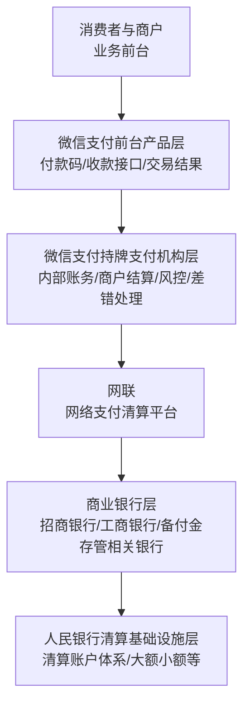
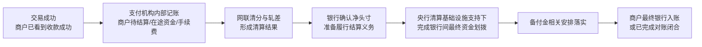
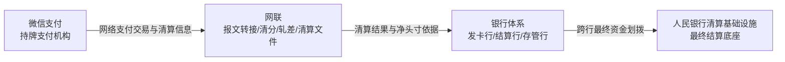
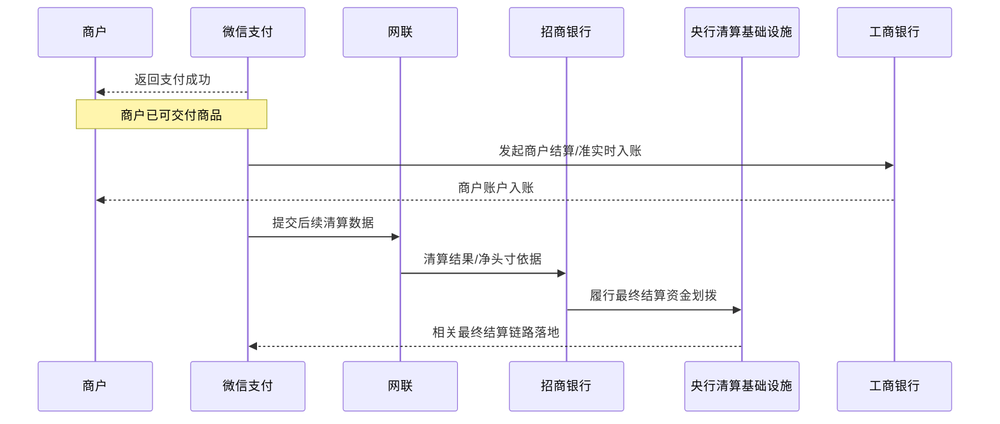

# 中国支付清结算体系示例：微信付款码支付（监管与央行清算基础设施视角增强版）

## 1. 写在前面：这份增强稿重点补什么

上一版文档已经从业务链路角度说明了“消费者扫付款码成功、商户看到已收款、后台再完成清算与结算”的基本机制。

这一版增强稿重点补足的是：

- 从 **监管视角** 看，为什么第三方支付机构不能任意直连银行完成网络支付清算
- 从 **央行清算基础设施视角** 看，为什么“支付成功”不等于“最终结算完成”
- 从 **基础设施分层视角** 看，网联、商业银行、备付金账户体系、人民银行支付系统分别承担什么职责
- 从 **法偿最终性** 角度看，哪一个时点才更接近严格意义上的“资金最终结清” 

这份文档不是替代原稿，而是作为原稿的监管/基础设施补充说明。它更适合：

- 支付行业新人建立制度层面的完整认知
- 产品、技术、运营理解“已收款”和“最终结算完成”的差异
- 从业人员理解网联、备付金、央行清算基础设施之间的边界

---

## 2. 监管与基础设施分层：不要把“微信支付”看成一个点

在业务讨论里，大家常把“微信支付”当成一个整体。但从监管与清结算角度，它至少可以拆成四层：

### 2.1 第一层：支付产品前台
这是消费者和商户直接接触到的部分：

- 消费者看到付款码
- 商户发起收款
- 页面返回“支付成功”“支付失败”
- 商户后台看到“已收款”“待结算”“已结算” 

这一层解决的是 **支付体验和交易受理问题**。

### 2.2 第二层：持牌支付机构经营层
这是“微信支付”作为第三方支付机构的经营实体能力，包括：

- 用户和商户账户体系管理
- 风控与交易路由
- 内部账务处理
- 商户结算管理
- 差错、撤销、退款、投诉、对账等处理

这一层解决的是 **支付机构内部账务与经营履约问题**。

### 2.3 第三层：网络支付清算基础设施层
典型就是 **网联**（部分业务场景也可能通过银联相关网络实现特定银行卡清算处理）。

这一层解决的是：

- 支付机构与银行体系之间的网络支付报文转接
- 清分、清算、轧差
- 清算文件生成
- 各参与机构净头寸的形成与确认

这一层解决的是 **跨机构网络支付清算组织问题**。

### 2.4 第四层：央行清算基础设施与银行间最终结算层
这一层是整个体系中最容易被业务人员忽略、但最关键的一层，包括：

- 人民银行清算账户体系
- 大额支付系统（HVPS）
- 小额批量支付系统（BEPS）
- 其他由央行组织或支撑的跨行支付清算基础设施安排

这一层解决的是：

> **银行间资金最终怎么划、划完之后何时具备最终结算效力。**

也就是说，前面三层更多是在做“交易确认、账务确认、清算组织”，而第四层才更接近“真实资金最终结清”。

---

## 3. 为什么支付机构不能任意直连银行完成网络支付清算

这是理解中国支付监管框架的第一原则。

### 3.1 早期直连模式的问题
在历史上，第三方支付机构曾广泛采用与多家银行分别直连的方式处理网络支付业务。直连模式的问题在于：

- 接口标准碎片化，不同银行报文、时序、风控差异大
- 清算关系复杂，双边关系太多
- 客户资金沉淀、路径不透明，监管穿透难度大
- 机构间对账、差错处理、风险隔离成本高
- 不利于统一监管、统一监测和系统性风险管理

因此，从监管角度看，网络支付业务需要纳入统一、持牌、可监管的清算基础设施体系。

### 3.2 当前典型监管逻辑
当前典型逻辑是：

- 支付机构负责前端交易受理和内部账务管理
- 银行负责账户管理、授权扣款、资金划拨
- 网络支付清算平台负责机构间报文转接、清分、轧差、清算组织
- 最终资金结算依赖央行清算账户体系及银行间支付系统完成

因此，本质上不是“微信支付不能和银行有任何技术连接”，而是：

> **网络支付清算不能再由支付机构以任意双边直连关系自行组织完成，而必须纳入持牌清算基础设施框架。**

### 3.3 对本案例意味着什么
在“微信付款码 + 招商银行卡 + 商户结算到工商银行”的案例中：

- 微信支付不能把“跨机构网络支付清算”简单理解为“我自己直接和招行、工行分别记一笔就结束”
- 典型模式下，微信支付发起的绑卡支付网络清算需要通过 **网联** 与银行体系对接
- 即使交易成功已经秒级返回，后续清算与最终结算仍需进入正式基础设施链路

---

## 4. 监管视角下的关键参与方边界

## 4.1 微信支付：产品前台与支付机构双重角色

### 业务视角
微信支付是一个产品：
- 用户打开微信即可付款
- 商户扫一下即可收款
- 交易结果秒级返回

### 监管视角
微信支付也是一个持牌支付机构，需要承担：
- 交易真实性与合规性管理
- 商户管理与结算管理
- 客户备付金相关管理义务
- 接入网络支付清算平台的合规义务
- 差错、投诉、风控、反洗钱等责任

所以，业务上说“微信支付收了钱”，监管上更准确的说法应是：

- 微信支付完成了交易受理
- 微信支付确认了对商户的付款责任
- 微信支付组织了后续清算与结算流程

而不是说“微信支付像银行一样直接完成了全部跨机构资金最终结算”。

## 4.2 网联：清算平台，不是最终资金所有者

网联在典型网络支付场景中的核心职责是：

- 交易报文转接
- 交易数据汇总
- 清分与轧差
- 清算文件生成
- 机构间头寸确认支持

必须特别强调：

> **网联负责网络支付清算，不等于网联本身就是所有资金的最终沉淀方，也不等于最终结算在网联层面自动完成。**

也就是说，网联解决的是“算账和组织清算”的问题，最终资金要不要、何时、如何在银行之间不可撤销地划过去，仍要进入银行间结算体系。

## 4.3 发卡行：消费者账户扣款责任主体

在本案例中，招商银行承担的是：

- 核验消费者账户与卡状态
- 判断余额、额度、风控规则
- 决定这 20 元能否被扣下
- 在后续清算和结算环节中，履行对应净付款义务

因此，招商银行的“授权/扣款成功”是交易成功的重要前提，但仍不是“全链路最终结算完成”的终点。

## 4.4 商户结算账户行：商户最终银行入账落点

工商银行在本场景下更重要的角色，是商户对公结算账户所在银行。

它关注的是：
- 微信支付何时发起商户结算
- 商户应入账多少
- 这笔入账是准实时、T+0 还是 T+1

因此，工商银行是商户最终银行存款体现的落点，但它看到商户账户入账，也不自动意味着上游发卡行到备付金安排的资金最终结清已经完全同步完成。

## 4.5 人民银行清算基础设施：最终结算的法定基础底座

这部分是监管视角里最核心的内容。

人民银行清算基础设施提供的是：

- 商业银行间清算账户基础
- 跨行支付资金划拨机制
- 最终结算的制度与技术底座
- 支付体系稳定性与系统性风险控制基础

如果不用监管语言，只用通俗语言来讲：

> 商户能在秒级看到“已收款”，是前台交易能力强；但银行之间的钱最终怎么算清、划清，靠的是央行清算基础设施这套后台底座。

---

## 5. 客户备付金集中交存：它到底改变了什么

## 5.1 什么是客户备付金
客户备付金，通俗理解就是：

- 支付机构在办理支付业务过程中，因客户委托支付而实际收受、待付或待清算的资金

在本案例里，消费者绑定招商银行卡支付 20 元，相关资金在支付机构清算结算链路里形成“应收、在途、待清算、待结算”的关系时，就会涉及客户备付金监管安排。

## 5.2 为什么要集中交存
集中交存的监管逻辑是：

- 避免支付机构把客户资金变成自己的自由资金池
- 降低挪用、期限错配、流动性风险
- 提高资金流向透明度
- 提升监管可穿透性
- 强化支付业务与支付机构自有资金之间的隔离

### 5.3 它对支付链路认知的影响
集中交存后，要特别避免一种错误理解：

> “微信支付内部记账说收到了 20 元” ≠ “微信支付就已经自由持有了这 20 元现金”。

更准确的理解是：

- 微信支付内部账务先记录权利义务和在途资金关系
- 真实资金要在合规备付金安排和银行间清算结算体系中逐步落实
- 支付机构并不能把客户资金当作不受约束的自有资金任意调度

### 5.4 对商户“已收款”的含义影响
商户看到“已收款”时，往往意味着：

- 微信支付已经确认对这笔交易承担商户付款责任
- 商户可基于该责任交付商品或服务

但从监管角度看，这不等于：

- 消费者侧资金已经完成从发卡行到备付金相关安排的最终结清
- 商户入账资金已经与上游原始消费者资金在时间上完全重合

---

## 6. 重新看三阶段：监管视角下每一阶段真正解决什么问题

## 6.1 交易（Transaction）：解决“这笔交易能不能成立”
监管并不否认交易阶段的快速性，反而要求：

- 交易真实性可核验
- 付款授权链条可追溯
- 风控、反欺诈、反洗钱要求得到执行
- 用户和商户能快速得到明确结果

所以交易阶段解决的是：

- 支付指令是否有效
- 消费者账户是否同意并具备支付条件
- 商户是否可以据此履约

它解决的是 **交易成立问题**，不是 **最终跨机构资金清偿问题**。

## 6.2 清算（Clearing）：解决“谁欠谁多少钱”
监管视角下，清算的关键词是：

- 清分
- 对账
- 头寸形成
- 轧差
- 清算文件
- 应收应付确认

在本案例中：

- 微信支付要确认自己对商户应付多少、应收手续费多少
- 招商银行要确认就该笔及同批次业务对外净应付多少
- 网联要形成清算结果并支持相关机构对净头寸达成一致

这一阶段解决的是 **债权债务和净头寸确认问题**。

## 6.3 结算（Settlement）：解决“真钱什么时候最终划清”
监管视角下，结算关注的不是页面展示，而是：

- 银行间清算账户是否已经实际划拨
- 哪一笔或哪一批净额义务是否已经履行完毕
- 该资金转移是否达到最终结算状态

因此，交易成功是“可履约”，清算完成是“账算明白”，最终结算完成才是“资金最终交割完成”。

---

## 7. 为什么“支付成功”不等于“最终结算完成”

这是支付行业最重要、也最容易被外部误解的一句话。

## 7.1 从业务前台看
支付成功表示：

- 用户付款动作成立
- 发卡行授权/扣款成功
- 微信支付确认交易成立
- 商户可以交付奶茶

这已经足以支撑业务闭环。

## 7.2 从支付机构账务看
支付成功后，微信支付会先做内部账：

- 商户待结算增加
- 手续费收入确认
- 渠道在途头寸记录
- 后续清算和结算任务生成

这是 **账务确认**，不是最终跨行资金交割。

## 7.3 从清算基础设施看
交易成功之后，还要经历：

- 网联汇总交易并清分
- 形成清算文件
- 轧差出净头寸
- 银行按净头寸进入后续结算安排

这属于 **清算完成过程**。

## 7.4 从央行清算基础设施看
只有当：

- 相关银行基于清算结果完成清算账户资金划拨
- 资金在法定支付清算基础设施支持下完成最终转移

才更接近严格意义上的 **最终结算完成**。

所以可以概括为：

> 交易成功，是业务世界里的“这单成了”；最终结算完成，是基础设施世界里的“这笔钱真正结清了”。

---

## 8. 网联负责什么，不负责什么

## 8.1 网联负责什么
在本案例中，网联典型负责：

- 支付机构到银行之间的网络支付报文转接
- 支付交易信息标准化流转
- 清分与清算组织
- 清算文件生成
- 净头寸形成
- 为后续结算提供清算依据

## 8.2 网联不负责什么
网联不应被理解为：

- 所有交易资金最终沉淀的商业主体
- 替代发卡行完成消费者账户管理的主体
- 替代商户结算账户行完成商户入账的主体
- 替代央行清算基础设施实现所有最终法偿结算的主体

### 8.3 最容易说错的一句话
不够严谨的说法是：
- “网联把钱从招行打到工行”

更严谨的说法应是：
- “网联组织网络支付清算、形成清算结果；相关最终资金结算仍通过银行体系和央行清算基础设施完成。”

---

## 9. 央行清算基础设施在这笔 20 元支付里到底扮演什么角色

## 9.1 它不是页面上的角色，但它是最终结算的底座
用户和商户通常看不到这层，因此容易误以为：

- 商户手机上出现“已收款”
- 那么整条资金链也已经彻底完成

但实际上，页面展示的是业务结果，真正把跨机构资金最终落地的，是央行清算基础设施支持下的银行间清算安排。

## 9.2 它承担的是“最终性”角色
所谓最终性，可以通俗理解为：

- 不再只是“某机构账上记了待清算”
- 不再只是“某个系统说这笔应收应付成立了”
- 而是银行间相关资金义务已经最终清偿

在监管和支付体系稳定性视角下，这一点极其关键。

## 9.3 为什么要强调“法偿最终性”
因为支付体系不是只看交易快不快，还要看：

- 机构之间最终有没有真正把钱结清
- 结清之后是不是具备稳定、可确认、不可随意逆转的效力
- 一旦出现机构流动性紧张、差错、系统故障，谁对谁还剩什么义务

所以，最终结算不是一个“附属动作”，而是支付体系能否稳定运行的根基之一。

---

## 10. 商户已收款，为什么不一定等于银行体系最终结算完成

## 10.1 商户看到的是“商业可履约结果”
商户在前台看到“已收款”，通常意味着：

- 这笔订单已经被微信支付确认成功
- 商户可以放心交付商品
- 从商业上，微信支付已经承接了对商户的付款责任

这对线下零售场景至关重要，因为商户不可能等银行间最终结算全部跑完再给用户奶茶。

## 10.2 基础设施看到的是“后台资金链条还在继续跑”
在商户已经放货之后，后台可能还在继续完成：

- 网联清分和清算文件生成
- 招商银行净付款义务确认
- 基于央行清算账户体系的最终资金划拨
- 备付金相关安排落地
- 微信支付与商户结算安排的最后闭合

因此，从时间维度看，存在明显的层次错位：

- **前台业务成功**：秒级
- **清算完成**：批次化或系统节奏化
- **最终结算完成**：取决于具体基础设施与清算周期安排

## 10.3 为什么这种错位是合理且必要的
因为现代支付体系追求两个目标同时成立：

1. 用户和商户体验足够快
2. 金融基础设施层面的结算足够稳、足够可监管

这就天然会形成“前台快确认、后台分层完成”的结构。

---

## 11. 垫资结算、轧差清算、最终结算：监管语言下怎么理解

## 11.1 垫资结算
垫资结算是指支付机构基于自身合规头寸安排、风控能力和商业规则，先向商户履行结算义务。

在本案例中表现为：

- 商户很快甚至准实时收到工商银行入账
- 但消费者侧资金对应的跨机构最终结算稍后才完成

监管视角下，垫资结算强调的是：
- 这是支付机构对商户的先行履约安排
- 它不改变上游资金仍需经正式清算结算基础设施最终落地的事实

## 11.2 轧差清算
轧差清算是把大量交易应收应付互相抵销，只按净额组织后续结算。

监管价值在于：
- 降低流动性占用
- 提升清算效率
- 降低逐笔划转压力
- 提高系统运行稳定性

## 11.3 最终结算
最终结算强调：

- 相关净额资金义务已经最终清偿
- 不再停留在“内部待结算”或“清算结果待落地”状态
- 具备正式基础设施支持下的最终性

这三个概念的关系可以概括为：

- **垫资结算**：先对商户履约
- **轧差清算**：先把账算成净额
- **最终结算**：再把净额真钱最终划清

---

## 12. 监管视角的 Mermaid 图

### 12.1 监管分层关系图

**图示说明：**
- 这张图不是交易时序图，而是监管分层图。
- 它强调：业务前台只是最上层，越往下越接近法定清算基础设施。
- 微信支付不是单一节点，而是同时覆盖产品层和持牌机构层。

### 12.2 交易成功到最终结算的监管链路图

**图示说明：**
- 这张图强调的是“从业务成功到基础设施最终结清”的后台路径。
- 交易成功只是起点，不是终点。
- 监管最关心的是后半段：清算结果、净头寸、最终资金划拨、备付金安排与商户结算闭合。

### 12.3 网联与央行基础设施的职责边界图

**图示说明：**
- 网联和央行基础设施不是同一个层级的职责。
- 网联更偏“清算组织”，央行基础设施更偏“最终结算底座”。
- 把两者混成一个概念，是支付新人最常见的误区之一。

### 12.4 商户先收款、最终结算后完成的时间错位图

**图示说明：**
- 这张图用时间顺序说明：商户已收款，可能发生在最终结算之前。
- 它对应的就是支付行业里常见的“前台先成功、后台后结清”的结构。

---

## 13. 监管视角时间轴

| 时间点 | 业务视角看到什么 | 监管/基础设施视角发生什么 |
|---|---|---|
| T时刻 | 消费者出示付款码，商户发起收款 | 支付指令开始进入受理链路 |
| T+秒级 | 商户看到支付成功 | 发卡行完成授权/扣款判断，支付机构内部先记账 |
| T+秒级后 | 商户已可放货 | 清算数据进入网联，后续等待清分、轧差、头寸确认 |
| T+批次 / T+0 / T+1 | 商户可能看到待结算转已结算 | 网联生成清算结果，银行按净头寸进入后续结算安排 |
| T+0 / T+1 | 商户对公账户可能已入账 | 支付机构完成商户结算组织，商户侧银行存款体现 |
| 最终结清时点 | 前台通常无新增可见动作 | 银行基于央行清算基础设施完成最终资金划拨，相关资金义务最终清偿 |

### 时间轴核心结论

对外部最重要的三个时点，其实不是一个时点：

1. **交易成功时点**：用户与商户关心
2. **商户入账时点**：商户财务关心
3. **最终资金结清时点**：监管、基础设施和清算体系最关心

---

## 14. 监管视角下最容易混淆的 6 个判断

### 14.1 “支付成功”就等于“钱已经最终到商户银行了”
不对。支付成功首先是交易成立和支付机构确认履约责任。

### 14.2 “网联处理了这笔交易”就等于“网联完成了最终结算”
不对。网联重点是网络支付清算，不是把所有最终结算概念都包进去。

### 14.3 “微信支付内部已经记账”就等于“真实资金已经全部到位”
不对。内部账务、备付金账务、银行间最终资金划拨，是三个层次。

### 14.4 “商户银行已入账”就一定意味着“消费者资金也已最终结清”
不一定。存在准实时入账、垫资结算等时间错位情况。

### 14.5 “备付金”就是“支付机构自己的钱”
不对。备付金监管恰恰强调客户资金与支付机构自有资金隔离。

### 14.6 “清算”和“结算”只是同义词
不对。清算是算账和形成净头寸，结算是真实资金最终划拨。

---

## 15. 总结：如果从监管与央行清算基础设施视角只记住三句话

### 第一句
**支付机构负责前台受理和内部账务，但不能脱离持牌清算基础设施任意组织网络支付清算。**

### 第二句
**网联负责网络支付清算组织，不等于替代央行清算基础设施完成所有最终结算。**

### 第三句
**商户看到“已收款”是业务履约结果；银行体系“最终结算完成”则是更靠后的基础设施结清结果。**

如果把这笔 20 元奶茶付款用一句监管视角的话总结：

> 微信支付前台让交易秒级成功，网联让跨机构网络支付清算有统一通道，备付金集中交存保证客户资金隔离，而真正决定这笔跨机构资金何时最终结清的，仍是央行清算基础设施支持下的银行间最终结算体系。
