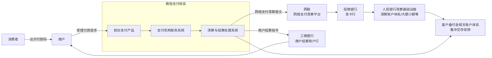
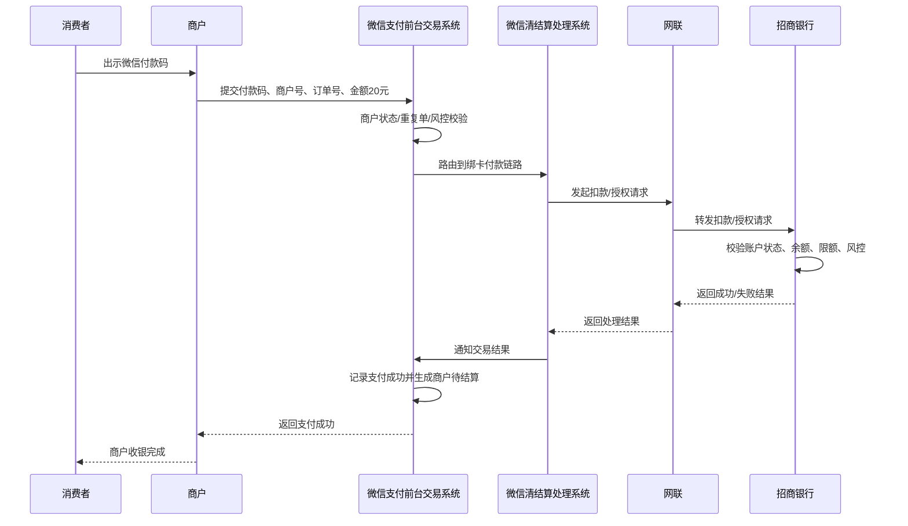
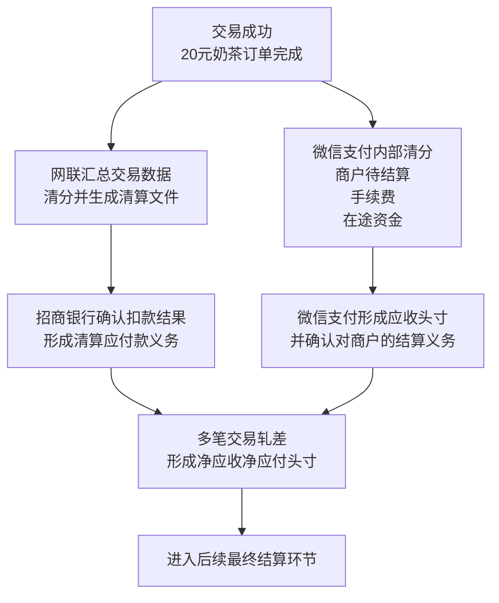
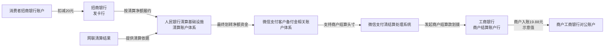
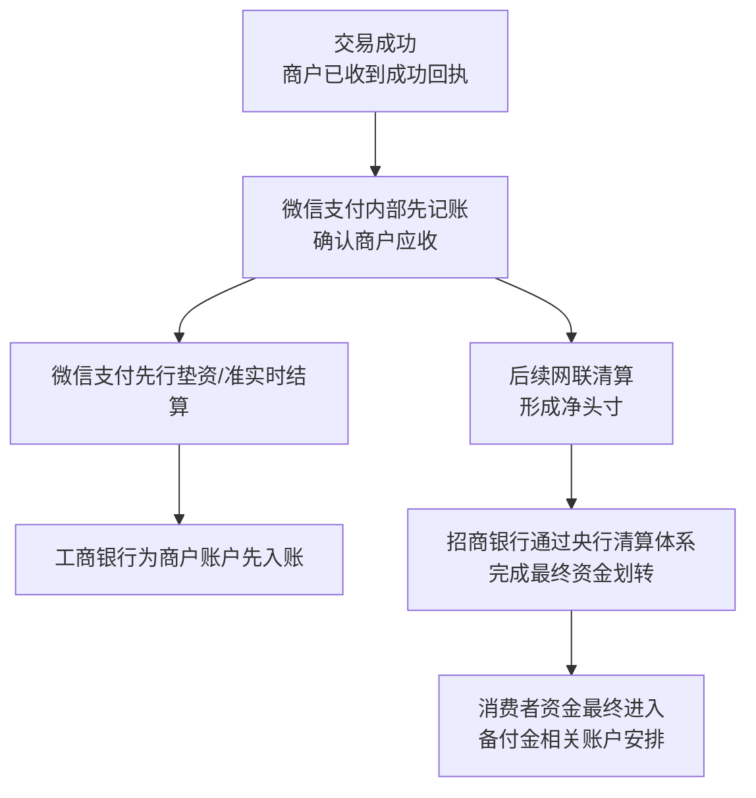

# 中国支付清结算体系示例：微信付款码支付

## 1. 场景设定

我们以一笔贴近中国支付基础设施实际的线下付款码支付为例：

- 消费者在商场购买一杯 **20 元奶茶**
- 消费者使用 **微信付款码** 支付
- 消费者绑定的付款账户是 **招商银行借记卡**
- 商户接入 **微信支付**，商户结算账户为 **工商银行对公账户**
- 发卡行（招商银行）与商户结算账户行（工商银行）不是同一家银行
- 微信支付作为第三方支付机构，不能像早期那样以任意双边直连方式完成网络支付清算；在典型网络支付清算场景下，需要通过 **网联**（部分场景也可能通过银联）接入银行体系
- 需要同时考虑：
  - 客户备付金集中交存
  - 网络支付清算平台的报文转接与清算职能
  - 最终跨机构资金结算依赖人民银行清算账户体系及相关支付系统
  - 在部分商业安排下，微信支付可能对商户实行 **准实时入账** 或 **垫资结算**，即商户先看到“已收款/可结算”，而消费者资金稍后才完成最终跨机构结清

这里必须先区分两个层面：

1. **买卖双方的支付行为**：消费者向商户支付 20 元，商户看到支付成功。
2. **金融基础设施层面的处理过程**：微信支付、网联、招商银行、工商银行、央行清算体系之间，如何传递交易信息、形成应收应付、再完成最终资金划转。

因此，“支付成功”只是用户侧体验结果，不等于所有金融机构之间的清算、结算都已完成。

---

## 2. 参与方与角色说明

### 2.1 消费者
付款人，在线下出示微信付款码，授权从其绑定的招商银行卡扣款。消费者感知到的是“我付了 20 元”。

### 2.2 商户
收款人，使用微信支付受理付款码支付。商户感知到的是“我收到一笔 20 元订单款”，但商户看到的“已收款”可能只是微信支付侧已确认承担付款责任或已完成内部记账，不必然代表银行体系最终结算已经全部完成。

### 2.3 微信支付（建议拆成三个视角理解）
微信支付在实际业务里同时扮演两个角色：

#### （1）前台支付产品
即用户和商户接触到的“微信支付”能力：
- 消费者在微信里生成付款码
- 商户 POS / 扫码设备调用微信支付接口受理交易
- 返回支付成功、失败、撤销、退款等业务结果

这个层面更偏 **业务前台** 和 **支付产品体验**。

#### （2）支付机构账务系统
即第三方支付机构内部账务：
- 记录消费者交易成功
- 记录商户待结算金额
- 记录手续费、渠道成本、在途资金、备付金映射关系
- 形成商户应收、机构应付、渠道应收应付等内部账务头寸

这个层面是 **账务流** 核心，不等于真实资金已经跨行划转。

#### （3）清算与结算处理系统
即微信支付作为支付机构，面向外部清算基础设施和银行体系：
- 通过网联（或部分场景银联）发起/接收网络支付清算报文
- 与发卡行、备付金存管银行、商户结算银行衔接
- 组织商户结算、备付金调拨、清算差错处理等

这个层面更偏 **监管/基础设施视角**。

### 2.4 招商银行（发卡行）
消费者绑定卡所属银行。其核心职责：
- 校验持卡人账户状态、余额、风控、限额
- 对扣款请求做授权/扣款处理
- 形成对网络支付清算平台/支付机构的应付款
- 在最终结算阶段，通过其在央行的清算账户参与跨机构资金划转

### 2.5 工商银行（商户结算账户行）
商户对公结算账户所在银行。其核心职责：
- 接收微信支付发起的商户结算入账指令
- 为商户对公账户记账入账
- 在银行体系最终清算完成后，对其自身头寸和清算账户进行对应处理

要注意：工商银行在这里通常不是线下受理端“收单机构”的独立主体，因为本题设定中商户在微信支付入驻，微信支付通常同时承担聚合后的受理与收单结算职责。工商银行更多体现为 **商户结算账户行**。

### 2.6 网联（典型）/ 银联（部分适用）
在本场景中，重点应理解 **网联清算有限公司** 所承担的网络支付清算平台角色：
- 作为支付机构与商业银行之间网络支付清算的持牌基础设施
- 负责报文转接、交易清分、轧差计算、清算文件生成等
- 不等于“替代所有银行直接持有客户资金”，也不等于最终资金都沉淀在网联

在部分条线、部分银行合作或特定支付业务中，也可能通过银联网络实现银行卡相关清算处理，但就“微信绑定银行卡的网络支付”这一典型表述，**网联是更符合当前主流监管框架的描述**。

### 2.7 备付金存管银行 / 客户备付金账户体系
第三方支付机构的客户备付金需集中交存。可以理解为：
- 支付机构不能像早期那样将客户资金分散沉淀、自由调度
- 客户备付金需按照监管要求存放于指定体系中
- 支付机构内部账务记录“应收了消费者的 20 元”，并不意味着其已自由占有这 20 元现金

因此，**备付金账务** 是一个独立概念，它既不同于微信支付内部商户账，也不同于银行间最终清算划转本身。

### 2.8 人民银行清算基础设施
包括但不限于：
- 人民银行相关清算账户体系
- 大额支付系统（HVPS）
- 小额批量支付系统（BEPS）
- 超级网银（IBPS）等基础设施中的适用环节

本题不必机械限定某一笔一定走哪条具体通道，但需要把握核心：

> **最终跨机构资金结算，落点依然是央行清算账户体系支持下的银行间最终清算。**

也就是说，招商银行与工商银行、备付金相关账户之间的最终资金转移，不是微信支付自己“喊一声就算完成”，而是要依赖法定清算基础设施实现最终结清。

---

## 3. 三阶段详细分析

## 3.1 交易（Transaction）

### 3.1.1 这一阶段解决的核心问题
交易阶段的目标不是“把所有钱立刻跨机构结清”，而是：

- 确认消费者是否愿意支付
- 确认付款账户是否可用、余额/额度是否足够
- 确认这笔 20 元是否被微信支付和银行体系认可为有效支付指令
- 让商户在秒级得到“是否收款成功”的结果

换句话说，交易阶段本质上是 **支付指令受理、验证、授权、结果返回**。

### 3.1.2 典型交易步骤
以消费者出示付款码、商户扫码为例：

#### 步骤1：消费者出示付款码
- 消费者打开微信付款码页面
- 微信前台支付产品生成动态付款码/付款凭证
- 商户收银员或设备扫码

此时发生的是 **支付行为的发起**，还没有发生银行间最终资金划转。

#### 步骤2：商户受理请求进入微信支付
商户的扫码设备 / POS / 收银系统将以下信息提交给微信支付前台交易系统：
- 付款码标识
- 商户号、门店号、终端号
- 订单号
- 交易金额 20 元
- 商品简要信息、时间戳、风控辅助信息等

#### 步骤3：微信支付识别付款工具并做前置校验
微信支付识别出：
- 该付款码对应某个微信用户
- 该用户当前扣款工具为招商银行卡
- 当前交易需走“绑定银行卡付款”的付款链路

微信支付会先做一轮前置判断：
- 商户状态是否正常
- 交易是否重复
- 风控是否命中
- 用户账户状态是否异常

#### 步骤4：微信支付通过网联向招商银行发起扣款/授权请求
这是中国实际基础设施里非常关键的一步：

- 微信支付不能随意与所有银行“自己搭一条线”完成网络支付清算
- 对于这类网络支付扣款，典型模式下由 **微信支付 -> 网联 -> 招商银行** 传递交易报文

报文中通常包含：
- 交易流水号
- 用户标识映射信息
- 扣款账户标识（脱敏/令牌化后的信息）
- 金额 20 元
- 商户信息
- 场景信息
- 风控辅助字段

#### 步骤5：招商银行完成授权/扣款判断
招商银行作为发卡行，基于自身核心系统和风控系统判断：
- 卡状态是否正常
- 账户余额/可用额度是否足够
- 是否超限
- 是否疑似欺诈

若通过，则招商银行返回成功结果；若不通过，则返回失败原因。

在很多实际实现里，这一步既可能表现为“授权成功并立即扣账”，也可能表现为“先冻结/预扣、后正式入账确认”。对用户来说通常看到的是余额已减少或可用余额已减少。

#### 步骤6：结果经网联返回微信支付
- 招商银行 -> 网联：返回授权/扣款结果
- 网联 -> 微信支付：返回处理结果

#### 步骤7：微信支付内部先记账并返回商户成功
如果结果成功，微信支付会先在内部做账：
- 记消费者侧支付成功
- 记商户侧形成一笔待结算收入（扣除手续费规则后形成可结算金额）
- 记渠道清算在途头寸

随后，微信支付向商户返回“支付成功”，商户收银完成。

### 3.1.3 这一阶段的信息流特点
交易阶段最核心的是 **信息流先行**：

- 消费者 -> 商户：展示付款凭证
- 商户 -> 微信支付：提交收款请求
- 微信支付 -> 网联 -> 招商银行：请求授权/扣款
- 招商银行 -> 网联 -> 微信支付 -> 商户：返回支付结果

### 3.1.4 这一阶段的账务特征
典型特征是：

> **先确认交易、先做内部记账，后续再进入清算和最终结算。**

也就是说，商户看到“收款成功”时，通常意味着：
- 微信支付愿意确认这笔交易有效
- 招商银行已返回可扣款/已扣款信息
- 微信支付内部账务已经把商户应收先记上

但此时不应理解为：
- 招商银行与工商银行之间已经完成最终跨行资金划转
- 央行清算账户体系下的最终结清已经完成

这正是“支付成功不等于最终结算完成”的第一层体现。

---

## 3.2 清算（Clearing）

### 3.2.1 清算阶段解决的核心问题
清算不是“真钱已经最终到了对方银行账户”，而是：

- 对交易信息进行确认、汇总、清分
- 计算各参与方之间应收应付
- 形成待结算头寸
- 为后续最终资金结算提供依据

在行业语言里，清算更强调 **算账、对账、轧差、确认债权债务**。

### 3.2.2 本场景中的清算对象
在本场景里，至少涉及几个层次的清算关系：

#### （1）微信支付内部清分
微信支付需要把这 20 元交易拆解成：
- 商户应收金额
- 微信支付应收手续费
- 渠道成本/网络支付清算相关成本
- 在途资金头寸

例如，仅示意：
- 订单金额：20 元
- 假设商户手续费率对应手续费 0.12 元
- 商户净应结算：19.88 元

那么微信支付内部会形成：
- 商户待结算 +19.88
- 平台手续费收入 +0.12
- 渠道应收/在途备付金映射 +20

这属于 **支付机构内部账务清分**，不是银行间清算本身。

#### （2）网联层面的网络支付清算
网联会接收和汇总来自微信支付及银行侧的交易数据，完成：
- 交易匹配
- 清算文件生成
- 应收应付计算
- 多笔交易轧差后形成净头寸

对于单笔交易可以理解为：
- 招商银行因该笔交易，形成对支付机构相关结算安排的付款义务 20 元
- 微信支付或其备付金安排项下形成相应应收 20 元

但在实际清算里，通常不是“每一笔都单独实时全额清算”，而是：

> 大量交易先汇总，按清算周期进行 **轧差清算**。

#### （3）银行体系头寸确认
招商银行、备付金相关账户体系、工商银行等还需要基于清算结果确认：
- 本清算周期净应付多少
- 本清算周期净应收多少
- 哪些资金已在途
- 哪些待下一批次最终结算

### 3.2.3 什么是“轧差清算”
轧差清算，简单说就是：

- 不对每一笔都逐笔拉真钱
- 而是先把一段时间内大量双向、多边交易汇总
- 计算净额后，只按净额发起最终资金划转

例如，在某一清算批次中：
- 招商银行经网联对应微信支付相关业务总应付 1 亿元
- 同期又有其他反向业务让其总应收 2000 万元
- 那么轧差后净应付 8000 万元

最终结算看的是 **净头寸**，而不是每笔原始交易逐笔拉清算资金。

### 3.2.4 清算与交易成功返回的时间关系
这是新人最容易混淆的地方之一。

**交易成功返回通常发生在秒级；清算往往在其后按系统节奏持续进行。**

也就是说：
- T 时刻消费者发起付款
- T+几秒内商户看到支付成功
- 但 T+批次、T+0、T+1 才陆续完成清分、清算文件生成、净头寸确认

因此，交易成功更多是业务前台“订单已经被确认可履约”的信号；清算完成则是金融机构之间“账算明白了”的信号。

### 3.2.5 清算阶段形成的债权债务关系
从业务直觉上可这样理解：

#### 交易成功后，微信支付对商户承担付款责任
一旦微信支付向商户回“成功”，在商业上通常意味着：
- 商户可认为该笔款项已由微信支付体系确认
- 微信支付对商户形成一笔结算义务

#### 招商银行对支付清算链路承担资金支付义务
当招商银行确认扣款成功后，意味着：
- 对应消费者账户已被扣减/控制
- 招商银行需按清算规则，在后续向支付机构备付金相关安排或相应清算安排履行资金支付义务

#### 网联本身主要是清算基础设施，不是最终收款经营主体
网联负责：
- 传递报文
- 组织清算
- 形成净头寸

网联并不是这笔 20 元奶茶交易的“商业收款人”。其角色重点在 **清算组织和基础设施**。

---

## 3.3 结算（Settlement）

### 3.3.1 结算阶段解决的核心问题
结算的关键是：

> **真实资金最终怎么划走、划到哪里、何时不可撤销地完成结清。**

结算阶段关注的是：
- 发卡行的钱最终怎么出去
- 支付机构相关备付金头寸怎么落实
- 商户什么时候真正拿到可支配银行存款
- 哪个时点属于最终结算完成

### 3.3.2 本场景中的典型结算主线
一个贴近中国实际的典型理解路径如下：

#### 第一步：招商银行侧完成对消费者账户扣款
从消费者视角看，20 元已从招商银行卡账户扣除，或至少进入不可自由支配状态。

但这只是 **消费者账户层面的扣账**，不等于跨机构全部结清。

#### 第二步：基于网联清算结果，发卡行与备付金/清算账户体系完成资金划转
根据网联生成的清算结果：
- 招商银行需履行相应净付款义务
- 相关资金通过银行间清算与央行清算账户体系支持的基础设施完成划转
- 最终落到与微信支付客户备付金安排相关的账户体系中，或落实到相应清算结算安排中

这里要强调：
- **网联负责清算组织与数据处理，不等同于最终资金永远“停在网联”**
- 最终结算是银行体系、央行清算账户体系支撑下完成的

#### 第三步：微信支付基于自身账务与头寸，对商户发起结算
微信支付对商户的结算可以有不同策略：
- D0/T+0 准实时结算
- T+1 结算
- 按商户合同约定的结算周期结算

当微信支付向工商银行发起商户入账时：
- 工商银行为商户对公账户入账
- 商户银行账户余额增加

此时完成的是 **商户结算入账**，但它与“发卡行到备付金的最终清算”在时间上不一定严格同刻。

### 3.3.3 备付金、银行间清算、商户入账三者关系
这是本题必须重点说明的核心。

#### （1）备付金
是支付机构客户资金相关的监管性、资金存放性安排。它反映：
- 支付机构不能把客户待清算资金当成自己的自由资金池随意运作
- 客户资金需要在合规框架下集中交存和管理

#### （2）银行间清算/最终结算
这是招商银行、工商银行、备付金相关银行账户、央行清算账户体系之间完成的 **最终资金划转过程**。这一步决定“真钱是否最终不可撤销地完成跨机构转移”。

#### （3）商户入账
这是商户最终看到自己工商银行对公账户余额增加的过程。它是商户侧最关心的结果，但不必然与消费者银行侧扣款后的最终跨机构清算同一瞬间发生。

### 3.3.4 什么是“最终结算”
最终结算可以理解为：

- 相关银行/清算账户之间的资金划转已经完成
- 该笔或该批净额资金义务已经得到最终清偿
- 不再只是“内部账上记了一笔”或“待清算头寸”

在监管/基础设施视角下，这才是严格意义上的 **资金结清**。

### 3.3.5 什么是“垫资结算”
垫资结算是指：

- 微信支付基于对交易成功、风控可控、历史清算可回收的判断
- 先使用自身可调度的合规资金头寸或既有清算头寸
- 提前向商户结算入账
- 后续再等待消费者资金通过发卡行 -> 清算体系 -> 备付金相关安排最终到位

这意味着：
- 商户可能 **先收到钱**
- 但消费者资金对应的跨机构最终结清 **稍后才完成**

因此，商户“已收款”与银行体系“最终结算完成”不是同一时刻。

### 3.3.6 本场景下可能出现的两种模式

#### 典型模式A：先交易成功，后清算，后结算
顺序大致为：
1. 秒级交易成功
2. 清算批次确认应收应付
3. 发卡行资金最终进入备付金相关安排
4. 微信按结算周期给商户结算

这是比较稳健、易理解的标准链路。

#### 可能变体B：微信先给商户准实时入账/垫资结算
顺序可能为：
1. 秒级交易成功
2. 微信内部先记商户应收并快速发起商户入账
3. 工商银行先给商户账户记账
4. 稍后发卡行资金再通过网联清算结果与央行清算账户体系完成最终结清

这就是题目要求特别指出的“商户可能先收到钱，但消费者资金稍后才完成最终清算”的情形。

---

## 4. 信息流、账务流、资金流的区别

这是理解中国支付清结算最关键的一组概念。

### 4.1 信息流
指交易信息、授权信息、清算报文、对账文件等数据的传递。

例如本案例中：
- 商户把 20 元付款请求发给微信支付
- 微信支付通过网联向招商银行发扣款请求
- 招商银行返回成功
- 网联生成清算文件

这些都属于 **信息流**。信息流可以非常快，往往秒级完成，但并不等于钱已经最终到账。

### 4.2 账务流
指各机构在自己账本上如何记账。

例如：
- 微信支付记一笔“商户待结算 +19.88”
- 微信支付记一笔“手续费收入 +0.12”
- 招商银行记消费者账户减少 20 元
- 工商银行记商户账户增加 19.88 元（若已结算入账）

这些属于 **账务流**。账务流反映权利义务、资产负债和头寸变化，但也不必然等同于跨机构真实现金已完成最终清算。

### 4.3 真实资金流
指真正发生在银行账户、清算账户之间的可结清资金划转。

例如：
- 招商银行在央行清算账户体系支持下，把净额资金划出
- 资金进入与微信支付备付金安排相关的账户体系
- 微信支付再向工商银行发起商户结算资金划拨
- 工商银行为商户账户入账

这才是 **真实资金流**。

### 4.4 三者的联系
可以把三者理解为三个不同层级：

1. **信息流先跑**：先确认交易能不能做
2. **账务流跟进**：各参与方先把应收应付和内部头寸记清楚
3. **资金流最终落地**：跨机构资金通过清算结算基础设施最终转移

所以：
- 信息流最先发生
- 账务流可能与信息流几乎同步，也可能按批次处理
- 资金流则受清算周期、结算周期、银行处理时点影响

这也是为什么：

> **支付成功 ≠ 清算完成 ≠ 最终结算完成**

---

## 5. Mermaid 图

## 5.1 整体参与方关系图

**图示说明：**
- 左侧的消费者、商户，是支付业务参与方。
- 中间的微信支付体系，既有前台支付产品角色，也有支付机构账务与清结算处理角色。
- 网联是网络支付清算基础设施，负责报文转接、清分、轧差，不等于商业收款人。
- 招商银行、工商银行是银行机构。
- 人民银行清算基础设施和客户备付金相关账户体系，体现的是监管/基础设施视角下的最终资金清算与资金存放安排。

---

## 5.2 交易阶段信息流时序图

**图示说明：**
- 这张图重点是交易阶段的 **信息流与授权流**。
- 秒级返回“支付成功”，依赖的是发卡行校验成功以及微信支付内部先记账、先确认收款责任。
- 到这一步，商户已经可以交付商品，但并不代表银行体系最终资金已结清。

---

## 5.3 清算阶段债权债务形成图

**图示说明：**
- 交易成功后，不是立刻所有机构逐笔真实打款，而是先进入清分、对账、应收应付确认。
- 微信支付内部先形成商户待结算和渠道在途头寸。
- 网联侧汇总大量交易并进行 **轧差清算**，形成净额头寸，后续再进入最终结算。

---

## 5.4 结算阶段资金流图

**图示说明：**
- 消费者账户扣减 20 元，只说明付款人账户已被扣账。
- 真正跨机构结清，要看招商银行依据清算结果，通过央行清算基础设施把净额资金完成最终划转。
- 微信支付再基于备付金相关头寸和自身结算安排，向工商银行发起商户结算。
- 商户到账金额通常是扣除手续费后的净额，这里 19.88 元仅为示意。

---

## 5.5 微信可能先行给商户结算的变体图

**图示说明：**
- 这是题目要求特别强调的变体：**商户可能先入账，消费者资金稍后才最终结清。**
- 其本质是微信支付基于自身账务、风险控制和合规头寸安排，对商户先做结算。
- 因此，商户看到“已收款”往往是商业结算结果，不等于银行间最终资金结算已经同时完成。

---

## 6. 关键时间轴

| 时间点 | 可能发生的事情 | 说明 |
|---|---|---|
| T时刻 | 消费者出示微信付款码，商户扫码发起 20 元收款 | 支付行为发起，进入交易受理 |
| T+秒级 | 微信支付经网联向招商银行完成授权/扣款判断，并向商户返回支付成功 | 这是交易确认时点，重点是信息流和授权结果返回 |
| T+秒级至T+批次 | 微信支付内部记账，形成商户待结算、手续费、在途资金等账务；网联开始汇总清算数据 | 属于内部账务流和清算准备，不等于最终资金结清 |
| T+批次 / T+0 / T+1 | 网联完成清分、轧差，形成净应收应付头寸；招商银行等机构按清算结果准备或发起结算 | 清算通常按批次和规则运行 |
| T+0 / T+1 | 微信支付按商户结算规则向工商银行发起结算，商户对公账户入账 | 商户入账时点取决于商户合同、产品规则、头寸安排 |
| 最终资金结清时点 | 招商银行基于清算结果，通过央行清算账户体系支持的基础设施完成净额资金最终划转，相关备付金/清算账户落实到位 | 这是严格意义上的最终结算完成 |

### 时间轴补充说明

- 对用户和商户来说，最敏感的是 **T+秒级支付成功**。
- 对支付机构来说，核心还包括 **后续清算、头寸管理、备付金与商户结算组织**。
- 对监管/基础设施视角来说，真正重要的是 **最终资金是否在法定清算基础设施下完成结清**。

---

## 7. 容易混淆的概念辨析

### 7.1 “支付成功”不是“最终结算完成”
支付成功通常表示：
- 交易信息验证通过
- 发卡行授权/扣款成功
- 微信支付确认对商户承担付款责任

但并不天然表示：
- 清算文件已经全部生成
- 轧差头寸已经最终确认
- 银行间最终资金已经通过央行清算账户体系划转完毕

### 7.2 “清算”不是“结算”
- **清算**：算清楚谁应收、谁应付、净额多少。
- **结算**：把真钱按净额最终划过去。

前者是“算账”，后者是“交钱”。

### 7.3 “微信支付内部账务”不是“备付金账务”
- 微信支付内部账务：记录商户待结算、手续费、在途头寸等。
- 备付金账务：反映客户资金在监管框架下的集中交存安排。

二者关联紧密，但不是同一本账，也不是同一个法律/监管概念。

### 7.4 “备付金账务”不是“银行间最终清算资金划转”
即便备付金相关头寸已经在账上反映，也不代表银行间最终清算已经完成。最终划转仍要依赖央行清算账户体系支持下的支付基础设施。

### 7.5 “垫资结算”是什么意思
垫资结算不是凭空创造资金，而是支付机构基于自身合规资金安排和风险判断：
- 先把钱结给商户
- 后续再等消费者侧资金最终清算到位

因此，垫资结算强调的是 **时间错配下的先行履约**。

### 7.6 “轧差清算”是什么意思
轧差清算是把一段时间内的大量应收应付相互抵销，只对净额做最终结算，降低资金搬运量和清算压力。

### 7.7 “最终结算”是什么意思
最终结算是指：
- 资金已在法定清算体系支持下不可撤销地划转完成
- 债务义务已经最终清偿
- 不再只是内部记账或待处理头寸

### 7.8 微信支付为什么同时是“支付产品前台”和“支付机构”
这是理解微信支付非常关键的一点。

#### 业务视角
用户看到的是：
- 微信里能展示付款码
- 商户扫一下就能收款
- 界面显示支付成功

这是 **支付产品前台能力**。

#### 监管/基础设施视角
真正支撑其落地的是：
- 支付机构账户体系
- 交易路由与风控
- 对接网联/银行的清算链路
- 商户结算、备付金管理、差错处理

这是 **支付机构能力**。

所以，“微信支付”对外看像一个产品，对内实际上是一整套支付机构经营与清结算系统。

### 7.9 为什么商户看到“已收款”与银行体系“最终结算完成”不是同一时刻
因为商户看到的是：
- 微信支付已经确认这笔订单成立
- 微信支付对商户承担了付款责任
- 甚至微信支付已经先把商户账记好或先给商户入账

而银行体系最终结算关注的是：
- 发卡行资金是否已按清算净额最终划出
- 央行清算账户体系支持下的资金是否真正完成最终结清

两者不是一个层级的问题，因此通常不会严格同一时刻发生。

---

## 8. 总结

从中国支付清结算体系的真实视角看，一笔“微信付款码支付”的完整链路，应当分成三个层次来理解：

1. **交易（Transaction）**：
   消费者出示付款码，商户扫码，微信支付通过网联向招商银行发起授权/扣款请求，秒级返回支付成功。

2. **清算（Clearing）**：
   微信支付、网联、招商银行等围绕交易数据做清分、对账、轧差，形成应收应付和待结算头寸。

3. **结算（Settlement）**：
   招商银行依据清算结果，通过央行清算账户体系支持的基础设施完成最终资金划转；微信支付再基于备付金相关头寸与结算策略，向工商银行为商户入账。

必须牢牢记住以下几点中国实际特征：

- 第三方支付机构不能像早期那样任意直连银行完成网络支付清算，典型上需通过 **网联/银联等持牌基础设施** 接入。
- **支付成功不等于最终结算完成**。
- **商户入账时间可能早于消费者资金最终清算完成**。
- **微信支付内部账务、备付金账务、银行间最终资金划转** 是三个不同层次的概念。
- **垫资结算、轧差清算、最终结算** 分别对应：先行对商户履约、先算净额、再完成法定基础设施下的资金最终结清。

如果用一句最简洁的话概括这笔 20 元奶茶的付款码支付：

> 商户看到的“收款成功”，本质上是微信支付基于发卡行授权结果和自身账务能力先确认了交易；而真正跨机构、跨银行的资金清算与最终结算，则在后台通过网联、备付金安排与央行清算基础设施继续完成。