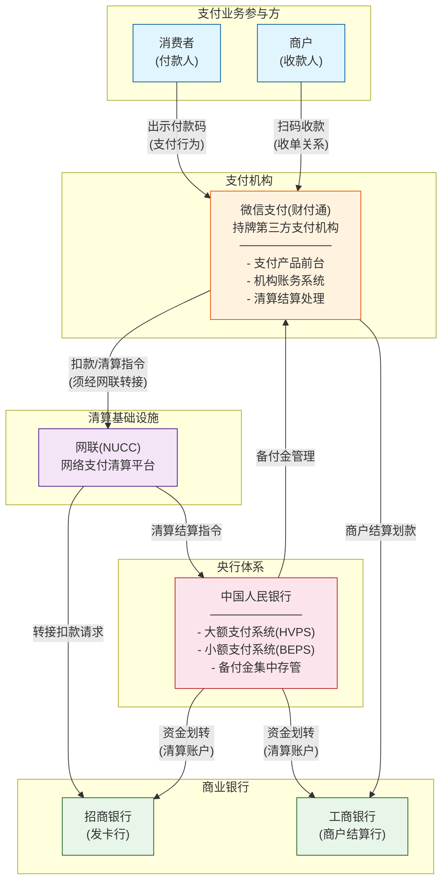
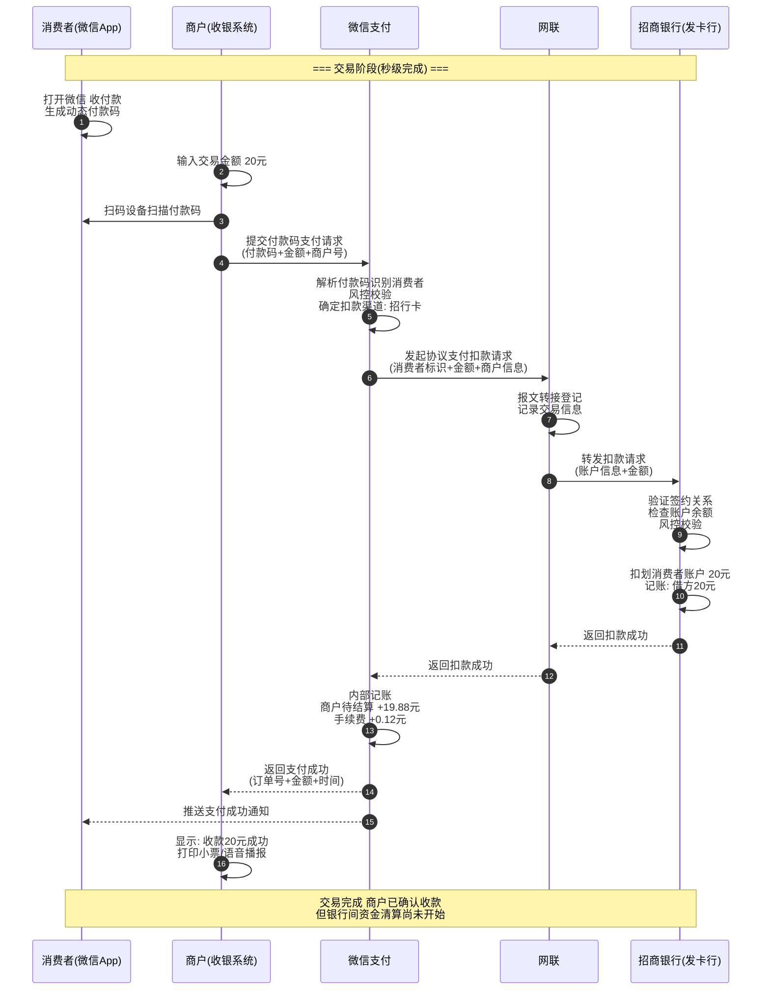
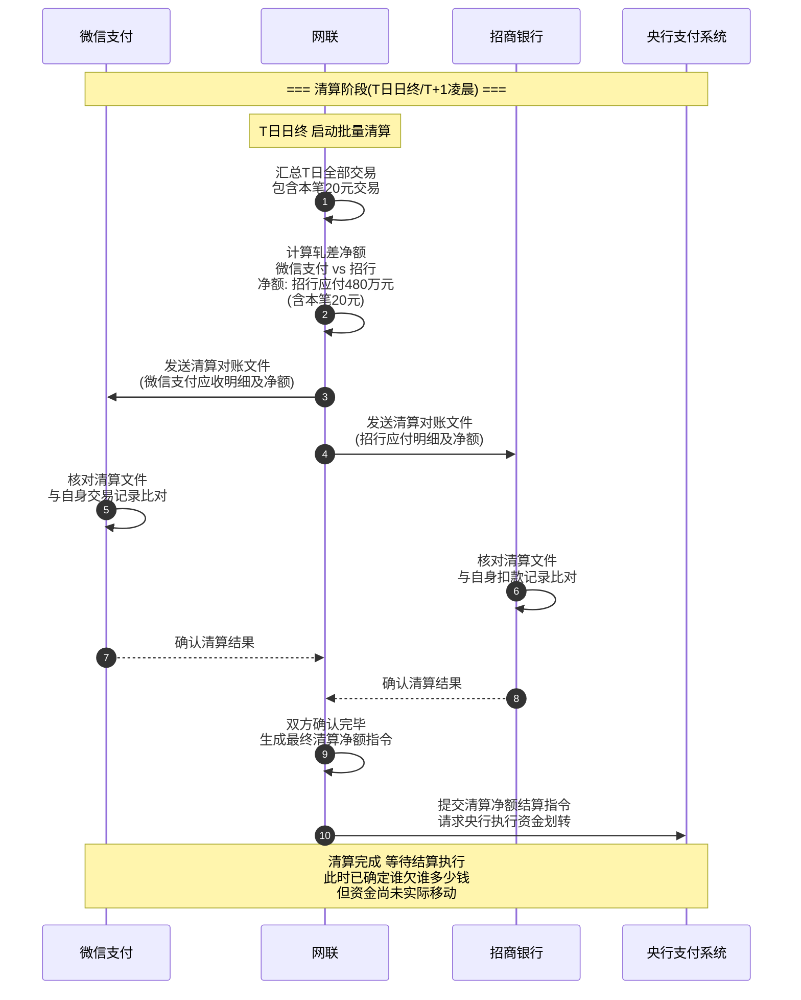
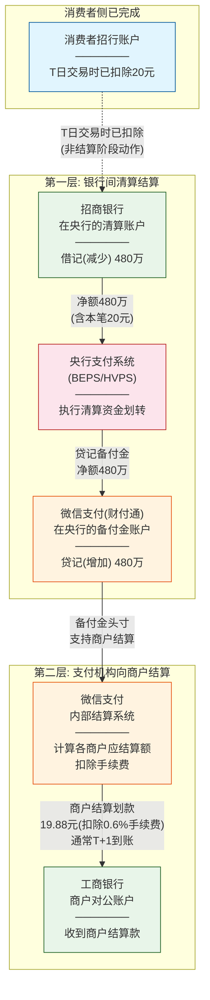
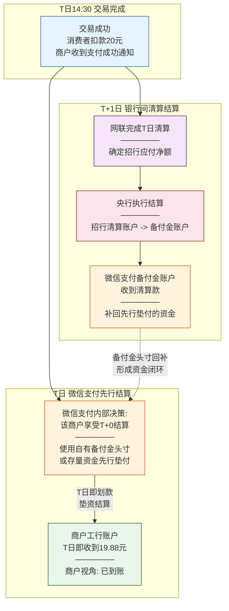

# 中国支付清结算体系示例：微信付款码支付

---

## 1. 场景设定

| 要素 | 具体内容 |
|------|----------|
| **场景** | 消费者在商场购买一杯 20 元奶茶 |
| **支付方式** | 微信付款码（被扫/商户主扫模式） |
| **消费者绑定银行卡** | 招商银行储蓄卡 |
| **商户入驻平台** | 微信支付（微信支付作为收单机构） |
| **商户结算账户** | 工商银行对公账户 |
| **跨行特征** | 发卡行（招行）≠ 商户结算行（工行），必须经过跨行清算 |
| **监管约束** | 支付机构不得与银行直连处理网络支付清算，须通过网联/银联接入 |

> **核心问题**：这笔 20 元从消费者招行卡到商户工行账户，经历了哪些环节？信息怎么传递？钱怎么走？账怎么记？

---

## 2. 参与方与角色说明

### 2.1 参与方总览

| 参与方 | 类别 | 角色说明 |
|--------|------|----------|
| **消费者（付款人）** | 支付业务参与方 | 发起支付行为，资金最终来源方 |
| **商户（收款人）** | 支付业务参与方 | 接收支付行为，资金最终到达方 |
| **微信支付（财付通）** | 持牌第三方支付机构 | 既是支付产品前台（提供付款码等产品），也是收单机构（为商户提供收单服务），同时承担支付机构账务处理 |
| **招商银行（发卡行）** | 商业银行 | 消费者银行卡的发卡银行，负责验证账户、扣划消费者资金 |
| **工商银行（商户结算行）** | 商业银行 | 商户结算账户所在银行，接收微信支付划转的商户货款 |
| **网联清算有限公司（网联/NUCC）** | 网络支付清算基础设施 | 为第三方支付机构与银行之间的网络支付交易提供转接清算服务 |
| **中国人民银行（央行）** | 监管与基础设施运营方 | 提供大额支付系统（HVPS）、小额支付系统（BEPS）等基础设施；管理备付金集中交存 |
| **备付金存管银行** | 央行指定银行（实际为央行统一管理） | 2019 年后，支付机构客户备付金 100% 集中交存至央行，备付金存管银行角色弱化 |

### 2.2 微信支付的多重角色拆解

微信支付在这笔交易中实际上同时扮演了多个角色，理解这一点至关重要：

```
微信支付（整体）
├── 【前台支付产品】
│   ├── 提供付款码、扫码支付等产品界面
│   ├── 管理消费者的支付体验（微信 App 内）
│   └── 对商户提供收单 API / SDK / 扫码设备对接
│
├── 【支付机构账务系统】
│   ├── 维护消费者在微信支付体系内的虚拟账户/余额
│   ├── 维护商户在微信支付体系内的待结算账户
│   ├── 记录每笔交易的内部账务（借贷记账）
│   └── 管理手续费、分润等内部账务
│
└── 【清算与结算处理系统】
    ├── 通过网联向发卡行（招行）发起扣款指令
    ├── 汇总交易、参与网联清算对账
    ├── 接收清算结果，管理备付金头寸
    └── 按结算周期向商户结算账户（工行）划款
```

> **业务视角**：消费者和商户看到的是一个统一的"微信支付"。
> **监管/基础设施视角**：微信支付的主体是"财付通支付科技有限公司"，持央行颁发的《支付业务许可证》，是受监管的第三方支付机构。

---

## 3. 三阶段详细分析

### 3.1 交易（Transaction）

交易阶段是"从消费者发起支付意愿到支付结果确认"的全过程。

#### 3.1.1 流程详述

**Step 1：消费者出示付款码**

消费者打开微信 App → "收付款" → 屏幕上显示一个动态付款码（通常是一个包含加密 token 的条形码/二维码）。

- 该付款码由微信支付系统生成，包含消费者身份标识、时效信息
- 付款码有时效性（通常 1 分钟内有效），防止被盗用
- 此时消费者不需要输入金额

**Step 2：商户扫码**

商户使用扫码设备（POS 终端、扫码枪等）扫描消费者的付款码，同时商户收银系统传入交易金额（20 元）。

- 商户的收银系统通过微信支付提供的 API，将付款码内容 + 交易金额 + 商户信息，组装成一笔"付款码支付请求"
- 这个请求发送到**微信支付后台**

**Step 3：微信支付处理**

微信支付后台收到请求后，执行以下操作：

1. **解析付款码**：识别消费者身份
2. **风控校验**：检查消费者账户状态、交易限额、风控规则（如异地消费、大额交易等）
3. **确定扣款渠道**：确定本笔交易使用消费者绑定的招行卡（而非微信零钱）
4. **发起扣款请求**：微信支付通过**网联**向**招商银行**发起协议支付/快捷支付扣款请求

**Step 4：网联转接**

网联作为网络支付清算平台，收到微信支付的扣款请求后：

1. **报文转接**：将微信支付的扣款报文格式化后，转发给招商银行
2. **交易登记**：记录这笔交易的基本信息，用于后续清算

**Step 5：招商银行（发卡行）验证与扣款**

招商银行收到扣款请求后：

1. **验证消费者身份**：校验签约关系（快捷支付签约是否有效）
2. **检查账户余额**：确认招行卡余额 ≥ 20 元
3. **冻结/扣划资金**：从消费者招行账户扣除 20 元
4. **记账**：在消费者账户上记录一笔借记（支出）
5. **返回扣款结果**：向网联返回"扣款成功"

**Step 6：结果回传**

```
招商银行 --[扣款成功]--> 网联 --[扣款成功]--> 微信支付 --[支付成功]--> 商户收银系统
```

- 商户收银系统收到"支付成功"，显示"收款 20 元成功"
- 消费者微信上同时收到支付成功通知
- **整个过程通常在 1-3 秒内完成**

#### 3.1.2 交易阶段的关键特征

| 特征 | 说明 |
|------|------|
| **实时性** | 交易确认通常在秒级完成 |
| **先记账后结算** | 虽然消费者银行卡已扣款，商户在微信支付体系内看到"已收款"，但银行间的资金清算尚未完成 |
| **在途资金出现** | 这 20 元已从消费者招行账户扣出，但尚未到达微信支付的备付金账户或商户工行账户，处于"在途"状态 |
| **商户的"已收款"是微信支付的承诺** | 微信支付在发卡行扣款成功后，对商户承诺这笔款项将会结算。此时商户信任的是微信支付，不是直接信任发卡行 |

### 3.2 清算（Clearing）

清算阶段是"交易完成后，各机构之间交换交易信息、核对账务、确定各方应收应付"的过程。

#### 3.2.1 什么是清算

> **清算**（Clearing）= 交易信息的汇总、核对、轧差，确定各参与方之间的净债权债务关系。
>
> 清算的核心产出是一份"谁该付给谁多少钱"的清单，但清算本身**不涉及实际资金移动**。

#### 3.2.2 清算流程详述

**Step 1：交易信息采集**

在交易阶段，网联已经记录了这笔交易的关键信息：

| 字段 | 内容 |
|------|------|
| 交易金额 | 20 元 |
| 付款方机构 | 微信支付（财付通） |
| 发卡行 | 招商银行 |
| 交易时间 | T日 14:30:25 |
| 交易流水号 | NUCC202604150001... |

**Step 2：日终批量清算（网联侧）**

网联通常在每日日终（如 T 日 23:30 之后或次日凌晨）进行批量清算：

1. **汇总**：将 T 日所有通过网联处理的交易汇总
2. **轧差**（Netting）：
   - 微信支付当天通过网联向招行发起了大量扣款（消费者付款）
   - 同时招行可能也通过网联向微信支付有退款、充值等反向资金
   - 网联计算微信支付与招行之间的**净额**
3. **生成清算指令**：形成各机构之间的应收应付净额清单

**典型轧差示例**（简化说明）：

```
微信支付 vs 招商银行（T日汇总）：
  微信支付应收（消费者扣款汇总）：  5,000,000 元
  微信支付应付（退款汇总）：        200,000 元
  ──────────────────────────────
  净额：招行应付给微信支付（备付金账户）4,800,000 元
```

我们这笔 20 元就包含在那 5,000,000 元的汇总中。

**Step 3：清算结果确认**

- 网联将清算结果分别发送给微信支付和招商银行
- 双方核对无误后确认
- 如有差错，进入差错处理流程

#### 3.2.3 清算阶段的关键特征

| 特征 | 说明 |
|------|------|
| **批量处理** | 清算通常不是逐笔实时的，而是批量汇总后轧差 |
| **轧差降低资金需求** | 通过净额轧差，大幅减少实际需要划转的资金量 |
| **清算 ≠ 资金移动** | 清算只确定"谁欠谁多少"，实际资金移动在结算阶段完成 |
| **时间差** | 交易在 T 日秒级完成，但清算可能在 T 日日终或 T+1 才完成 |
| **网联的核心价值** | 作为独立第三方，保证清算信息的准确性和各方对账的一致性 |

> **重要提示**：网联也支持实时清算模式（如资金实时到账场景），但大多数常规商户交易采用批量清算模式。

### 3.3 结算（Settlement）

结算阶段是"根据清算结果，完成实际资金划转，最终清偿各方债权债务"的过程。

#### 3.3.1 什么是结算

> **结算**（Settlement）= 根据清算确定的应收应付，实际完成资金从一个账户到另一个账户的划转，最终消灭债权债务关系。
>
> 结算是**真正的钱在动**。

#### 3.3.2 结算流程详述

结算实际上分为**两个层面**：

**层面一：银行间清算资金结算（通过央行支付系统）**

1. 网联根据清算结果，向央行支付系统（如小额批量支付系统 BEPS 或大额实时支付系统 HVPS）提交清算资金划转指令
2. 央行支付系统执行以下操作：
   - **借记**招商银行在央行的清算账户（或备付金缴存相关账户）
   - **贷记**微信支付（财付通）在央行的客户备付金集中存管账户
3. 资金在央行层面完成了从招行到微信支付备付金账户的转移

> **注意**：自 2019 年 1 月起，第三方支付机构的客户备付金已 100% 集中交存至中国人民银行。微信支付的备付金账户开在央行，不再分散存放于多家商业银行。

**层面二：商户结算（微信支付向商户划款）**

1. 微信支付根据与商户的结算协议（通常 T+1，部分商户可 T+0）
2. 从备付金账户中，按照商户当日/前日的应结算金额，扣除手续费后
3. 通过银行渠道（可能通过网联或直接通过央行支付系统）向商户的工商银行账户划款

**对于这笔 20 元交易**：

```
假设微信支付手续费率 0.6%（即 0.12 元）：

商户应收 = 20 - 0.12 = 19.88 元

微信支付在 T+1 日，将 19.88 元（连同该商户当日其他交易汇总后）
划入商户在工商银行的对公账户
```

#### 3.3.3 结算阶段的关键特征

| 特征 | 说明 |
|------|------|
| **最终性（Finality）** | 央行支付系统的结算具有最终性，一旦完成不可撤销 |
| **分层结算** | 第一层：银行间通过央行结算；第二层：微信支付向商户结算 |
| **备付金的枢纽作用** | 微信支付的备付金账户是资金流转的核心节点 |
| **结算周期** | 商户结算通常 T+1，部分场景 T+0（见下文垫资说明） |
| **手续费扣除** | 微信支付在向商户结算时扣除手续费，这是微信支付的主要收入来源之一 |

---

## 4. 信息流、账务流、资金流的区别

这是理解中国支付体系最关键的概念之一。三者看起来相似，实则本质不同、发生时间不同。

### 4.1 三流对比

| 维度 | 信息流 | 账务流 | 资金流 |
|------|--------|--------|--------|
| **定义** | 支付指令、交易报文、清算信息等数据的传递 | 各机构在自己账务系统中的记账动作（借记/贷记） | 真实货币资金从一个账户划转到另一个账户 |
| **载体** | 电子报文、API 调用、清算文件 | 各机构内部账务系统的分录 | 央行支付系统中的账户余额变动 |
| **发生时间** | 交易阶段即发生（秒级） | 交易确认后各机构分别记账（秒级到分钟级） | 清算完成后、结算执行时（T+0 到 T+1） |
| **是否可逆** | 信息可重传、可冲正 | 账务可冲正、调账 | 结算完成后通常不可逆（具有最终性） |
| **举例** | 微信支付通过网联向招行发送扣款报文 | 招行在消费者账户上记一笔借方 20 元；微信支付在内部商户待结算账户记贷方 19.88 元 | 招行在央行的清算账户被借记，微信支付备付金账户被贷记 |

### 4.2 三流在本案例中的具体对应

**T 日 14:30（交易发生时）**：

| 流 | 发生了什么 |
|----|-----------|
| 信息流 | 商户收银系统 → 微信支付 → 网联 → 招行 → 网联 → 微信支付 → 商户，传递了扣款请求和扣款结果 |
| 账务流 | 招行：消费者账户 -20 元（借记）；微信支付内部：商户待结算 +19.88 元、手续费 +0.12 元 |
| 资金流 | **尚未发生**。资金仍在招行体系内，只是消费者账户上被扣除了 |

**T 日日终 / T+1 凌晨（清算时）**：

| 流 | 发生了什么 |
|----|-----------|
| 信息流 | 网联汇总当日交易，生成清算报表，发送给微信支付和招行确认 |
| 账务流 | 网联清算系统记录：招行应付微信支付净额 XXX 万元 |
| 资金流 | **尚未发生**。仍在等待央行支付系统执行 |

**T+1 日（结算时）**：

| 流 | 发生了什么 |
|----|-----------|
| 信息流 | 网联向央行支付系统提交结算指令；微信支付向工行提交商户划款指令 |
| 账务流 | 各方账务更新为已结算状态 |
| 资金流 | **真正发生**。央行划转招行→备付金账户；微信支付划转备付金→商户工行账户 |

### 4.3 一句话总结

> **信息流是"说"，账务流是"记"，资金流是"给"。说了不等于给了，记了也不等于给了。只有央行支付系统执行了资金划转，钱才真正动了。**

---

## 5. Mermaid 图

### 5.1 整体参与方关系图



**图解**：
- **蓝色**（消费者/商户）：支付业务的最终参与方，是资金的起点和终点
- **橙色**（微信支付）：连接消费者和商户的支付机构，承上启下
- **绿色**（招行/工行）：商业银行，管理实际的银行账户资金
- **紫色**（网联）：清算基础设施，负责支付机构与银行之间的转接清算
- **红色**（央行）：最终结算的基础设施提供者，备付金的管理者

> **关键认知**：微信支付不能绕过网联直接与银行完成网络支付清算，这是 2017-2018 年"断直连"监管的核心要求。

---

### 5.2 交易阶段信息流时序图



**图解**：

1. **步骤 1-3**：消费者出示付款码，商户扫码，这是纯粹的本地交互
2. **步骤 4-5**：商户收银系统将交易信息发往微信支付，微信支付做风控和渠道路由
3. **步骤 6-8**：微信支付通过网联向招行发起扣款——这是"断直连"后的标准链路
4. **步骤 9-10**：招行验证并实际扣款——消费者银行账户资金减少
5. **步骤 11-16**：结果逐级回传，商户看到"收款成功"

> **核心要点**：交易阶段结束时，消费者的钱已从招行卡扣除，商户已被告知"收款成功"，但这 20 元的银行间清算结算流程尚未开始。微信支付在这里扮演了"信用中介"角色——基于发卡行的扣款成功确认，微信支付向商户承诺这笔款将会到账。

---

### 5.3 清算阶段债权债务形成图



**图解**：

清算的本质是**信息处理**，不是资金移动。在这个阶段：

1. **汇总**：网联将当天海量交易按机构对汇总
2. **轧差**：不是每笔交易都单独结算，而是计算净额。比如微信支付当天通过招行扣了 500 万、退了 20 万，净额就是 480 万
3. **对账**：双方核对确认，确保数据一致
4. **生成指令**：确认无误后，网联生成结算指令提交央行

> **为什么要轧差？** 假如当天微信支付与招行之间有 100 万笔交易，逐笔结算意味着 100 万次资金划转。通过轧差，可能只需要一笔净额划转，极大提高了效率并降低了流动性需求。

> **清算与交易的时间差**：消费者在 T 日 14:30 就完成了支付，但清算在 T 日日终才进行。这个时间差内，消费者的 20 元处于"在途"状态。

---

### 5.4 结算阶段资金流图



**图解**：

结算分两层理解：

**第一层（银行间结算）**：
- 央行支付系统根据网联提交的清算指令，从招行在央行的清算账户划出 480 万（净额），划入微信支付在央行的备付金账户
- 这是**最终结算**，具有法律上的最终性（finality）

**第二层（商户结算）**：
- 微信支付根据自身与商户的结算协议，从备付金账户向商户工行账户划款
- 对本笔交易：划出 19.88 元（20 元 - 0.12 元手续费）
- 这是微信支付作为收单机构对商户的结算义务

> **关键点**：消费者的钱在 T 日交易时就已从招行卡扣除。但这 20 元真正从招行体系转移到微信支付备付金体系，是在 T+1 清算结算完成时。

---

### 5.5 微信可能先行给商户结算的变体图

在实际业务中，微信支付可能提供 **T+0 结算** 服务，即商户在交易当天就能收到货款。这时候就出现了"垫资结算"的情况。



**图解**：

**垫资结算的核心逻辑**：

1. **T 日 14:30**：交易完成，消费者已扣款，发卡行已确认
2. **T 日（当天）**：微信支付判断该商户享受 T+0 服务，使用自己备付金账户中的存量资金，**先行**向商户工行账户划款 19.88 元
3. **T+1 日**：网联完成 T 日清算，央行执行结算，招行的 20 元（含在净额中）最终进入微信支付备付金账户
4. **资金闭环**：微信支付备付金账户在 T+1 收到清算款后，回补了 T 日垫付的资金

> **这意味着**：
> - 商户在 T 日就收到了钱（T+0 结算），体验很好
> - 但消费者的 20 元在银行间的清算结算要到 T+1 才完成
> - 中间的时间差，微信支付用**自有备付金头寸**承担了垫资风险
> - 这也是为什么监管对支付机构的备付金管理非常严格——备付金不是支付机构的钱，是客户的钱

---

## 6. 关键时间轴

| 时间点 | 事件 | 信息流 | 账务流 | 资金流 | 各方状态 |
|--------|------|--------|--------|--------|----------|
| **T日 14:30:00** | 消费者出示付款码 | 付款码生成 | - | - | 消费者打开微信收付款 |
| **T日 14:30:01** | 商户扫码提交请求 | 商户→微信支付 | - | - | 商户收银系统发起请求 |
| **T日 14:30:01** | 微信支付风控处理 | 内部处理 | - | - | 验证消费者身份、限额等 |
| **T日 14:30:02** | 微信支付→网联→招行 | 扣款请求转接 | - | - | 网联记录交易信息 |
| **T日 14:30:02** | 招行验证并扣款 | 内部处理 | 消费者账户 -20元 | 消费者银行账户减少20元 | 消费者招行卡余额减少 |
| **T日 14:30:03** | 扣款结果回传 | 招行→网联→微信支付 | 微信内部商户待结算 +19.88元 | - | 微信支付确认扣款成功 |
| **T日 14:30:03** | 支付成功通知 | 微信支付→商户/消费者 | - | - | **商户看到"收款20元成功"** |
| **T日（若T+0）** | 微信垫资结算 | 微信支付→工行 | 微信备付金 -19.88元 | 商户工行账户 +19.88元 | 商户银行账户收到款项（T+0场景） |
| **T日 23:30** | 网联启动日终清算 | 网联汇总全天交易 | 形成轧差净额 | - | 计算各机构间应收应付 |
| **T+1日 凌晨** | 清算对账确认 | 网联↔微信支付↔招行 | 确认清算结果 | - | 各方核对无误 |
| **T+1日 上午** | 央行执行结算 | 网联→央行支付系统 | 招行清算账户 -净额 | **真实资金从招行→备付金账户** | **银行间最终结算完成** |
| **T+1日（若T+1）** | 微信支付商户结算 | 微信支付→工行 | 备付金 -19.88元 | 商户工行账户 +19.88元 | 商户银行账户收到款项（T+1场景） |
| **T+1日** | 全部完成 | - | 所有账务轧平 | 所有资金到位 | **20元完成全链路流转** |

> **注意**：以上时间点为典型场景，实际时间因系统处理效率和结算批次有所差异。

---

## 7. 容易混淆的概念辨析

### 7.1 "支付成功" ≠ "清算完成" ≠ "结算完成"

| 概念 | 含义 | 时间点 | 谁告诉谁 |
|------|------|--------|----------|
| **支付成功** | 发卡行已确认扣款，微信支付向商户确认这笔交易成功 | T日秒级 | 微信支付告诉商户 |
| **清算完成** | 网联汇总轧差后，各方确认了应收应付净额 | T日日终/T+1 | 网联告诉微信支付和银行 |
| **结算完成** | 央行支付系统实际执行了资金划转，各方清算账户/备付金账户余额变动 | T+1 | 央行支付系统执行 |

### 7.2 "垫资结算" / "轧差清算" / "最终结算"

| 概念 | 含义 | 特点 |
|------|------|------|
| **垫资结算** | 微信支付在收到银行间清算款之前，先用自有备付金头寸向商户划款 | 商户体验好（T+0到账），但支付机构承担资金垫付风险 |
| **轧差清算** | 将一定时期内多笔交易的应收应付进行抵消，只结算净额差额 | 大幅减少实际资金划转量，提高效率 |
| **最终结算** | 通过央行支付系统完成的、具有法律最终性的资金划转 | 不可撤销，标志着债权债务最终消灭 |

### 7.3 商户看到的"已收款"与银行体系"最终结算"的区别

| 商户视角 | 银行体系视角 |
|----------|-------------|
| "我的微信商户后台显示 14:30 收了一笔 20 元" | "这笔 20 元的清算尚未开始" |
| "我的银行账户今天/明天会收到结算款" | "微信支付的备付金账户可能还没收到这笔钱对应的清算资金" |
| "已收款 = 钱已经是我的了" | "发卡行已扣款确认 + 支付机构承诺结算 ≠ 银行间最终结算完成" |

> **本质原因**：商户信任的是微信支付这个机构的**信用承诺**。微信支付在发卡行确认扣款后，就向商户承诺"这笔钱我会给你"。但银行间的真实资金流转还需要经过网联清算、央行结算这个完整链条。

### 7.4 "备付金"到底是什么

| 问题 | 回答 |
|------|------|
| 备付金是谁的钱？ | 是**客户**（消费者/商户）的钱，不是支付机构自己的钱 |
| 存在哪里？ | 2019 年后 100% 集中交存至中国人民银行 |
| 有什么作用？ | 支付机构处理支付业务过程中产生的在途资金、待结算资金等 |
| 为什么监管严格？ | 历史上发生过支付机构挪用备付金的风险事件，故央行要求集中交存 |

### 7.5 "在途资金"的理解

当消费者的 20 元从招行卡扣出，到最终进入商户工行账户之间，这笔资金处于多个"在途"状态：

```
消费者招行卡 (-20元)
    │
    ├── 在途状态1：已扣未清算（T日交易后~T+1清算前）
    │   消费者银行卡已减少，但银行间清算尚未执行
    │
    ├── 在途状态2：已清算未结算（清算完成~结算执行前）
    │   网联已确定净额，等待央行支付系统执行
    │
    ├── 在途状态3：已入备付金未结算给商户（银行间结算完成~商户结算前）
    │   资金已到微信支付备付金账户，尚未划给商户
    │
    └── 最终到达：商户工行账户 (+19.88元)
```

---

## 8. 总结

### 8.1 一笔 20 元微信付款码支付的完整生命周期

```
消费者出示付款码
      ↓
商户扫码 → 微信支付 → 网联 → 招商银行（验证+扣款）
      ↓ (秒级返回)
支付成功（交易完成）
      ↓ (T日日终)
网联清算（汇总、轧差、对账）
      ↓ (T+1)
央行结算（资金最终划转：招行 → 备付金账户）
      ↓
微信支付向商户结算（备付金 → 商户工行账户，扣除手续费）
      ↓
全链路完成
```

### 8.2 五个关键认知

1. **断直连**：微信支付不能直接与银行完成网络支付清算处理，必须通过网联（或部分场景通过银联）。这是 2017-2018 年央行推动的核心监管要求，目的是让监管机构能够看清每一笔交易的资金流向。

2. **支付成功 ≠ 最终结算**：消费者和商户在秒级内感知到"交易完成"，但银行间的真正资金清算结算可能要到 T+1 日才完成。支付体验的即时性是由支付机构的信用承诺和技术能力保障的。

3. **三流分离**：信息流（秒级）、账务流（秒级到分钟级）、资金流（T+0 到 T+1）各自独立运行。理解三者的区别是理解支付清结算体系的关键。

4. **备付金是客户的钱**：支付机构的备付金不是利润，而是在途中的客户资金。央行 100% 集中交存的要求，就是为了防止支付机构挪用这笔钱。

5. **分层结算**：第一层是银行间通过央行支付系统的最终结算；第二层是支付机构向商户的结算。两层的时间点和法律性质不同。微信支付可能通过垫资在第一层结算完成前就完成第二层结算，为商户提供更好的资金到账体验。

### 8.3 监管与业务的平衡

中国支付清结算体系的设计，体现了**效率**与**安全**的平衡：

- **效率侧**：消费者和商户秒级完成交易，商户最快 T+0 到账
- **安全侧**：所有交易必须经过持牌清算机构，备付金集中交存，央行可以穿透监控每一笔资金流向

这套体系让中国移动支付在全球范围内实现了最好的用户体验，同时保持了金融体系的稳定性和可监管性。

---

> **免责声明**：本文档基于公开信息和行业通识编写，用于解释中国支付清结算体系的基本原理。实际业务中，各机构的具体实现细节、清算时间、结算规则可能存在差异。涉及的手续费率仅为举例，以实际签约为准。
