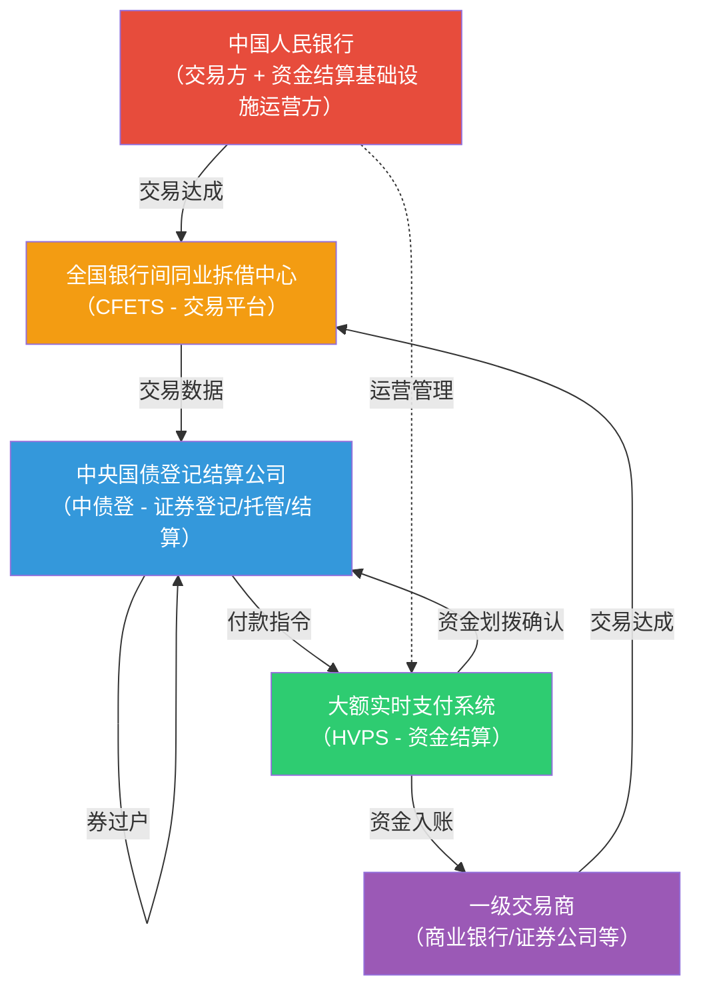
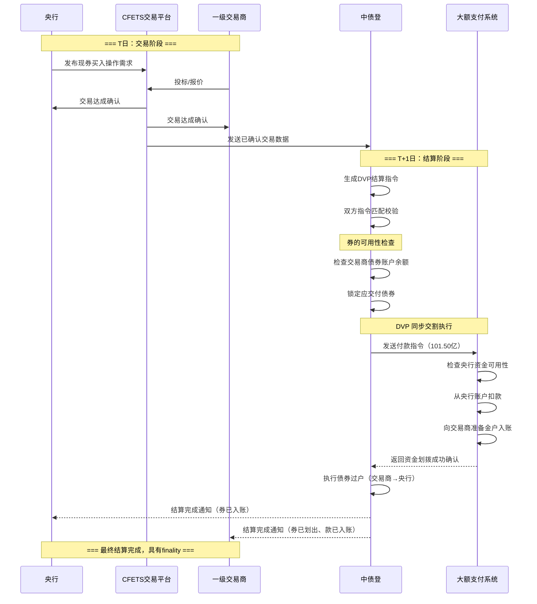
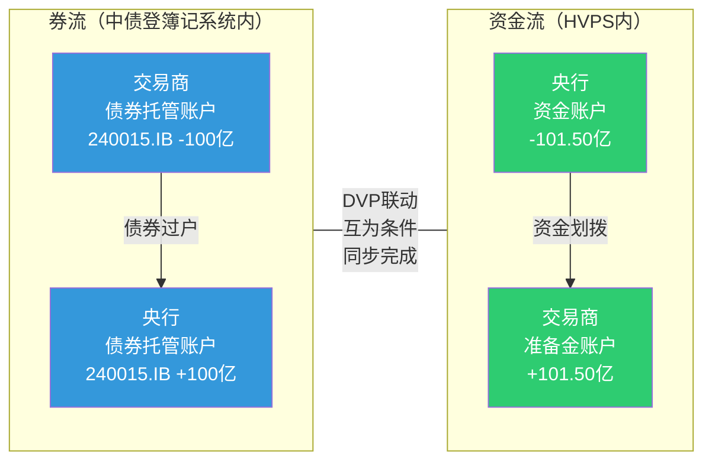
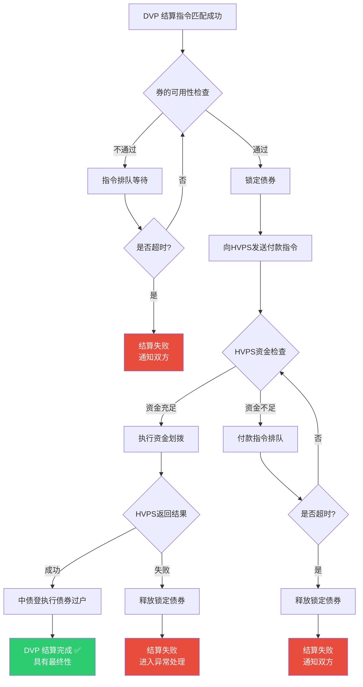

# 中国中央银行买卖有价证券中的 DVP 运作机制

> **适用读者**：金融市场新人、支付清算从业者、金融科技开发人员
>
> **核心场景**：中国人民银行（PBOC）通过公开市场操作，在银行间债券市场买卖国债、政策性金融债、央行票据等有价证券时，券和款如何实现安全、同步交割。
>
> **关键词**：DVP、券款对付、中央对手方、公开市场操作、中债登、大额支付系统

---

## 1. 什么是 DVP

### 1.1 DVP 定义

**DVP（Delivery Versus Payment，券款对付）** 是一种证券结算机制，其核心原则是：

> **证券的交付（Delivery）和资金的支付（Payment）必须同步发生，互为条件——要么同时完成，要么同时不发生。**

换言之，卖方交出证券的那一刻，买方的资金必须同时到达卖方账户；如果任何一方无法履行，则整笔交易都不执行。

### 1.2 DVP 要解决的核心问题

DVP 要消除的是 **本金风险（Principal Risk）**——即交易一方已经履行了自己的义务（交出了券或付出了款），但对手方却未能履行对等义务的风险。

| 风险场景 | 具体描述 | 后果 |
|----------|----------|------|
| **券已过户，款未到账** | 卖方证券已划转给买方，但买方资金未能支付 | 卖方既失去证券又未收到资金，面临全额本金损失 |
| **款已支付，券未交付** | 买方资金已划出，但卖方证券未能过户 | 买方资金已出但未获得证券，面临全额本金损失 |

这种风险在跨时区交易中尤为突出，历史上最著名的案例是 **1974 年赫斯塔特银行（Herstatt Bank）倒闭事件**——该银行在收到德国马克后，未能交付对应的美元，导致对手方遭受巨额损失。这一事件直接推动了全球金融市场对 DVP 机制的系统性建设。

### 1.3 DVP 与 FOP 的区别

| 比较项 | DVP（券款对付） | FOP（Free of Payment，纯券过户） |
|--------|----------------|--------------------------------|
| **定义** | 券与款同步、条件性交割 | 仅有证券过户，不关联资金支付 |
| **风险** | 消除本金风险 | 存在本金风险 |
| **适用场景** | 买卖交易、回购交易等有对价的场景 | 质押、赠与、同一机构内部账户划转、监管划转等无对价场景 |
| **典型操作** | 央行买入国债（需付款） | 央行接受质押品（不涉及买卖） |
| **系统要求** | 需要券系统与资金系统联动 | 仅需券登记系统操作 |

### 1.4 DVP 在金融市场基础设施中的意义

国际清算银行（BIS）下属的支付与市场基础设施委员会（CPMI）和国际证监会组织（IOSCO）在《金融市场基础设施原则》（PFMI，2012）中明确要求：

> **原则 12**：如果 FMI 结算证券交易，应当提供 DVP 结算方式，以消除本金风险。

DVP 不仅是一项技术安排，更是 **金融市场基础设施安全运行的基石**，是系统性风险防控的核心环节。

---

## 2. 为什么央行买卖有价证券需要 DVP

### 2.1 公开市场操作的特点

中国人民银行的 **公开市场操作（Open Market Operations, OMO）** 是货币政策最重要的日常工具之一，包括：

| 操作类型 | 说明 | 证券交割特点 |
|----------|------|------------|
| **逆回购（Reverse Repo）** | 央行向一级交易商买入有价证券并约定到期卖回，向市场注入流动性 | 首期：央行获券、付款；到期：央行还券、收款 |
| **正回购（Repo）** | 央行向一级交易商卖出有价证券并约定到期买回，回收流动性 | 首期：央行出券、收款；到期：央行收券、付款 |
| **现券买断** | 央行在二级市场直接买入债券，永久性注入基础货币 | 一次性交割：央行获券、付款 |
| **现券卖断** | 央行在二级市场直接卖出债券，永久性回收基础货币 | 一次性交割：央行出券、收款 |
| **央行票据发行/到期** | 央行发行短期债务工具（央票），调节流动性 | 发行：交易商获券、付款；到期：央行兑付本息 |
| **国债买卖（2024年新增工具）** | 央行在二级市场买卖国债，丰富货币政策工具箱 | 与现券买断/卖断类似 |

### 2.2 交易规模与系统重要性

- **单日操作规模巨大**：央行公开市场操作单日净投放/回笼规模可达数百亿至数千亿元人民币。
- **对手方集中于系统重要性机构**：交易对手为一级交易商，主要是大型商业银行、政策性银行和头部证券公司。
- **直接影响基础货币供给**：每一笔操作都会改变银行体系的超额准备金水平。

在如此大的规模和系统重要性下，**如果没有 DVP 保障，任何一笔交割失败都可能引发连锁反应**，波及整个银行间市场的流动性和信心。

### 2.3 本金风险控制的刚性需求

| 风险维度 | 无 DVP 时的风险 | DVP 提供的保护 |
|----------|---------------|---------------|
| **本金风险** | 央行付款后，对手方未交券；或央行交券后，对手方未付款 | 券款互为条件，不会出现单边履约 |
| **流动性风险** | 券或款被占用但交易未完成，资源被锁定 | 交易要么完成要么释放，不长期占用资源 |
| **系统性风险** | 一笔大额交割失败引发连锁违约 | 逐笔确认、原子性交割，阻断风险传导 |
| **信用风险** | 对手方信用恶化时暴露过大 | 即时交割，不留信用敞口 |

---

## 3. 中国实际中的参与方与基础设施

### 3.1 核心参与方

```
┌─────────────────────────────────────────────────────┐
│                   中国人民银行（PBOC）                  │
│  ┌───────────────┐  ┌───────────────┐  ┌──────────┐ │
│  │  货币政策司     │  │  支付结算司     │  │ 公开市场  │ │
│  │ （操作决策）    │  │ （系统运维）    │  │ 业务操作室│ │
│  └───────────────┘  └───────────────┘  └──────────┘ │
└──────────────────────────┬──────────────────────────┘
                           │
              ┌────────────┼────────────┐
              ▼            ▼            ▼
    ┌─────────────┐ ┌──────────┐ ┌──────────────┐
    │  一级交易商   │ │ 中债登    │ │ 大额支付系统  │
    │（约50家机构）│ │（CCDC）  │ │ （HVPS）     │
    └─────────────┘ └──────────┘ └──────────────┘
```

### 3.2 参与方详细说明

| 参与方 | 角色 | 在 DVP 中的职责 |
|--------|------|---------------|
| **中国人民银行（PBOC）** | 交易发起方（买方或卖方）、货币政策执行者 | 发起交易指令，在中债登持有债券托管账户，在 HVPS 中拥有资金清算账户 |
| **一级交易商** | 央行公开市场操作的直接交易对手 | 约 50 家机构，包括大型商业银行（工农中建交等）、政策性银行（国开行等）、股份制银行及头部证券公司 |
| **中央国债登记结算有限责任公司（中债登/CCDC）** | 中央证券存管机构（CSD） | 负责债券的登记、托管、结算，维护债券账户簿记系统，执行券的过户 |
| **上海清算所（上清所/SHCH）** | 中央对手方清算机构（CCP） | 主要负责信用债、同业存单等品种的集中清算；部分品种提供 CCP 清算下的 DVP |
| **中国人民银行大额实时支付系统（HVPS）** | 资金结算基础设施 | 处理大额资金的实时全额结算（RTGS），是银行间市场资金清算的核心通道 |
| **全国银行间同业拆借中心（CFETS）** | 交易平台 | 提供银行间债券交易的电子化交易平台，公开市场操作的交易达成和确认通常通过其系统完成 |

### 3.3 中国金融市场基础设施分工

中国债券市场由 **多个市场** 组成，DVP 的实现方式因市场而异：

| 市场 | 主要品种 | 证券登记/托管 | 资金结算 | DVP 状态 |
|------|----------|-------------|---------|---------|
| **银行间债券市场**（主市场） | 国债、政策性金融债、央票、金融债、信用债等 | 中债登（CCDC）/ 上清所（SHCH） | 央行 HVPS（大额支付系统） | **已实现 DVP**（2004 年起） |
| **交易所债券市场** | 国债、企业债、公司债、可转债等 | 中国证券登记结算公司（中证登/CSDC） | 中证登内部资金结算 + 央行 HVPS | 已实现 DVP |
| **商业银行柜台市场** | 国债、地方政府债等 | 中债登（二级托管） | 商业银行内部账户 | 银行内部实现 DVP 逻辑 |

> **央行公开市场操作主要发生在银行间债券市场，因此以下讨论聚焦于"中债登 + HVPS"这一 DVP 实现路径。**

### 3.4 证券过户与资金划拨各在哪里完成

```
┌─────────────────────────────────────────────────────┐
│          证券端（券的世界）                            │
│                                                     │
│   中债登（CCDC）债券簿记系统                          │
│   ┌───────────┐        ┌───────────┐               │
│   │ PBOC 债券  │ ─券过户→ │ 交易商债券 │               │
│   │   托管账户  │ ←券过户─ │  托管账户  │               │
│   └───────────┘        └───────────┘               │
└────────────────────────┬────────────────────────────┘
                         │ DVP 联动（条件性触发）
┌────────────────────────┴────────────────────────────┐
│          资金端（钱的世界）                            │
│                                                     │
│   央行大额实时支付系统（HVPS）                         │
│   ┌───────────┐        ┌───────────┐               │
│   │ PBOC 资金  │ ─付款──→ │ 交易商在央 │               │
│   │   账户     │ ←收款── │ 行准备金户 │               │
│   └───────────┘        └───────────┘               │
└─────────────────────────────────────────────────────┘
```

**关键点**：
- **券在中债登**：证券的所有权转移通过中债登簿记系统完成
- **款在 HVPS**：资金的最终结算通过央行大额实时支付系统完成，使用的是 **中央银行货币**（央行准备金），而非商业银行货币
- **DVP 联动**：中债登与 HVPS 之间通过专线连接，实现券过户与资金划拨的条件性联动

---

## 4. 核心概念与账户体系

### 4.1 关键概念

| 概念 | 英文 | 定义 | 通俗理解 |
|------|------|------|---------|
| **交易（Trade）** | Trade / Transaction | 买卖双方就证券品种、数量、价格等要素达成一致 | "我们谈好了要做这笔买卖" |
| **清算（Clearing）** | Clearing | 交易达成后，计算双方各自应交付的券和应支付的款 | "算清楚谁欠谁多少" |
| **结算（Settlement）** | Settlement | 实际执行券的过户和款的划拨，完成所有权转移 | "真正把券和钱交到对方手上" |
| **交割（Delivery）** | Delivery | 特指证券从卖方向买方的转移 | "把券交出去" |
| **DVP（券款对付）** | Delivery Versus Payment | 券的交割与款的支付互为条件、同步完成 | "一手交钱一手交货，缺一不可" |
| **FOP（纯券过户）** | Free of Payment | 仅有券的转移，不关联资金收付 | "只过户不付钱（如质押场景）" |
| **本金风险** | Principal Risk | 已履约一方面临的全额损失风险 | "我把货给了你，你没给我钱，我亏了全部" |

> **重要区分**：**"交易成交" ≠ "最终结算完成"**。交易达成只是双方形成了一个合约关系，只有经过清算和结算（DVP 交割）之后，证券所有权和资金才真正完成转移。在这之间，交易双方面临着对手方信用风险和本金风险。

### 4.2 账户体系

在中国银行间债券市场的 DVP 体系中，涉及以下核心账户：

| 账户类型 | 开设机构 | 所在系统 | 用途 |
|----------|---------|---------|------|
| **债券托管账户（甲类/乙类/丙类）** | 各市场参与者在中债登开设 | 中债登簿记系统 | 记录债券持有量，债券过户在此完成 |
| **PBOC 自营债券账户** | 中国人民银行 | 中债登簿记系统 | 央行持有的债券头寸登记 |
| **准备金存款账户** | 商业银行等存款类金融机构在央行开设 | 央行账户体系 / HVPS | 存放法定准备金和超额准备金，DVP 资金结算在此完成 |
| **PBOC 发行账户/资金账户** | 中国人民银行 | 央行内部账户体系 | 央行自身的资金账户，用于公开市场操作的资金收付 |
| **清算账户（债券结算专户）** | 参与者在中债登开设的结算相关账户 | 中债登 | 用于结算过程中的债券暂存和清算 |

### 4.3 四种"流"的区分

理解 DVP 必须区分四条并行的"流"：

| 流的类型 | 内容 | 载体/系统 | 方向示例（央行买入债券） |
|----------|------|----------|---------------------|
| **指令流** | 交易指令、结算指令、确认信息 | CFETS 交易系统 → 中债登结算系统 → HVPS | 双向传递 |
| **券流** | 债券所有权的实际转移 | 中债登簿记系统 | 交易商债券账户 → 央行债券账户 |
| **资金流** | 资金的实际划拨 | 央行 HVPS（大额支付系统） | 央行资金账户 → 交易商准备金账户 |
| **账务记录流** | 各方内部账务和头寸的更新 | 各机构内部核心系统 | 央行记增债券/减资金；交易商记减债券/增资金 |

---

## 5. DVP 的核心运作流程

### 5.1 总体流程概览

在中国银行间债券市场，一笔 DVP 结算的完整流程如下：

```
交易达成 → 交易确认 → 结算指令生成 → 指令匹配 → 券款检查 → 同步交割 → 最终结算 → 账务更新
  (T)       (T)        (T)          (T/S)      (S)        (S)        (S)        (S)

T = 交易日   S = 结算日（可能 T+0 或 T+1）
```

### 5.2 各步骤详解

#### 步骤 1：交易达成

| 要素 | 说明 |
|------|------|
| **场所** | 全国银行间同业拆借中心（CFETS）电子交易平台 |
| **方式** | 央行公开市场业务操作室通过 CFETS 系统发布操作需求，一级交易商投标/报价，双方达成交易 |
| **内容** | 确定交易方向（买/卖）、券种、面额、价格/收益率、结算方式（DVP）、结算日期 |
| **结果** | 生成交易合约，但此时 **尚未发生任何券或款的转移** |

#### 步骤 2：交易确认

- 交易双方在 CFETS 系统中对交易要素进行确认
- 确认后交易具有法律约束力
- CFETS 将已确认的交易信息发送至中债登结算系统

#### 步骤 3：结算指令生成

- 中债登根据交易信息生成 **DVP 结算指令**
- 指令包含：买卖双方账户信息、债券代码、面额、结算金额、结算日期、DVP 标识
- 分为 **券指令**（在中债登执行）和 **款指令**（需发送至 HVPS 执行）

#### 步骤 4：指令匹配

- 中债登对买卖双方的结算指令进行 **匹配校验**
- 校验内容：券种、面额、金额、结算日、对手方等要素必须完全一致
- 匹配成功后进入交割环节；匹配失败则通知双方修正

#### 步骤 5：券款可用性检查

这是 DVP 的 **核心环节**：

| 检查项 | 检查系统 | 检查内容 |
|--------|---------|---------|
| **券的可用性** | 中债登簿记系统 | 卖方债券账户中是否有足够的、未被冻结/质押的可用债券余额 |
| **款的可用性** | 央行 HVPS | 买方资金账户中是否有足够的可用资金余额（超额准备金） |

- 如果 **任一条件不满足**，交割不执行，指令进入排队等待
- 系统可能对券或款进行 **预冻结/锁定**，确保在检查通过到实际交割之间不被挪用

#### 步骤 6：同步交割（DVP 核心）

当券和款均检查通过后，中债登与 HVPS 协同执行 **原子性交割**：

1. 中债登在簿记系统中 **冻结卖方债券**（如尚未冻结）
2. 中债登向 HVPS 发送 **付款指令**
3. HVPS 检查买方资金账户余额，确认可用后 **实时扣款并划入卖方账户**
4. HVPS 向中债登返回 **资金划拨成功确认**
5. 中债登收到确认后，**立即执行债券过户**：从卖方账户划至买方账户
6. 如果 HVPS 返回资金划拨失败，中债登 **不执行债券过户，释放冻结**

> **这就是 DVP 的核心：资金到位是券过户的前提条件；资金不到位，券不动。反之亦然。**

#### 步骤 7：最终结算完成

- 债券所有权完成法律意义上的转移
- 资金结算使用 **中央银行货币**（在 HVPS 中以准备金形式完成），具有最终性（finality）
- 结算完成后 **不可撤销**

#### 步骤 8：账务更新

| 参与方 | 债券账户变化 | 资金账户变化 |
|--------|------------|------------|
| **央行（买方）** | 债券持仓增加 | 资金减少 |
| **交易商（卖方）** | 债券持仓减少 | 准备金增加 |
| **中债登** | 更新双方托管余额 | —（不持有资金） |
| **HVPS** | —（不持有债券） | 更新双方资金余额 |

---

## 6. 具体案例：央行买入一笔国债（现券买断）

### 6.1 案例背景

| 要素 | 内容 |
|------|------|
| **交易类型** | 现券买断（Outright Purchase） |
| **买方** | 中国人民银行 |
| **卖方** | 某大型商业银行（一级交易商，假设为工商银行） |
| **标的证券** | 10 年期国债（假设代码 240015.IB） |
| **面额** | 100 亿元 |
| **成交价格** | 全价 101.50 元/百元面值 |
| **结算金额** | 101.50 亿元 |
| **结算方式** | DVP |
| **结算日** | T+1（次日结算） |
| **目的** | 向市场注入基础货币 |

### 6.2 逐步拆解

#### T 日 09:30 —— 交易达成

```
央行公开市场业务操作室
      │
      │ 通过 CFETS 系统发布现券买入需求
      ▼
CFETS 交易平台
      │
      │ 工商银行投标报价
      ▼
双方达成交易：
  买方 = PBOC
  卖方 = 工商银行
  标的 = 240015.IB，面额 100 亿
  价格 = 101.50
  结算金额 = 101.50 亿元
  结算方式 = DVP
  结算日 = T+1
```

**此时状态**：
- 交易已达成，形成合约
- 但 **没有任何券或款发生移动**
- 双方确认交易要素

#### T 日 10:00 —— 交易确认与指令生成

- CFETS 系统将确认后的交易数据发送至中债登
- 中债登生成 DVP 结算指令：
  - **券指令**：从工商银行债券账户划出 240015.IB 面额 100 亿元至央行债券账户
  - **款指令**：从央行资金账户划出 101.50 亿元至工商银行准备金账户

#### T+1 日 09:00 —— 结算日开始，指令匹配

- 中债登系统进行结算指令匹配
- 确认双方提交的结算指令要素一致
- 匹配成功，进入 DVP 交割流程

#### T+1 日 09:15 —— 券的可用性检查

中债登簿记系统检查：

```
工商银行债券托管账户
├── 240015.IB 持有面额：500 亿元
├── 其中已质押/冻结：200 亿元
├── 可用余额：300 亿元
├── 本次需交付：100 亿元
└── 检查结果：✅ 通过（300 亿 ≥ 100 亿）
```

中债登 **锁定**（预冻结）工商银行账户中 100 亿元面额的 240015.IB，防止在结算完成前被挪用。

#### T+1 日 09:15 —— 款的可用性检查（与券检查近乎同步）

中债登向 HVPS 发起资金可用性查询/付款指令：

```
央行资金账户
├── 可用资金：充足（央行作为货币发行者，资金可用性通常无问题）
├── 本次需支付：101.50 亿元
└── 检查结果：✅ 通过
```

> **特殊说明**：央行作为买方时，资金端的"可用性检查"与普通市场参与者不同。央行是基础货币的发行者，其支付能力在技术上是没有约束的。但在系统操作层面，仍然需要通过 HVPS 完成规范的资金划拨流程。

#### T+1 日 09:16 —— DVP 同步交割执行

```
步骤 1：中债登确认券已锁定 ✅
步骤 2：中债登通过专线向 HVPS 发送付款指令
         "请从央行账户划付 101.50 亿元至工商银行准备金账户"
步骤 3：HVPS 实时处理，从央行账户扣款 101.50 亿元
         ├── 工商银行准备金账户增加 101.50 亿元
         └── HVPS 向中债登返回"资金划拨成功"确认 ✅
步骤 4：中债登收到确认，立即执行债券过户
         ├── 工商银行债券账户减少 240015.IB 面额 100 亿
         └── 央行债券账户增加 240015.IB 面额 100 亿
步骤 5：DVP 结算完成，双方状态更新
```

#### T+1 日 09:16 —— 最终结算完成

| 参与方 | 变化 |
|--------|------|
| **央行** | 债券持仓 +100 亿面额 240015.IB；资金 -101.50 亿元；基础货币投放 +101.50 亿元 |
| **工商银行** | 债券持仓 -100 亿面额 240015.IB；超额准备金 +101.50 亿元 |
| **中债登** | 更新双方托管余额簿记 |
| **HVPS** | 更新双方资金账户余额 |

结算完成，具有 **最终性（finality）**，不可单方面撤销。

#### 失败场景处理

| 失败点 | 具体情况 | 系统处理 |
|--------|---------|---------|
| **券不足** | 工商银行账户中可用 240015.IB 不足 100 亿 | 中债登不启动付款指令，结算指令进入排队等待或在约定时限后标记失败 |
| **款不足** | 买方资金不足（非央行场景下可能发生） | HVPS 拒绝付款，中债登收到失败通知后释放已锁定的券 |
| **HVPS 返回失败** | 系统故障或其他原因导致资金划拨未成功 | 中债登不执行券过户，释放锁定，保持原状 |
| **超时未完成** | 在结算日约定时限内（通常为下午某时点）仍未完成 | 指令按规则处理——可能延期、可能标记失败并通知双方 |

### 6.3 补充案例：逆回购到期的 DVP

以 7 天期逆回购为例，DVP 涉及 **两次交割**：

| 阶段 | 时点 | 券流 | 资金流 | DVP |
|------|------|------|-------|-----|
| **首期（T 日）** | 逆回购达成日 | 交易商 → 央行（交付质押券/卖出券） | 央行 → 交易商（支付购买款） | DVP：央行付款的同时获得券 |
| **到期（T+7 日）** | 逆回购到期日 | 央行 → 交易商（返还券） | 交易商 → 央行（偿还本金+利息） | DVP：交易商付款的同时取回券 |

> **注意**：逆回购到期时的 DVP 中，"买方"变成了交易商（他们要买回券），"卖方"变成了央行（返还券并收取款项）。

---

## 7. Mermaid 图示

### 7.1 参与方关系图



### 7.2 DVP 时序图（央行买入国债）



### 7.3 券流与资金流示意图



### 7.4 失败场景与处理分支图



---

## 8. DVP 的风险控制机制

### 8.1 DVP 如何降低本金风险

DVP 的核心风控逻辑是 **条件性交割（Conditional Settlement）**：

| 机制 | 说明 |
|------|------|
| **原子性（Atomicity）** | 券过户与资金划拨被绑定为一个不可分割的操作单元——要么全部完成，要么全部不发生 |
| **条件触发** | 中债登只有在收到 HVPS"资金划拨成功"的确认后，才执行债券过户 |
| **失败回滚** | 如果资金划拨失败，已锁定的债券立即释放，恢复原状 |

**DVP 前后本金风险对比**：

| 场景 | 无 DVP | 有 DVP |
|------|--------|--------|
| 卖方先交券，买方后付款 | 卖方承担 100% 本金风险 | 不存在——系统不允许券先走 |
| 买方先付款，卖方后交券 | 买方承担 100% 本金风险 | 不存在——系统不允许款先走 |
| 买方支付失败 | 卖方已交出的券无法追回 | 券未过户，卖方无损失 |
| 卖方交券失败 | 买方已支付的款无法追回 | 款未划出，买方无损失 |

### 8.2 具体风控机制

#### 8.2.1 锁券机制

- 在 DVP 流程启动后，中债登会在卖方账户中 **冻结/锁定** 应交付的债券
- 被锁定的债券不能被用于其他交易、质押或转移
- 目的：确保在资金划拨确认前，券不会被卖方挪用

#### 8.2.2 资金可用性检查与排队

- HVPS 在执行付款前，实时检查买方账户的可用资金余额
- 如果余额不足，付款指令进入 **排队（Queuing）** 状态
- HVPS 提供 **排队管理** 功能，可按优先级、时间顺序处理
- 部分场景下支持 **日间透支便利** 或 **流动性支持机制**，帮助机构临时补充流动性

#### 8.2.3 头寸检查（Pre-settlement Check）

| 检查维度 | 检查内容 | 检查时点 |
|----------|---------|---------|
| **券头寸** | 卖方可用债券余额 ≥ 应交付面额 | 结算日开始时 / DVP 执行前 |
| **资金头寸** | 买方可用资金余额 ≥ 应付金额 | DVP 执行时实时检查 |
| **额度检查** | 是否超出机构结算限额 | DVP 执行前 |

#### 8.2.4 流动性支持机制

为降低因临时流动性不足导致的结算失败，存在以下机制：

- **日间流动性便利**：央行可向系统重要性机构提供日间透支或日间回购便利
- **排队优化算法**：HVPS 可对排队中的付款指令进行优化处理，通过 **多边轧差** 减少所需资金量
- **结算窗口管理**：设定多个结算批次/窗口，给予机构筹措资金的时间

#### 8.2.5 失败处理与违约管理

| 处理方式 | 说明 |
|----------|------|
| **排队等待** | 在结算时限内，未完成的指令在队列中等待条件满足 |
| **部分结算** | 某些场景下允许拆分面额进行部分交割（需双方同意） |
| **结算失败标记** | 超时后指令被标记为"结算失败" |
| **通知与报告** | 中债登向双方和监管机构通报结算失败情况 |
| **违约处理** | 根据市场规则，由违约方承担相应违约责任和经济处罚 |
| **买断交割（Buy-in）** | 极端情况下，买方可在市场上寻找替代券源，向违约卖方追偿差价 |

### 8.3 如果没有 DVP 会怎样

| 风险类型 | 无 DVP 下的具体表现 | 可能后果 |
|----------|------------------|---------|
| **本金风险（Principal Risk）** | 一方履约、另一方不履约，导致全额损失 | 单笔损失可达百亿级 |
| **赫斯塔特风险（Herstatt Risk）** | 跨时区或非同步交割中，一方已履约而另一方所在系统已关闭 | 资金或券被锁定，无法追回 |
| **流动性风险（Liquidity Risk）** | 券或款被对手方占用，自身无法使用 | 引发自身的其他交易结算困难 |
| **系统性风险（Systemic Risk）** | 一笔大额交割失败引发连锁反应 | 多家机构同时面临结算困难，市场冻结 |
| **替代成本风险（Replacement Cost Risk）** | 交易失败后需重新在市场上建立头寸，价格可能已变动 | 承担市场价格波动损失 |
| **操作风险（Operational Risk）** | 手工操作、分步交割增加出错概率 | 错误交割、重复支付等 |

---

## 9. DVP1 / DVP2 / DVP3 与中国实践

### 9.1 三种 DVP 模式

国际清算银行（BIS）在 1992 年《证券结算系统中的券款对付》报告中定义了三种 DVP 模式：

| 模式 | 证券结算方式 | 资金结算方式 | 特点 |
|------|------------|------------|------|
| **DVP1** | **逐笔全额**（Gross） | **逐笔全额**（Gross） | 每笔交易单独结算，券和款均实时逐笔交割。风险最低，但流动性需求最高 |
| **DVP2** | **逐笔全额**（Gross） | **净额轧差**（Net） | 券逐笔交割，但资金端在日终或特定时点进行多笔交易的净额轧差后一次性结算 |
| **DVP3** | **净额轧差**（Net） | **净额轧差**（Net） | 券和款均在日终进行净额轧差后一次性结算。流动性需求最低，但风险敞口最大 |

### 9.2 三种模式的对比

| 比较维度 | DVP1 | DVP2 | DVP3 |
|----------|------|------|------|
| **风险水平** | 最低 | 中等 | 较高 |
| **流动性需求** | 最高 | 中等 | 最低 |
| **结算效率** | 逐笔处理，效率相对较低 | 券逐笔、款轧差，效率中等 | 全部轧差，效率最高 |
| **适用场景** | 大额、高价值交易 | 大额券+中等规模资金交易 | 大量、小额、标准化交易 |
| **系统要求** | 需要实时全额支付系统（RTGS） | 需要 RTGS + 净额结算功能 | 需要净额结算系统 + 风险管理 |

### 9.3 中国实践

#### 银行间债券市场（央行公开市场操作的主场）

中国银行间债券市场的 DVP 实践 **更接近 DVP1（逐笔全额对逐笔全额）**：

| 特征 | 中国银行间市场实际做法 |
|------|---------------------|
| **证券端** | 逐笔全额过户，通过中债登簿记系统实时完成 |
| **资金端** | 逐笔全额结算，通过央行 HVPS（大额实时支付系统，RTGS 模式）实时完成 |
| **DVP 联动** | 中债登与 HVPS 专线连接，逐笔对接，实时联动 |
| **结算货币** | 中央银行货币（央行准备金） |
| **模式判断** | **典型的 DVP1** |

**原因**：
- 银行间债券市场交易笔数相对较少但单笔金额巨大，适合逐笔全额结算
- HVPS 本身就是 RTGS 系统，天然支持逐笔全额处理
- 逐笔全额模式下本金风险最低，符合央行公开市场操作对安全性的极高要求

#### 上清所（CCP 清算）

上海清算所作为中央对手方（CCP），其清算模式有所不同：

| 特征 | 上清所 CCP 清算模式 |
|------|-------------------|
| **证券端** | 可能进行多边净额轧差 |
| **资金端** | 可能进行多边净额轧差 |
| **DVP 联动** | 净额后的券和款通过 DVP 机制完成最终结算 |
| **模式判断** | **更接近 DVP3**（净额对净额），但最终交割仍通过 DVP1 通道完成 |

#### 交易所市场

| 特征 | 交易所债券市场 |
|------|-------------|
| **证券端** | 通过中证登（CSDC）完成，通常净额结算 |
| **资金端** | 通过中证登结算资金账户 + HVPS 完成，通常净额结算 |
| **模式判断** | **更接近 DVP3** |

#### 总结

```
┌──────────────────────────────────────────────────┐
│              中国 DVP 模式分布                     │
├──────────────────────────────────────────────────┤
│                                                  │
│  银行间市场（中债登 + HVPS）                       │
│  → DVP1（逐笔全额 vs 逐笔全额）                   │
│  → 央行公开市场操作主要采用此模式                    │
│                                                  │
│  上清所 CCP 清算                                  │
│  → 清算环节 DVP3（净额 vs 净额）                   │
│  → 最终交割通过 DVP1 通道完成                      │
│                                                  │
│  交易所市场（中证登）                              │
│  → DVP3（净额 vs 净额）                           │
│                                                  │
└──────────────────────────────────────────────────┘
```

---

## 10. 不同公开市场操作业务中 DVP 的体现

| 业务类型 | DVP 特点 | 关键差异 |
|----------|---------|---------|
| **现券买断** | 标准 DVP：一次性交割，央行获券并付款 | 最简单的 DVP 场景，一笔交易对应一次 DVP 交割 |
| **现券卖断** | 标准 DVP：一次性交割，央行出券并收款 | 与买断方向相反，券和款流向互换 |
| **逆回购（首期）** | DVP 交割：央行付款获券 | 类似现券买断，但约定到期还券 |
| **逆回购（到期）** | DVP 交割：交易商付款赎回券 | 方向反转——交易商变为买方（赎回券），央行变为卖方（还券收款） |
| **正回购（首期）** | DVP 交割：央行出券并收款 | 央行卖出券获得资金，回收流动性 |
| **正回购（到期）** | DVP 交割：央行付款取回券 | 方向反转——央行买回券并付款 |
| **央票发行** | DVP 交割：交易商付款获得央票 | 类似新债发行的缴款交割 |
| **央票到期兑付** | 央行支付本息，央票注销 | 到期兑付通常通过 HVPS 付款 + 中债登注销券完成 |
| **买断式回购** | 两笔独立 DVP：首期买入 + 到期卖回 | 与质押式回购不同，债券所有权真正转移，需两次 DVP |

> **关键认知**：回购类业务涉及 **两次 DVP 交割**（首期和到期），每次 DVP 的券流和资金流方向相反。

---

## 11. 新人如何理解整条链路

### 11.1 从交易到交割的认知框架

建议新人按以下 **五层模型** 建立认知：

```
第 5 层：账务与头寸（结果层）
         各方内部系统的账务更新和头寸变化
              ↑
第 4 层：结算与交割（执行层）
         DVP 实际执行——券过户 + 资金划拨
              ↑
第 3 层：清算（计算层）
         确定谁欠谁、欠多少券、欠多少钱
              ↑
第 2 层：确认与匹配（校验层）
         双方确认交易要素，系统匹配结算指令
              ↑
第 1 层：交易（合约层）
         买卖双方达成交易意向，形成合约
```

### 11.2 最容易混淆的概念辨析

| 混淆点 | 正确理解 |
|--------|---------|
| **"成交了"就是"结算完了"** | 错误。交易达成只是形成合约，还需经过清算、结算/交割等步骤。"买了"不等于"到手了" |
| **"清算"和"结算"是一回事** | 不同。清算是"算账"——计算应收应付；结算是"交割"——真正把券和钱交到对方手上 |
| **DVP 就是"先付款后交券"** | 错误。DVP 的精髓是"同步"和"条件性"——不是先后顺序的问题，而是二者绑定、缺一不可 |
| **"交割"只指券的转移** | 不完全。在 DVP 语境下，交割包括券的交付（delivery）和款的支付（payment）两部分 |
| **央行付款和商业银行付款一样** | 不同。央行是基础货币的发行者，其付款在 HVPS 中用的是中央银行货币（准备金），具有最高层级的结算最终性 |
| **"最终结算"可以被撤销** | 不可以。在 HVPS 中完成的资金结算和在中债登中完成的券过户具有法律上的最终性（finality） |
| **中债登既管券又管钱** | 中债登只管券。资金结算在 HVPS 中完成。DVP 是两个系统的联动 |

### 11.3 一个形象的比喻

> 把 DVP 想象成 **公证处监督下的房屋买卖交割**：
>
> - **买方**把购房款存入公证处的监管账户（类似 HVPS 中的资金锁定）
> - **卖方**把房产证交给公证处验证（类似中债登中的锁券）
> - 公证处确认两边都到位后，**同时**把钱划给卖方、把房产证过户给买方
> - 如果任何一方没到位，交易不执行——钱退回买方，房产证还给卖方
>
> DVP 就是金融市场版的"公证处监管交割"。

### 11.4 学习建议

| 阶段 | 建议 |
|------|------|
| **入门** | 先理解"交易 → 清算 → 结算"三步走框架，区分这三个概念 |
| **进阶** | 了解中国金融市场基础设施版图：CFETS（交易）、中债登/上清所/中证登（券）、HVPS/CNAPS（款）各自的分工 |
| **深入** | 阅读 BIS/CPMI-IOSCO《金融市场基础设施原则》（PFMI）、中债登业务规则、央行支付系统运行规则 |
| **实操** | 关注央行公开市场操作公告，对照实际操作理解 DVP 各环节 |

**推荐阅读**：

1. 《中国人民银行公开市场业务操作规程》
2. 《全国银行间债券市场债券交易管理办法》
3. 《中央国债登记结算有限责任公司债券登记、托管与结算业务规则》
4. BIS：*Delivery versus Payment in Securities Settlement Systems*（1992）
5. CPMI-IOSCO：*Principles for Financial Market Infrastructures*（2012）
6. 《中国支付清算系统运行报告》（央行年度发布）

---

## 12. 总结

以下是关于"中国央行买卖有价证券中 DVP 运作机制"的 **最重要的认知点**：

1. **DVP = 券款同步、条件交割**。核心是"要么同时完成、要么同时不发生"，消除本金风险。

2. **交易成交 ≠ 最终结算**。从交易达成到 DVP 交割完成，中间经历确认、清算、券款检查、同步交割等多个环节。

3. **券和款分别在两个系统**。在中国银行间市场，**券在中债登簿记系统**，**款在央行大额支付系统（HVPS）**，DVP 是两个系统的 **跨系统联动**。

4. **资金最终结算使用中央银行货币**。通过 HVPS 以准备金形式完成的资金结算，具有最高层级的 **结算最终性（finality）**，不可撤销。

5. **中国银行间市场主要采用 DVP1 模式**（逐笔全额），与 HVPS 的 RTGS 特性天然匹配，安全性最高。

6. **DVP 的核心流程**：锁券 → 发付款指令 → 资金划拨确认 → 券过户。资金到位是券过户的前提条件。

7. **回购类业务涉及两次 DVP**：首期和到期各一次，券流和资金流方向相反。

8. **关键风控机制**包括：锁券/冻结、实时资金检查、排队管理、超时处理和违约管理。

9. **DVP 是防范系统性风险的基石**。在央行公开市场操作这种大规模、高频次、系统重要性极高的场景下，DVP 是不可或缺的安全保障。

10. **理解 DVP 需要区分四条流**：指令流（谁通知谁）、券流（券从哪到哪）、资金流（钱从哪到哪）、账务记录流（谁记了什么账）。

---

> **文档版本**：v1.0
>
> **最后更新**：2026 年 4 月
>
> **免责声明**：本文档为学习参考材料，基于公开信息和行业通行实践编写。实际操作流程以中国人民银行、中债登、上清所等机构发布的最新业务规则为准。部分流程细节可能因系统升级、规则调整而有所变化。
