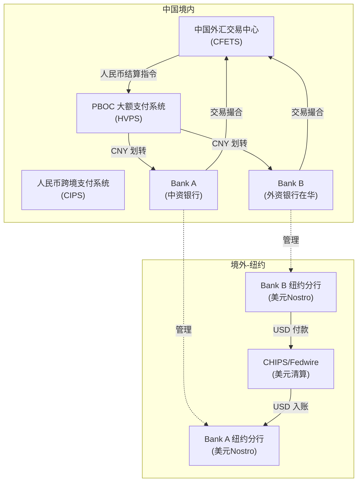
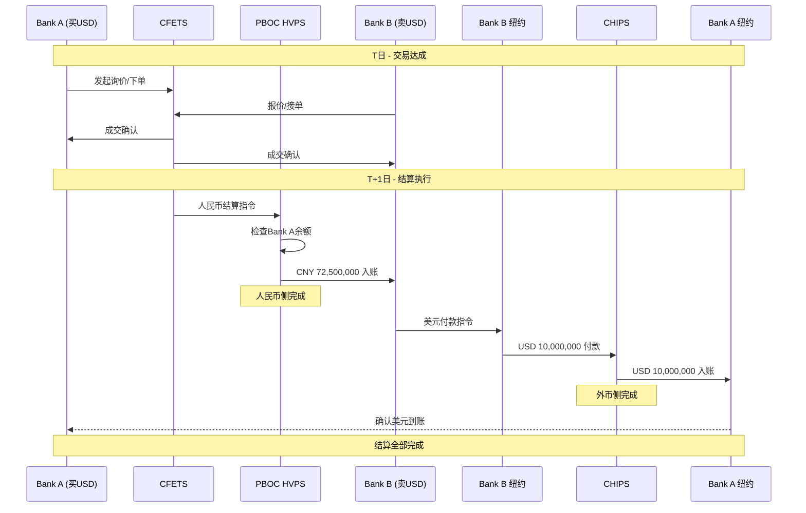
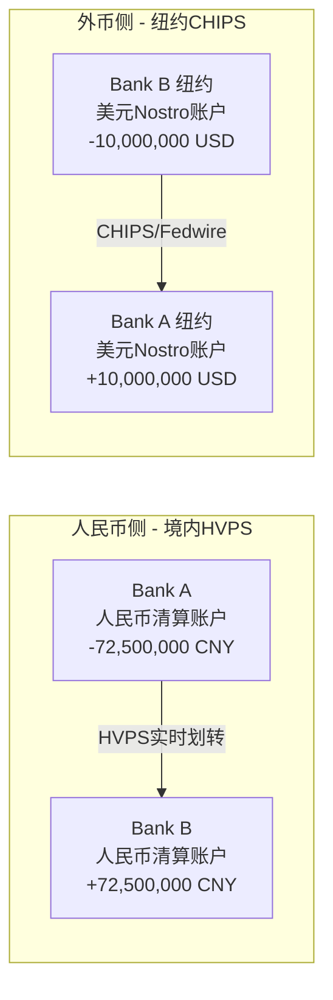
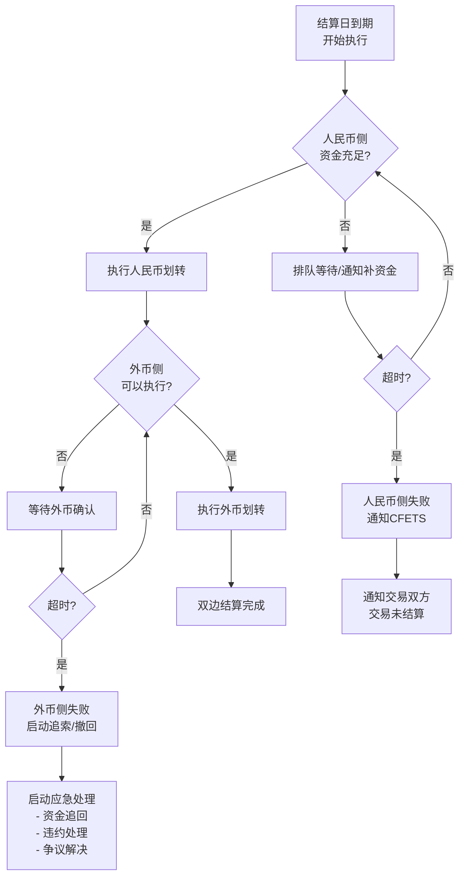

# 中国银行间外汇市场交易中的 PVP 运作机制

> 本文面向金融市场新人，系统讲解中国银行间外汇市场中 PVP（Payment Versus Payment，款款对付）机制的概念、运作流程、参与方、风险控制与实现特征。

---

## 1. 什么是 PVP

### 1.1 PVP 定义

**PVP（Payment Versus Payment，款款对付）** 是一种外汇交易结算机制，其核心原则是：

> **一笔外汇交易中，一种货币的付款以另一种货币的付款为前提条件——两个币种的资金交割要么同时完成，要么同时不发生。**

简单来说：我付给你人民币的同时，你付给我美元；如果其中任何一方无法完成付款，则另一方的付款也不会执行。

### 1.2 PVP 要解决的问题

外汇交易天然涉及两种不同货币的交换。两种货币通常在不同的支付系统、不同的清算网络、甚至不同的时区中完成结算。这导致一个根本性风险：

> **一方已经付出了自己的货币，但另一方的货币尚未收到——此时如果对方违约或系统故障，已付出的本金将面临损失。**

这就是 **本金风险（Principal Risk）**，也叫 **Herstatt Risk（赫斯塔特风险）**。

PVP 的目标就是：**将"先付后收"变为"同付同收"，从根本上消除或大幅降低本金风险。**

### 1.3 PVP 与非 PVP 结算的区别

| 比较维度 | PVP 结算 | 非 PVP 结算（自由付款/Free Payment） |
|---------|---------|--------------------------------------|
| 付款条件 | 两个币种付款相互关联，条件联动 | 两笔付款各自独立发出，无联动条件 |
| 本金风险 | 消除或大幅降低 | 存在完整的本金风险敞口 |
| 结算时序 | 两侧同步或在受控窗口内完成 | 两侧可能跨时区、跨日完成 |
| 典型场景 | CLS 结算、基础设施支持的联动结算 | 代理行自由付款、双边约定结算 |
| 失败处理 | 一侧失败则另一侧回滚/不执行 | 一侧已付出后，只能追索，无法自动回滚 |
| 复杂度 | 需要基础设施或制度安排支持 | 操作简单，但风险高 |

### 1.4 PVP 在外汇市场基础设施中的意义

PVP 是国际清算银行（BIS）和各国央行高度推荐的外汇结算安排。它被视为外汇市场基础设施安全的基石之一：

- **系统性风险防控**：防止一家银行的结算违约引发连锁反应
- **市场信心基础**：交易双方可以放心达成交易，不必担心对手方结算违约
- **监管合规要求**：各国央行和金融稳定理事会（FSB）持续推动 PVP 覆盖率提升

---

## 2. 为什么银行间外汇交易需要 PVP

### 2.1 外汇交易的双币种特性

一笔外汇交易本质上是：**用一种货币买入另一种货币**。例如：

- 银行 A 用 **7,250,000 元人民币** 买入 **1,000,000 美元**
- 这意味着银行 A 要付出人民币，同时收到美元

与股票交易（一手交钱、一手交货，在同一个交易所内完成）不同，外汇交易的两个"侧"（Leg）天然分处不同的支付体系：

| 交易侧 | 货币 | 清算/结算网络 | 所在时区 |
|--------|------|-------------|---------|
| 人民币侧 | CNY | PBOC 支付系统（HVPS）/ CIPS | UTC+8 |
| 美元侧 | USD | Fedwire / CHIPS | UTC-5（东部时间） |
| 欧元侧 | EUR | TARGET2 / EURO1 | UTC+1（中欧时间） |

### 2.2 时区错配和本金风险

由于两条侧在不同系统中结算，存在天然的时间差：

- 北京时间上午 9:00 中国的 HVPS 系统开始运行
- 此时纽约仍处于夜间（东部时间约 21:00 前一天），CHIPS/Fedwire 尚未开始当日营业
- 如果人民币侧已在北京时间完成付款，而美元侧要等到纽约时间白天才能结算——中间存在长达数小时的"一侧已付、一侧未收"的风险窗口

### 2.3 Herstatt Risk 的来源

**Herstatt Risk** 得名于 1974 年德国赫斯塔特银行（Bankhaus Herstatt）事件：

> 1974年6月26日，多家银行在外汇交易中已经向赫斯塔特银行支付了德国马克（在法兰克福的支付系统营业时间内完成），但赫斯塔特银行在纽约时间开市前被德国监管当局关闭，导致应付的美元从未支付。已付出马克的银行面临全部本金损失。

这一事件直接推动了国际社会对外汇结算风险的关注，并最终催生了 CLS Bank 和各国的 PVP 机制。

### 2.4 为什么仅有成交不够

> **"交易成交"（Trade Execution）≠ "结算完成"（Settlement Finality）**

这是新人最容易混淆的概念。当两家银行在 CFETS 平台上达成一笔 USD/CNY 即期交易时：

- **成交瞬间**：双方在法律上形成了交易合同义务
- **结算完成**：可能在 T+1 或 T+2 才发生（即成交后 1~2 个工作日）
- 在成交到结算之间，交易只是一个"承诺"，实际资金尚未转移

如果在这个时间窗口内，任何一方出现违约、破产或系统故障，另一方就面临风险。PVP 正是要在结算环节构建安全机制，确保最终的资金交换是安全的。

---

## 3. 中国实际中的参与方与基础设施

### 3.1 参与方总览

| 参与方 | 角色 | 具体说明 |
|--------|------|---------|
| **中国外汇交易中心（CFETS）** | 交易平台 + 结算组织方 | 提供交易撮合、成交确认、结算指令生成与传递 |
| **中国人民银行（PBOC）** | 监管方 + 支付系统运营方 | 制定规则、运营大额支付系统（HVPS）、监督市场 |
| **上海清算所（SHCH）** | 中央对手方清算（部分产品） | 为部分外汇衍生品提供集中清算服务 |
| **交易双方银行** | 市场参与者 | 在 CFETS 平台达成交易的买卖双方 |
| **人民币清算系统（HVPS/CIPS）** | 人民币侧结算基础设施 | HVPS 处理境内大额人民币实时支付；CIPS 处理跨境人民币支付 |
| **外币清算行/代理行** | 外币侧结算通道 | 通过境外代理行/清算行在相应货币的支付系统中完成结算 |
| **SWIFT** | 报文传输网络 | 传输跨境支付指令和确认报文 |
| **CLS Bank** | 全球多币种 PVP 结算平台 | 有限适用于涉及人民币的离岸交易（下文详述） |

### 3.2 CFETS 的角色

**中国外汇交易中心（China Foreign Exchange Trade System，CFETS）** 是中国银行间外汇市场的核心基础设施，隶属于中国人民银行。其在外汇交易结算链条中承担多重角色：

```
交易撮合 → 成交确认 → 结算指令生成 → 结算协调与监控
```

具体职能：

1. **交易撮合**：提供电子交易平台，支持询价（RFQ）和竞价（Matching）两种交易模式
2. **成交确认**：交易达成后自动生成成交确认，双方通过系统确认交易要素
3. **结算指令生成**：根据成交信息自动生成人民币侧和外币侧的结算指令
4. **结算协调**：将人民币结算指令发送至 PBOC 支付系统，将外币结算指令通知相关清算行/代理行
5. **净额清算**：对符合条件的交易进行多边净额轧差（Multilateral Netting），减少实际结算金额
6. **风险监控**：监控结算执行状态，管理结算风险

### 3.3 人民币清算基础设施

人民币侧的结算主要依赖以下系统：

| 系统 | 全称 | 功能 | 典型场景 |
|------|------|------|---------|
| **HVPS** | 大额实时支付系统（High Value Payment System） | 实时全额逐笔结算 | 境内银行间大额人民币转账 |
| **CIPS** | 人民币跨境支付系统（Cross-border Interbank Payment System） | 跨境人民币清算结算 | 涉及境外参与行的人民币支付 |
| **BEPS** | 小额批量支付系统 | 批量定时净额结算 | 一般不用于银行间外汇交易结算 |

在银行间外汇交易中：
- **纯境内交易**（两家境内银行之间）：人民币侧通常通过 **HVPS** 完成
- **跨境交易**（涉及境外银行）：人民币侧可能通过 **CIPS** 或境外人民币清算行完成

### 3.4 外币清算行/代理行体系

外币侧的结算需要通过相应货币所在国/地区的支付系统完成，中国的银行需要通过 **代理行（Correspondent Bank）** 体系接入这些系统：

| 外币 | 最终清算系统 | 中国银行的典型接入方式 |
|------|-------------|---------------------|
| USD（美元） | Fedwire / CHIPS | 通过在纽约的代理行或自设分支机构 |
| EUR（欧元） | TARGET2 / EURO1 | 通过在欧洲的代理行或自设分支机构 |
| GBP（英镑） | CHAPS | 通过在伦敦的代理行或自设分支机构 |
| JPY（日元） | BOJ-NET / FXYCS | 通过在东京的代理行或自设分支机构 |
| HKD（港币） | CHATS | 通过在香港的代理行或分支机构 |

大型中资银行（如工、农、中、建、交）通常在主要金融中心设有分支机构，可以直接参与当地支付系统；中小银行则主要依赖代理行。

### 3.5 CLS 的角色与边界

**CLS（Continuous Linked Settlement）Bank** 是目前全球最主要的多币种 PVP 结算平台，总部位于纽约。

**CLS 与人民币的关系：**

| 维度 | 说明 |
|------|------|
| CNH（离岸人民币） | CLS 于 2015 年将 CNH 纳入可结算币种，支持离岸人民币的 PVP 结算 |
| CNY（在岸人民币） | CLS **不直接** 处理在岸人民币交易 |
| 在岸银行间市场 | 中国银行间外汇市场的在岸交易 **绝大多数不通过 CLS 结算** |
| 参与银行 | 仅部分大型国际银行和中资银行以 CLS 会员或第三方身份参与 |

**关键认知：**

> **在中国银行间外汇市场（在岸市场）中，绝大多数 USD/CNY、EUR/CNY 等即期和远期交易并不通过 CLS 进行 PVP 结算。** CLS 主要服务于离岸市场和国际市场中涉及 CNH 的交易。
>
> 因此，中国在岸市场的 PVP 实现路径与 CLS 模式有本质区别——它更多依赖于 CFETS 主导的结算安排、央行支付系统和双边/多边风控机制。

---

## 4. 核心概念与账户体系

### 4.1 概念详解

#### 外汇交易（FX Transaction）
两种不同货币之间的买卖交易。银行间市场的外汇交易是批发市场行为，单笔金额通常在百万美元级别以上。

#### 成交（Trade Execution）
交易双方就交易要素（币种对、金额、汇率、交割日期等）达成一致的时刻。在 CFETS 上，这发生在撮合成功或询价确认的瞬间。

#### 确认（Confirmation）
交易达成后，双方对交易要素进行核实确认的过程。CFETS 系统自动完成电子确认。

#### 清算（Clearing）
对已确认的交易进行处理，计算各方的应付/应收金额，生成最终的结算指令。如涉及净额轧差，则在此阶段完成。

#### 结算（Settlement）
根据清算结果，实际完成货币资金从一方到另一方的转移。这是资金发生实际移动的环节。

#### 结算最终性（Settlement Finality）
结算完成后不可撤销。一旦达到结算最终性，资金转移在法律上是终局性的，不受任何一方后续破产或违约的影响。

### 4.2 账户体系

理解 PVP 必须理解银行的账户体系，特别是 **Nostro/Vostro 账户**：

| 概念 | 英文 | 含义 | 举例 |
|------|------|------|------|
| **Nostro 账户** | "Our account with you" | 我行在他行/境外代理行开设的账户 | 工商银行在花旗银行纽约开设的美元账户 |
| **Vostro 账户** | "Your account with us" | 他行/境外银行在我行开设的账户 | 花旗银行在工商银行上海开设的人民币账户 |
| **人民币清算账户** | — | 银行在央行支付系统中的清算账户 | 工商银行在 PBOC 的准备金账户 |
| **外币清算账户** | — | 银行在境外清算系统中（通过代理行）的账户 | 工商银行通过纽约分行在 CHIPS 的清算账户 |

**Nostro 和 Vostro 是同一个账户从不同角度的称呼：**

> 工商银行在花旗纽约开的美元账户：
> - 从工商银行角度看 → 这是工商银行的 **Nostro 账户**（我行在你那里的账户）
> - 从花旗银行角度看 → 这是花旗银行的 **Vostro 账户**（你行在我这里的账户）

### 4.3 关键概念对照表

| 概念 | 所属环节 | 中国语境下的对应 | 说明 |
|------|---------|----------------|------|
| 外汇交易 | 交易 | CFETS 上的撮合/询价交易 | 法律合同义务产生 |
| 成交确认 | 确认 | CFETS 系统自动确认 | 核实交易要素 |
| 净额轧差 | 清算 | CFETS 多边净额清算 | 减少实际结算金额 |
| 人民币侧结算 | 结算 | 通过 HVPS/CIPS 完成 | 人民币资金实际转移 |
| 外币侧结算 | 结算 | 通过代理行/外币支付系统完成 | 外币资金实际转移 |
| PVP | 结算安排 | CFETS 结算联动+风控机制 | 确保两侧联动 |
| 结算最终性 | 法律保障 | 央行支付系统的终局性规定 | 不可撤销 |
| Nostro 账户 | 账户体系 | 中资银行境外美元/欧元账户 | 外币收付的载体 |
| Vostro 账户 | 账户体系 | 外资银行境内人民币账户 | 人民币收付的载体 |

---

## 5. PVP 的核心运作流程

### 5.1 交易全生命周期

一笔银行间外汇交易从发起到完成，经历以下阶段：

```
交易发起 → 成交撮合 → 成交确认 → 清算处理（含净额轧差）
    → 结算指令生成 → 资金可用性检查 → 人民币侧准备 → 外币侧准备
    → PVP 条件联动 → 双边付款执行 → 结算完成 → 账务更新
```

### 5.2 四条并行的"流"

在整个流程中，有四条逻辑上独立但相互关联的信息/资金流：

| 流 | 载体 | 说明 |
|----|------|------|
| **指令流** | CFETS 系统 → 各支付系统 | 交易指令、结算指令、确认报文的传递 |
| **人民币资金流** | PBOC HVPS / CIPS | 人民币从付款方到收款方的实际转移 |
| **外币资金流** | 境外支付系统（如 CHIPS/Fedwire） | 外币从付款方代理行到收款方代理行的实际转移 |
| **账务记录流** | 各银行内部核心系统 | 各方的账务记簿更新、头寸变化记录 |

### 5.3 核心步骤详解

#### 步骤 1：交易达成

- 两家银行通过 CFETS 平台达成外汇交易
- 交易要素确定：币种对、交易方向（买/卖）、金额、汇率、交割日（Value Date）
- 此时产生的是法律义务，而非资金移动

#### 步骤 2：成交确认

- CFETS 系统自动生成成交确认
- 双方通过系统确认交易细节（电子化自动匹配）
- 确认完成后，交易进入"待结算"状态

#### 步骤 3：清算处理

- CFETS 对当日到期结算的交易进行处理
- 如果参与多边净额清算：将同一交易对手之间的多笔交易进行轧差，计算净应付/净应收金额
- 生成最终结算指令（包括人民币金额和外币金额）

#### 步骤 4：资金可用性检查

- **人民币端**：检查付款方在央行支付系统中的账户余额/可用额度是否充足
- **外币端**：检查付款方的 Nostro 账户或代理行授信额度是否能支持付款
- 如果资金不足，可能进入排队等待或要求补充资金

#### 步骤 5：人民币侧结算准备

- CFETS 将人民币结算指令发送至 PBOC HVPS（或 CIPS，视场景而定）
- 付款方银行在支付系统中确认/授权该笔付款
- 系统进行资金锁定或预扣处理

#### 步骤 6：外币侧结算准备

- 外币结算指令通过 SWIFT 或其他通道发送至付款方的境外代理行/分行
- 代理行在相应的外币支付系统中准备执行付款
- 考虑到时区差异，指令可能需要提前发送

#### 步骤 7：PVP 条件联动

这是 PVP 机制的核心。在中国实际中（详见第 9 节），这一步的实现方式主要包括：

- **结算窗口管理**：在特定时间窗口内要求双侧同时完成
- **条件释放机制**：人民币侧的资金在确认外币侧可以完成后才最终释放（或反之）
- **净额处理**：通过轧差减少结算金额，从而减少风险敞口
- **头寸监控**：实时监控各方头寸，及时发现异常

#### 步骤 8：双边付款执行

- 人民币侧：通过 HVPS 完成人民币从买方/卖方到对手方的实时转账
- 外币侧：通过境外支付系统完成外币从卖方/买方代理行到对手方代理行的转账

#### 步骤 9：结算完成

- 双方均确认收到应收货币
- 结算达到最终性（Finality），不可撤销
- CFETS 系统更新结算状态

#### 步骤 10：账务更新

- 各银行内部核心系统更新：
    - 外汇头寸变化
    - Nostro 账户余额变化
    - 损益核算
    - 监管报表数据更新

---

## 6. 具体案例：人民币兑美元即期交易

### 6.1 案例背景

| 要素 | 内容 |
|------|------|
| **交易类型** | 即期（Spot）外汇交易 |
| **币种对** | USD/CNY |
| **买方（Bank A）** | 中国工商银行（境内大型商业银行） |
| **卖方（Bank B）** | 汇丰银行（中国）（在华外资银行） |
| **交易方向** | Bank A 买入 USD，卖出 CNY；Bank B 卖出 USD，买入 CNY |
| **交易金额** | Bank A 买入 10,000,000 USD |
| **成交汇率** | 7.2500 |
| **人民币金额** | 72,500,000 CNY |
| **成交日（Trade Date）** | T 日（例如周一） |
| **交割日（Value Date）** | T+1 日（例如周二，即期交割惯例） |
| **Bank A 美元代理行** | 工商银行纽约分行（在 CHIPS 有清算账户） |
| **Bank B 美元代理行** | 汇丰银行纽约分行（在 CHIPS 有清算账户） |

### 6.2 时间顺序拆解

> 以下时间均为北京时间，时间点为示意性质，实际时间视系统安排可能有所不同。

#### T 日：交易达成

| 时间（北京） | 事件 | 参与系统/方 |
|-------------|------|------------|
| 09:30 | Bank A 交易员在 CFETS 平台发起询价，Bank B 报价 7.2500 | CFETS |
| 09:31 | Bank A 确认接受报价，交易成交 | CFETS |
| 09:31 | CFETS 自动生成成交确认，双方系统同步接收 | CFETS |
| 09:31~09:35 | 双方后台系统录入交易、风控初筛 | Bank A/B 内部系统 |
| 当日下午 | CFETS 对 T+1 结算的交易进行清算准备，计算净额（如有） | CFETS |
| 当日下午 | 双方准备结算指令，确认 Nostro 账户余额 | Bank A/B 财务/运营部门 |

#### T+1 日：结算执行

| 时间（北京） | 事件 | 参与系统/方 |
|-------------|------|------------|
| 08:30~09:00 | PBOC HVPS 开始当日营业；各行确认可用人民币头寸 | HVPS |
| 09:00 | CFETS 结算系统开始处理当日到期的外汇交易结算 | CFETS |
| 09:00~09:30 | **人民币侧启动**：CFETS 向 HVPS 发送人民币结算指令——Bank A 向 Bank B 支付 72,500,000 CNY | CFETS → HVPS |
| | HVPS 检查 Bank A 清算账户余额是否充足 | HVPS |
| | 余额充足 → 扣减 Bank A 账户 72,500,000 CNY | HVPS |
| | 贷记 Bank B 账户 72,500,000 CNY | HVPS |
| | **人民币侧结算完成** | HVPS |
| 同日 08:00 前（前一晚纽约时间工作时段内） | **外币侧指令已预先发出**：Bank B 通过其纽约分行向 CHIPS 发送付款指令——Bank B 纽约分行向 Bank A 纽约分行（即工行纽约分行）支付 10,000,000 USD | SWIFT/CHIPS |
| 纽约时间 09:00~17:00（北京时间约 21:00~次日 05:00） | CHIPS 处理并执行该笔美元付款 | CHIPS |
| | Bank A 纽约分行 Nostro 账户收到 10,000,000 USD | CHIPS |
| | **外币侧结算完成** | CHIPS |

#### 结算后

| 事件 | 说明 |
|------|------|
| Bank A 账务更新 | 人民币存放央行减少 72,500,000；美元 Nostro 增加 10,000,000 USD；外汇头寸调整 |
| Bank B 账务更新 | 人民币存放央行增加 72,500,000；美元 Nostro 减少 10,000,000 USD；外汇头寸调整 |
| CFETS 记录更新 | 该笔交易状态标记为"已结算" |
| 双方对账 | 核对 Nostro 账户余额变动与预期一致 |

### 6.3 各参与方协作关系

| 参与方 | 在此交易中的具体动作 |
|--------|---------------------|
| **CFETS** | 提供交易平台、撮合交易、生成确认和结算指令、协调结算流程 |
| **PBOC HVPS** | 执行人民币侧的资金划转（Bank A → Bank B） |
| **Bank A（工行）** | 买入美元方；付出 CNY，接收 USD；指示纽约分行确认收款 |
| **Bank B（汇丰中国）** | 卖出美元方；付出 USD，接收 CNY；指示纽约分行执行 USD 付款 |
| **Bank A 纽约分行** | 工行的美元 Nostro 账户所在行，接收美元入账 |
| **Bank B 纽约分行** | 汇丰的美元 Nostro 账户所在行，执行美元付款 |
| **CHIPS** | 处理 Bank B 纽约 → Bank A 纽约的美元转账 |

### 6.4 此案例中的风险窗口

> **关键风险点**：人民币侧在北京时间上午完成，美元侧在纽约时间白天（北京时间夜间至次日凌晨）完成。两侧之间存在数小时甚至超过半天的时间差。

在这个时间差内：
- 如果 Bank B 收到人民币后、但在纽约时间美元付款前被监管关闭或宣布破产 → Bank A 面临 10,000,000 USD 的本金损失
- 这正是 PVP 机制要解决的核心问题

---

## 7. Mermaid 图示

### 7.1 参与方关系图



### 7.2 PVP 时序图



### 7.3 人民币侧与外币侧资金流图



### 7.4 失败场景与处理分支图



---

## 8. PVP 的风险控制机制

### 8.1 Herstatt Risk（赫斯塔特风险）

| 维度 | 说明 |
|------|------|
| **风险本质** | 一方已不可撤回地付出一种货币，但另一种货币因对手方违约/破产/系统故障未能收到 |
| **风险规模** | 等于交易的全部本金金额（非利息差，是本金！） |
| **为什么严重** | 外汇交易金额巨大（银行间单笔千万至数亿美元），一笔交易的本金损失可能导致银行破产 |
| **PVP 如何缓释** | 将两侧联动，确保"付出"以"收到"为前提，从根本上消除或大幅缩小风险窗口 |

### 8.2 本金风险的具体场景

> 假设 Bank A 在北京时间上午已通过 HVPS 支付了 72,500,000 CNY 给 Bank B，该笔支付已达到结算最终性（不可撤销）。此时：

**场景一：Bank B 在纽约美元付款前被监管关闭**
- Bank A 已付出 7250 万人民币
- Bank B 应付的 1000 万美元无法执行
- Bank A 面临 1000 万美元的本金损失（约 7250 万人民币）
- Bank A 只能作为 Bank B 的债权人在清算程序中追偿（通常只能收回部分）

**场景二：CHIPS 系统故障导致美元付款无法执行**
- 人民币已付，美元未到
- 需要等待系统恢复或启动备用结算通道
- Bank A 面临临时性流动性风险和不确定性

### 8.3 风险控制手段

PVP 机制及其配套安排通过以下手段控制风险：

| 控制手段 | 作用 | 在中国实际中的体现 |
|---------|------|------------------|
| **净额轧差（Netting）** | 大幅减少实际结算金额，降低风险敞口 | CFETS 对符合条件的交易进行多边净额轧差 |
| **资金预检/锁定** | 确保付款方有足够资金再执行结算 | HVPS 的实时余额检查；排队机制 |
| **结算窗口管理** | 控制两侧结算的时间范围 | CFETS 设定结算时间窗口，监控执行进度 |
| **双边授信/额度管理** | 控制对单一交易对手的风险敞口 | 银行间双边授信额度管理；CFETS 系统额度检查 |
| **实时监控** | 及时发现异常，快速干预 | CFETS 和 PBOC 对结算状态的实时监控 |
| **违约处理机制** | 事后追索和处置 | 市场规则中的违约处理条款；法律追索 |
| **流动性支持** | 防止因临时资金不足导致系统性连锁失败 | 央行流动性便利（如日间透支、SLF 等） |
| **逐笔全额结算（RTGS）** | 人民币侧通过 HVPS 逐笔实时完成，降低积累风险 | HVPS 的 RTGS 模式 |

### 8.4 如果人民币已支付但外币未到账

这是最核心的风险场景。实际处理通常包括：

1. **实时追踪**：Bank A 通过 SWIFT 和纽约分行追踪美元付款状态
2. **催收/联络**：联系 Bank B 确认付款指令是否已发出
3. **CFETS 介入**：如问题涉及多个市场参与者，CFETS 可以协调
4. **央行介入**：极端情况下（系统性风险），PBOC 可能协调处置
5. **法律追索**：根据银行间市场主协议（NAFMII Master Agreement）进行违约处理
6. **市场处置**：如果涉及对方违约，可以进行替代交易（Replacement Trade）并向违约方追偿差价

### 8.5 锁定与排队机制

在 HVPS 中：
- 如果付款方账户余额不足，付款指令不会被拒绝，而是进入 **排队（Queuing）** 状态
- 排队指令按优先级排序，当资金到账后自动执行
- 如果到当日系统关闭前仍未执行，指令被退回
- 系统支持 **流动性节约机制（LSM）**，通过优化支付顺序减少资金需求

---

## 9. 中国实践中的 PVP 实现特征与边界

### 9.1 核心判断

> **中国银行间外汇市场的 PVP 实现，整体上更接近"结算联动安排 + 风控机制"模式，而非完全的基础设施级原子性交割。**

原因如下：

| 因素 | 说明 |
|------|------|
| **双系统分离** | 人民币侧通过 PBOC HVPS 结算，外币侧通过境外支付系统（如 CHIPS）结算，两者是独立的基础设施 |
| **时区不重叠** | 人民币系统运营时间（北京时间白天）与美元系统运营时间（纽约时间白天）仅部分重叠 |
| **无统一原子性控制** | 不存在一个单一系统能同时控制 HVPS 中的人民币划转和 CHIPS 中的美元划转 |
| **非 CLS 模式** | 在岸交易不通过 CLS，缺少类似 CLS 的集中化 PVP 平台 |

### 9.2 哪些场景接近严格 PVP

| 场景 | PVP 程度 | 说明 |
|------|---------|------|
| **CFETS 净额清算后的结算** | 较高 | 净额轧差大幅降低了风险敞口，配合时间窗口管理和预检机制 |
| **大型银行间交易** | 中等偏高 | 大行之间有完善的双边协议、实时通讯、代理行高效配合 |
| **CLS 结算的离岸 CNH 交易** | 接近严格 PVP | CLS 提供真正的多币种 PVP 服务 |

### 9.3 哪些场景是制度性/流程性 PVP

| 场景 | 说明 |
|------|------|
| **多数 USD/CNY 即期交易** | 依赖 CFETS 结算安排 + 代理行配合 + 双边协议 + 时间窗口管理 |
| **涉及小型银行的交易** | 小型银行代理行效率较低，时间差较大 |
| **非主要货币对交易** | 清算路径更长，参与环节更多 |

### 9.4 哪些风险仍然不能完全消除

| 风险类型 | 能否完全消除 | 说明 |
|---------|------------|------|
| **本金风险（全额）** | 不能完全消除，但可大幅缓释 | 净额轧差减少敞口；但在非 CLS 模式下，仍存在残余风险 |
| **时区错配风险** | 不能消除 | CNY 和 USD/EUR 清算系统运营时间天然不完全重叠 |
| **代理行风险** | 不能消除 | 依赖代理行的信用和操作可靠性 |
| **操作风险** | 不能消除 | 系统故障、人为错误等 |
| **流动性风险** | 不能消除，但可缓释 | 净额轧差减少资金需求；央行流动性支持工具可用 |
| **法律风险** | 主要通过协议管理 | NAFMII 主协议和双边 CSA 等 |

### 9.5 与国际 CLS 模式的比较

| 比较维度 | CLS 模式 | 中国在岸市场模式 |
|---------|---------|----------------|
| **PVP 实现方式** | 基础设施级原子性——CLS 同时控制所有币种的资金移动 | 制度安排+流程协调+风控机制 |
| **参与币种** | 18 种货币（含 CNH） | 以 CNY 为一侧，对手为各外币 |
| **净额效率** | 多边净额，可降低 96% 以上结算金额 | CFETS 净额轧差，效率较高但币种受限 |
| **结算窗口** | 约 5 小时的 PVP 窗口（覆盖亚、欧、美洲） | 依赖两个独立系统的营业时间 |
| **失败处理** | 自动回退，保证原子性 | 追索、协调、违约处理 |
| **覆盖范围** | 全球主要外汇交易（约占全球 FX 结算量的 50%+） | 中国在岸银行间市场 |
| **CNY 适用性** | 仅支持 CNH（离岸人民币） | 处理 CNY（在岸人民币） |

### 9.6 CIPS 在 PVP 中的潜在角色

值得关注的是，**CIPS（人民币跨境支付系统）** 在提升人民币跨境支付效率方面扮演越来越重要的角色。CIPS 的发展方向包括：

- 延长运营时间以更好覆盖全球时区（目前已实现接近 24 小时运营）
- 增加直接参与行数量
- 提供更高效的人民币清算通道

CIPS 运营时间的延长有助于缩短人民币侧与外币侧之间的时间差，从而在一定程度上降低时区错配风险。但要实现真正的基础设施级 PVP，仍需要跨系统的联动机制。

---

## 10. 不同币种交易的 PVP 实现差异

### 10.1 USD/CNY（人民币兑美元）

| 维度 | 说明 |
|------|------|
| **交易量** | 最大的银行间外汇交易品种 |
| **人民币侧** | HVPS（境内）或 CIPS（跨境） |
| **美元侧** | CHIPS / Fedwire，通过纽约代理行/分行 |
| **时区差** | 北京比纽约快 12~13 小时，重叠窗口有限 |
| **PVP 挑战** | 时区差大，是最典型的 Herstatt Risk 场景 |
| **净额安排** | CFETS 多边净额轧差适用 |

### 10.2 EUR/CNY（人民币兑欧元）

| 维度 | 说明 |
|------|------|
| **人民币侧** | 同上 |
| **欧元侧** | TARGET2 / EURO1，通过欧洲代理行/分行 |
| **时区差** | 北京比法兰克福快 6~7 小时，重叠窗口较多 |
| **PVP 挑战** | 时区差较美元小，但仍存在 |
| **特殊性** | 交易量相对较小，清算路径可能更长 |

### 10.3 HKD/CNY（人民币兑港币）

| 维度 | 说明 |
|------|------|
| **人民币侧** | HVPS / CIPS |
| **港币侧** | CHATS（港元实时全额结算系统） |
| **时区差** | 无（香港与北京同一时区） |
| **PVP 挑战** | 时区问题最小，PVP 条件相对最好 |
| **特殊性** | 受益于地理和时区邻近 |

### 10.4 JPY/CNY（人民币兑日元）

| 维度 | 说明 |
|------|------|
| **人民币侧** | HVPS / CIPS |
| **日元侧** | BOJ-NET / FXYCS |
| **时区差** | 仅 1 小时（东京 UTC+9，北京 UTC+8） |
| **PVP 挑战** | 时区差小，系统营业时间高度重叠 |

### 10.5 总结：时区对 PVP 的影响

| 币种对 | 时区差（小时） | PVP 实现难度 | 说明 |
|--------|-------------|------------|------|
| CNY/HKD | 0 | 最低 | 同时区，系统重叠最大 |
| CNY/JPY | 1 | 低 | 亚洲时区，高度重叠 |
| CNY/SGD | 0 | 低 | 同时区 |
| CNY/EUR | 6~7 | 中等 | 有一定重叠窗口 |
| CNY/GBP | 7~8 | 中等偏高 | 重叠窗口较小 |
| CNY/USD | 12~13 | 最高 | 重叠窗口最小，是最大风险场景 |

---

## 11. 新人如何理解整条链路

### 11.1 从交易到结算的认知框架

建议新人用 **"五阶段"框架** 理解一笔外汇交易的完整生命周期：

```
┌──────────┐    ┌──────────┐    ┌──────────┐    ┌──────────┐    ┌──────────┐
│  1.交易   │ →  │  2.确认   │ →  │  3.清算   │ →  │  4.结算   │ →  │ 5.账务更新│
│          │    │          │    │          │    │          │    │          │
│ 达成合同  │    │ 核实要素  │    │ 计算净额  │    │ 资金转移  │    │ 记簿变更  │
│ 价格锁定  │    │ 双方同意  │    │ 生成指令  │    │ 最终交割  │    │ 头寸调整  │
│ CFETS上   │    │ 系统自动  │    │ 可能轧差  │    │ PVP联动  │    │ 各行内部  │
└──────────┘    └──────────┘    └──────────┘    └──────────┘    └──────────┘
```

**关键认知：**
- 阶段 1 和阶段 4 之间可能隔了 1~2 个工作日
- "成交"是合同层面的，"结算"是资金层面的
- PVP 发生在阶段 4，是保护最终资金交割安全的机制
- 风险主要存在于阶段 4 内部——两条侧的时间差

### 11.2 最容易混淆的概念辨析

| 容易混淆的概念对 | 区别 |
|----------------|------|
| **成交 vs 结算** | 成交是达成交易协议；结算是实际交付资金。两者可能间隔数日 |
| **清算 vs 结算** | 清算是计算净额、生成指令；结算是执行资金转移。清算在先，结算在后 |
| **PVP vs DVP** | PVP 是"款款对付"（两种货币对付），用于外汇；DVP 是"券款对付"（证券与资金对付），用于债券 |
| **CNY vs CNH** | CNY 是在岸人民币（中国境内）；CNH 是离岸人民币（香港等离岸市场）。CLS 处理 CNH，不直接处理在岸 CNY |
| **Nostro vs Vostro** | 同一个账户，从不同角度称呼。"我在你那里的账户"=Nostro；"你在我这里的账户"=Vostro |
| **HVPS vs CIPS** | HVPS 主要处理境内人民币大额支付；CIPS 主要处理跨境人民币支付 |
| **CHIPS vs Fedwire** | 两者都处理美元支付。CHIPS 是私营净额系统（效率高）；Fedwire 是美联储运营的 RTGS 系统（最终性高） |
| **代理行 vs 清算行** | 清算行是在特定支付系统中有直接参与资格的银行；代理行是为其他银行提供支付服务的银行。清算行可以是代理行，但代理行不一定是清算行 |

### 11.3 学习建议

1. **先理解"为什么"再理解"怎么做"**
    - 先想清楚外汇交易为什么有风险（双币种、双系统、跨时区）
    - 再去理解 PVP 作为解决方案是如何设计的

2. **画出资金流图**
    - 对每一笔交易，自己画出人民币和外币分别是怎么从 A 到 B 的
    - 标注每一步经过了哪个系统、账户、参与方

3. **关注时间线**
    - 在时间轴上标注：什么时候成交、什么时候发出指令、什么时候人民币到账、什么时候美元到账
    - 找出"风险窗口"在哪里

4. **区分"理想"和"现实"**
    - 理想：两侧完全同步、原子性交割
    - 现实：通过制度、流程、技术手段尽量接近理想状态
    - 理解差距在哪里，理解残余风险是什么

5. **从单笔交易开始，再理解系统**
    - 先彻底搞懂一笔 USD/CNY 即期交易的全过程
    - 再推广到其他币种、远期、掉期等复杂产品
    - 最后理解系统层面的净额轧差、流动性管理等

6. **关注基础设施的演进**
    - CIPS 的运营时间延长
    - CFETS 结算机制的持续完善
    - 人民币国际化进程对结算基础设施的要求
    - 数字货币（e-CNY）对未来跨境支付和 PVP 的潜在影响

---

## 12. 总结

### 12.1 十条核心认知

1. **PVP 的本质是"有条件付款"**——一种货币的支付以另一种货币的支付为前提条件，目标是消除本金风险。

2. **"交易成交"不等于"结算完成"**——银行间外汇交易在 CFETS 上成交后，实际资金交割可能在 T+1 或 T+2 才发生，期间存在信用风险。

3. **人民币侧和外币侧在不同的基础设施中结算**——人民币通过 PBOC HVPS/CIPS，外币通过境外支付系统（如 CHIPS/TARGET2），两者是独立系统。

4. **时区错配是 PVP 的核心挑战**——人民币系统和美元系统的运营时间差可达 12 小时以上，这段时间差是 Herstatt Risk 的主要来源。

5. **中国在岸市场的 PVP 是"结算联动安排 + 风控机制"模式**——不同于 CLS 的基础设施级原子性交割，中国在岸市场通过 CFETS 协调、净额轧差、时间窗口管理、头寸预检等组合手段实现 PVP 目标。

6. **CLS 不直接处理在岸 CNY 交易**——CLS 支持 CNH（离岸人民币），但中国银行间外汇市场的在岸交易绝大多数不通过 CLS 结算。

7. **净额轧差是重要的风险缓释手段**——通过将多笔交易轧差为净额，大幅减少实际需要结算的金额，从而降低风险敞口。

8. **Nostro/Vostro 账户是外币结算的载体**——理解银行的账户体系（特别是代理行关系）是理解外汇结算流程的基础。

9. **部分风险只能被缓释而不能完全消除**——在非 CLS 模式下，时区错配风险、代理行风险、操作风险等始终存在残余。PVP 的目标是将风险降到可接受水平，而非完全为零。

10. **基础设施在持续演进**——CIPS 运营时间延长、CFETS 结算机制完善、数字货币发展等都在持续推动中国外汇结算安全水平的提升。

### 12.2 一句话总结

> 在中国银行间外汇市场中，PVP 不是一个单一的系统或按钮，而是一套由 CFETS 主导、央行支付系统支撑、代理行网络配合、制度规则保障的 **结算安全体系**——它的目标是让每一笔外汇交易的人民币支付和外币支付尽可能安全地联动完成，最大限度保护市场参与者免受本金损失。

---

## 附录 A：缩略语对照表

| 缩略语 | 英文全称 | 中文名称 |
|--------|---------|---------|
| PVP | Payment Versus Payment | 款款对付 |
| DVP | Delivery Versus Payment | 券款对付 |
| CFETS | China Foreign Exchange Trade System | 中国外汇交易中心 |
| PBOC | People's Bank of China | 中国人民银行 |
| HVPS | High Value Payment System | 大额实时支付系统 |
| CIPS | Cross-border Interbank Payment System | 人民币跨境支付系统 |
| CNAPS | China National Advanced Payment System | 中国现代化支付系统 |
| SHCH | Shanghai Clearing House | 上海清算所 |
| CLS | Continuous Linked Settlement | 持续联结结算 |
| CHIPS | Clearing House Interbank Payments System | 纽约清算所银行间支付系统 |
| RTGS | Real-Time Gross Settlement | 实时全额结算 |
| SWIFT | Society for Worldwide Interbank Financial Telecommunication | 环球银行金融电信协会 |
| NAFMII | National Association of Financial Market Institutional Investors | 中国银行间市场交易商协会 |
| BIS | Bank for International Settlements | 国际清算银行 |
| FSB | Financial Stability Board | 金融稳定理事会 |

## 附录 B：延伸阅读

- BIS: *Triennial Central Bank Survey of Foreign Exchange and OTC Derivatives Markets*
- BIS CPMI: *FX Settlement Risk*（外汇结算风险系列报告）
- CLS Group: *CLS Settlement Service*
- CFETS 官方网站：关于银行间外汇市场规则和结算安排的公告
- CIPS 官方网站：关于人民币跨境支付系统的业务规则
- 中国人民银行：关于支付系统运行规则的相关规定

---

*本文档基于公开信息和行业通用知识编写，旨在帮助新人建立对中国银行间外汇市场 PVP 机制的系统性认知。部分基础设施的内部运行细节可能不完全对外公开，实际操作以监管规定和各基础设施最新业务规则为准。*
